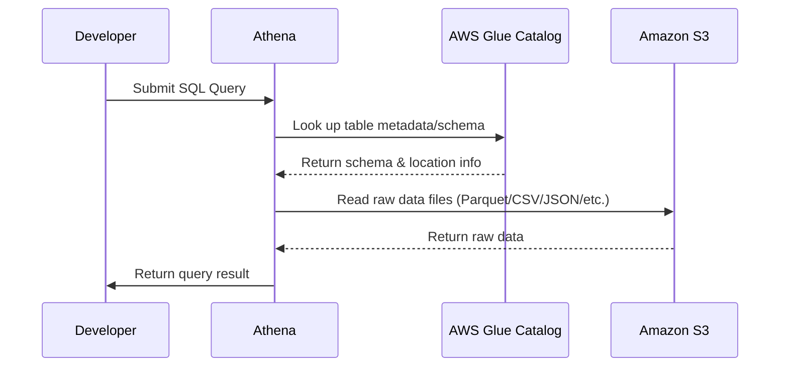
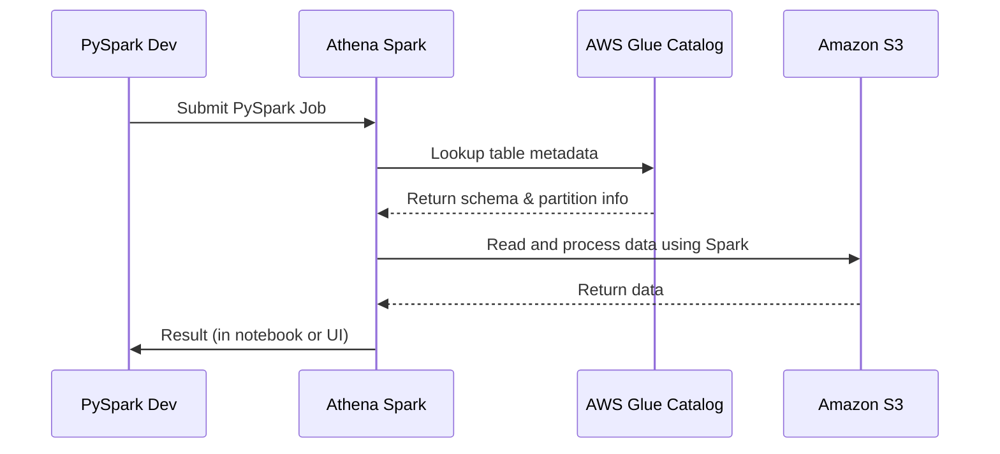

# 🔍 How AWS Athena Works Behind the Scenes

Amazon Athena is more than just a magical black box that answers SQL queries. If you’re the kind of engineer (like you 😎) who hates not knowing what’s going on under the hood, this is for you. Let’s dig into the internal mechanics of Athena in a detailed, clear, and slightly funny way—no magic, just smart architecture.

---

## 📚 Official Definition First

> **Amazon Athena** is an interactive, serverless query service that lets you use **standard SQL** to analyze data directly in **Amazon S3**. It integrates with the **AWS Glue Data Catalog** to provide schema management and metadata querying.

But what does that _really_ mean? Let’s peel the onion 🧅.

---

## 🧠 Concept: Querying Data in Object Storage

Unlike traditional databases (PostgreSQL, MySQL, etc.) that store and compute together, Athena separates compute (query engine) and storage (S3). That’s the first shift in mindset.

Think of it this way:



---

## 🛠️ What Makes Athena Tick (Under the Hood)

### 🔄 1. **Glue Data Catalog = The Brain 🧠**

Athena doesn’t understand “raw” S3 data. It needs a schema—columns, data types, file formats, partitions, etc. That’s where **AWS Glue Data Catalog** comes in.

- It acts like a **metastore** (yes, similar to Apache Hive Metastore).
- It stores **metadata** about your tables: file paths, schema, partition structure, etc.
- Tables can be created manually via DDL (SQL) or automatically using a **Glue Crawler**.

📌 Think of it as: “How do I make this unstructured S3 data look like a SQL table?”

---

### 🧠 2. **Presto/Trino Under the Hood = The Query Engine**

Athena uses a **modified Presto/Trino engine** behind the scenes. Yep, it’s **distributed computing**!

- **Presto/Trino** is an open-source distributed SQL query engine.
- When you run a query in Athena, AWS spins up a **fleet of ephemeral workers** (EC2-like compute nodes).
- These workers **read your data in parallel** from S3.
- They then **execute the SQL logic** (joins, filters, aggregates), and return the result.

💡 So yes, Athena is a distributed system — **just like Hadoop, Hive, or Spark**, but it’s optimized and serverless. You don’t manage the cluster — AWS does that for you.

---

### 📦 3. **How the Query Lifecycle Works**

Here’s what happens when you run a query in Athena:

1️⃣ Glue Catalog Lookup  
2️⃣ Parse + Generate Execution Plan  
3️⃣ Launch Presto Workers  
4️⃣ Parallel Read from S3  
5️⃣ Apply Filters, Joins, Aggregates  
6️⃣ Save Result to S3 Bucket  
7️⃣ Show Results in Athena UI

> - Athena saves results in **your specified S3 bucket**.
> - You only pay for **data scanned**, not for compute uptime.
> - Compression, partitioning, and using columnar formats like **Parquet** = major cost savers 💰.

---

### 🔥 Bonus: What About PySpark in Athena?

In 2023, **Amazon Athena for Apache Spark** was introduced! 🎉

- It lets you run **PySpark jobs** interactively on a **Spark-on-Athena backend**.
- AWS provisions **managed Spark clusters** under the hood.
- It’s optimized for **on-demand, low-latency Spark workloads**.
- You pay **per session runtime**, not continuously running clusters.



So yes, under the hood it’s **Apache Spark**, and you can run **interactive notebooks** or **SQL/SparkSQL jobs** on demand 🚀

---

## 🎯 Athena’s Secret Weapons

| Feature               | Power Behind It                               |
| --------------------- | --------------------------------------------- |
| Serverless            | No EC2, fully managed by AWS                  |
| Distributed execution | Presto/Trino engine                           |
| Schema management     | Glue Data Catalog                             |
| Spark Support         | Athena for Apache Spark                       |
| SQL standard support  | ANSI SQL                                      |
| Storage integration   | Amazon S3 (open formats like Parquet/ORC/CSV) |
| Metadata optimization | Partitioning, Column stats                    |

---

## 🧪 Example: Querying Logs from S3 (CSV)

1. **You have a CloudFront log file in S3**
2. You use Glue Crawler to create a table from it
3. Now in Athena you run:

```sql
SELECT status, COUNT(*)
FROM cloudfront_logs
WHERE date BETWEEN '2024-03-01' AND '2024-03-05'
GROUP BY status;
```

And voilà 🎉—Athena:

- Checks Glue for schema
- Reads data in parallel using Presto
- Applies filters + aggregation
- Returns results to you in seconds!

---

## 🧠 TL;DR

| Component        | Description                                         |
| ---------------- | --------------------------------------------------- |
| Query Engine     | Presto/Trino (distributed SQL engine)               |
| Metadata Layer   | AWS Glue Data Catalog (tables, schema, partitions)  |
| Data Source      | Amazon S3 (structured/semi-structured/unstructured) |
| Result Output    | S3 (your specified bucket)                          |
| Advanced Support | PySpark with Athena for Apache Spark                |

---

## ✅ Final Thoughts

Athena isn’t magic — it’s **distributed compute + metadata + S3 + Presto + Glue**, wrapped in a beautiful serverless shell. Understanding how it works helps you:

- Optimize costs
- Improve performance (partitioning + file formats)
- Integrate with other tools (QuickSight, Redshift, Spark)

So next time someone says, “Athena is just a query tool,” you can proudly say:

> “It’s a serverless SQL-powered distributed compute engine with a catalog-backed metastore that leverages Presto/Trino to run federated queries across object storage and more.” 😏
