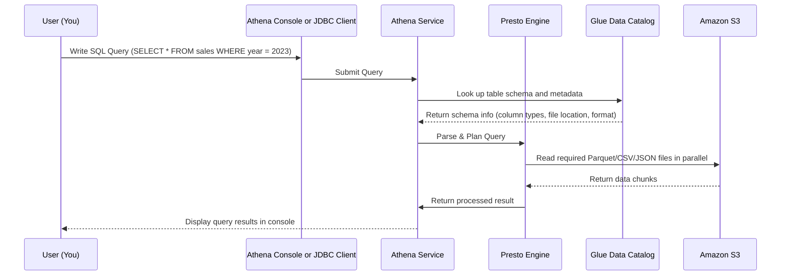

# 🧠 How Does AWS Athena Work Behind the Scenes?

---

## 📜 **Official Definition (But Human-Readable)**

> **Amazon Athena** is a _serverless_, interactive **query service** that allows you to use **standard SQL** to query data directly from **Amazon S3**.

But what _actually_ happens when you run a SQL query in Athena? Let's break it open 🔨

---

## 🧰 The Stack Under the Hood (Spoiler: Yes, It's Based on Presto!) 🧱

At its core, **Athena is built on top of Presto (now called Trino)** — a **distributed SQL query engine** designed for **big data analytics**.

Here's what Athena is _not_:

- ❌ Not built on Hive (but uses Hive metastore APIs via Glue Data Catalog)
- ❌ Not Hadoop MapReduce (but reads data from S3 like HDFS)
- ❌ Not Spark (no DAG-based execution here)

Instead, it follows a **distributed MPP (Massively Parallel Processing)** model using **Presto** for compute and **S3** as the data source.

---

## 🔬 Sequence of How a Query Executes in Athena



---

## 🧱 Components Breakdown (Like a Real Engineer 🧑‍💻)

| Component             | What It Does                                             | Analogy                                             |
| --------------------- | -------------------------------------------------------- | --------------------------------------------------- |
| **Athena Frontend**   | Receives query, manages results, tracks history          | Your waiter taking your order                       |
| **Glue Data Catalog** | Stores table definitions, partitions, schema             | The restaurant menu                                 |
| **Presto Engine**     | Parses, plans, and executes SQL over distributed workers | The kitchen where food (results) are cooked         |
| **Amazon S3**         | Stores the raw data in formats like Parquet, ORC, JSON   | Your pantry or fridge where ingredients (data) live |
| **Result Bucket**     | Stores final `.csv` output of your query                 | The plate your food is served on                    |

---

## 🔄 What Happens at Each Step (With Real Engineer Details) 🧪

### 1. **Query Submission** 💬

You type SQL via the **Athena Console**, **JDBC client**, or **API**.  
Athena accepts **ANSI SQL** (DDL, DML, SELECT).

### 2. **Schema Lookup (Glue Data Catalog)** 📘

Athena checks Glue for:

- Table name
- File location (S3 path)
- Format (Parquet/CSV/ORC)
- Column names, types
- Partition keys (for partition pruning)

### 3. **Query Planning (Presto Core)** 🧠

Presto parses the SQL and builds a **query execution plan**:

- Breaks the query into multiple **stages**
- Generates **intermediate steps** like filters, joins, and aggregates
- **Pushes down filters** and **selects only required columns** (data skipping!)

### 4. **Data Scanning (S3 Reads)** 📦

Presto uses **multiple worker nodes** to:

- Read data directly from **S3** (like HDFS blocks)
- Use **columnar formats** (like Parquet) to avoid reading unused columns
- Filter data using **predicate pushdown**

📌 _This is where cost savings happen: you're charged per scanned data!_

### 5. **Query Execution** 🏃

Each worker:

- Processes a portion of the data
- Applies `WHERE`, `GROUP BY`, `JOIN`, etc.
- Exchanges intermediate data via **pipelines**

All nodes report back to a **coordinator node**, which assembles the final result.

### 6. **Results Storage** 🧾

Final output is written to a `.csv` file in a **designated S3 bucket**.

---

## 🎯 Why Athena Is Fast (or Slow)

| Optimization            | Why It Helps                                      |
| ----------------------- | ------------------------------------------------- |
| **Parquet/ORC Format**  | Columnar + compressed = less data scanned         |
| **Partitioning**        | Skips entire S3 folders based on partition column |
| **Projection Pushdown** | Reads only selected columns                       |
| **Predicate Pushdown**  | Applies filters at the data scan step             |
| **Use Glue Catalog**    | Enables partition pruning & schema awareness      |

---

## 📘 Real Example

You have 1 TB of Parquet data stored like:

```txt
s3://my-logs/year=2023/month=03/day=15/data.parquet
```

You run:

```sql
SELECT user_id, page FROM my_logs WHERE year=2023 AND month=03;
```

Athena will:

- Use **Glue** to figure out where `my_logs` lives
- Only scan the folder `year=2023/month=03/`
- Only load columns `user_id`, `page`
- Scan perhaps **50 MB instead of 1 TB** — that's what you pay for!

---

## 🧾 Athena’s Architecture at a Glance

| Layer          | Tech/Concept      | Purpose                        |
| -------------- | ----------------- | ------------------------------ |
| Query Engine   | Presto (Trino)    | Distributed SQL execution      |
| Metadata Layer | Glue Data Catalog | Table definitions & partitions |
| Storage        | Amazon S3         | Object-based data lake         |
| Interface      | Console/API/JDBC  | SQL interface to run queries   |

---

## 🧪 Pro Tip: When NOT to Use Athena

- ❌ Real-time querying? Use **Redshift** or **OpenSearch**.
- ❌ Massive concurrent complex joins? Use **EMR Presto** with tuning.
- ❌ Data not in S3? You’ll need federation via connectors (RDS, JDBC, etc.)

## 🧠 Final Thoughts (From One Engineer to Another)

- ❌ It’s not built on Hadoop or Hive (although it uses the Hive metastore format)
- ❌ It’s not built on Spark (no DAGs, no RDDs)
- ✅ It uses a **distributed SQL engine (Presto/Trino)** that queries data **directly from S3**
- ✅ It's **serverless**, meaning you don’t manage nodes, clusters, or infrastructure.
- ✅ Athena is **not a black box** once you know it runs on **Presto**, uses **distributed workers**, and directly queries **S3** with ANSI SQL.
- ✅ You get massive scalability without managing EC2, Hadoop, or clusters.
- ✅ It's _perfect_ for ad-hoc queries, log analysis, or BI dashboards — just don’t use it for OLTP-style workloads.

---

## 🧪 Want to Dive Deeper?

If you love getting into the internals:

- Look into [Trino architecture](https://trino.io/docs/current/overview/concepts.html)
- Read AWS’s documentation on [Athena's engine versions](https://docs.aws.amazon.com/athena/latest/ug/engine-versions.html)
- Explore [AWS Glue Catalog](https://docs.aws.amazon.com/glue/latest/dg/components-overview.html) to understand schema management
- Try running `EXPLAIN` on Athena queries to see query plans
