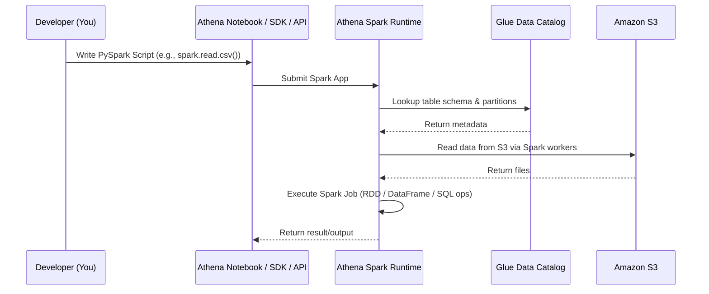

# 🧠 How Does PySpark Work in AWS Athena? 🐍⚙️

> _Is it still Presto under the hood? What engine is used? How does Athena run PySpark scripts?!_

---

## 📜 **Official Definition First**

> Amazon Athena **notebooks** allow you to run **PySpark** code on a **serverless Spark runtime** managed by AWS. This lets you do data engineering, exploratory analysis, and ETL — without provisioning infrastructure.

🎯 _This is **Athena for Apache Spark**, not regular Athena (Presto-based SQL)._  
These are **two different runtimes** under the hood, though both share the **Athena console** UI.

---

## ⚙️ Architecture: Athena (SQL) vs Athena for Apache Spark

| Feature / Runtime    | Athena (SQL)            | Athena for Apache Spark                                 |
| -------------------- | ----------------------- | ------------------------------------------------------- |
| Underlying Engine    | **Presto / Trino**      | **Apache Spark 3.x**                                    |
| Language             | ANSI SQL                | PySpark (Python + Spark)                                |
| Ideal Use Case       | Ad-hoc queries on S3    | Exploratory data analysis, ETL, complex data processing |
| Entry Point          | Query editor, JDBC, API | Jupyter-style notebooks in Athena or API                |
| Serverless?          | ✅ Yes                  | ✅ Yes                                                  |
| Parallel Processing? | ✅ Yes (MPP model)      | ✅ Yes (Spark executors)                                |

---

## 🔍 How It Works Behind the Scenes

### ✅ You’re actually using **Apache Spark under the hood**, not Presto

Amazon has built a **managed, serverless Spark runtime** into Athena that launches Spark clusters **on demand**, just like Glue, but faster to start and easier to use via notebooks or scripts.

---

### 🔁 PySpark Job Flow in Athena (Visualized)



---

## 🧰 Example PySpark Code You Can Run

```python
df = spark.read.option("header", "true").csv("s3://my-bucket/data/sales.csv")

# Perform some transformation
df_filtered = df.filter(df["year"] == "2023")

# Save back to S3
df_filtered.write.mode("overwrite").parquet("s3://my-bucket/output/sales_2023")
```

This runs **on Spark** behind the scenes — _you don't manage clusters, executors, or memory_ — AWS takes care of it.

---

## ⚙️ What Happens Behind the Curtain (Detailed Breakdown)

| Step                              | What Happens                                                             |
| --------------------------------- | ------------------------------------------------------------------------ |
| You submit PySpark code           | Through Athena notebook or API                                           |
| AWS provisions Spark environment  | Athena launches a **Spark application**, with a **driver and executors** |
| Spark initializes                 | Glue Data Catalog is used (if querying tables)                           |
| Data is read from S3              | Executors pull data in parallel (CSV/Parquet/ORC)                        |
| Execution graph (DAG) is built    | Spark does lazy evaluation                                               |
| Job runs in parallel              | RDDs, transformations, actions are run                                   |
| Results returned or written to S3 | You can display, store, or visualize                                     |

---

## 🚀 What Makes It Different from Glue?

| Feature          | Athena for Spark              | AWS Glue Spark Jobs       |
| ---------------- | ----------------------------- | ------------------------- |
| Startup time     | ⚡ Fast (<10 sec)             | 🐢 Slower (~60 sec)       |
| Interface        | Athena notebook / SDK         | Glue Studio / Scripts     |
| Use case         | Ad-hoc, exploratory           | Scheduled pipelines       |
| Pricing          | Per session (\$ per DPU-hour) | Per job (\$ per DPU-hour) |
| Session duration | Up to 5 mins idle             | Longer sessions           |

📌 _Athena Spark is better for short, interactive analysis._  
📌 _Glue Spark is better for production ETL pipelines._

---

## 🧪 When Should You Use PySpark in Athena?

✅ Great for:

- Building **data frames** for visual inspection
- Creating **ML training datasets**
- Writing **quick ETL logic** before saving to S3
- Using Spark SQL with Glue catalog tables
- No-infra experimentation with Spark

❌ Not ideal for:

- Long-running production pipelines
- Jobs needing custom JARs or libraries
- Ultra-low latency responses

---

## ✅ Summary

- **Yes**, PySpark in Athena runs on **Apache Spark** (not Presto).
- Athena Spark is a **managed, serverless Spark runtime** integrated into Athena UI.
- Ideal for **interactive, exploratory, data engineering** work — not batch ETL.
- Uses **Glue** for schema, and **S3** for storage.
- Behind the scenes: Spark driver + workers are spun up automatically, run your job, and disappear 💨.

---

## ❓Want More?

Would you like a follow-up topic on:

- ✨ How Glue Data Catalog powers both SQL & Spark in Athena?
- 🧱 Spark execution architecture in more depth (driver, stages, RDD lineage)?
- 🧼 Cleaning, transforming and joining large datasets with PySpark?
