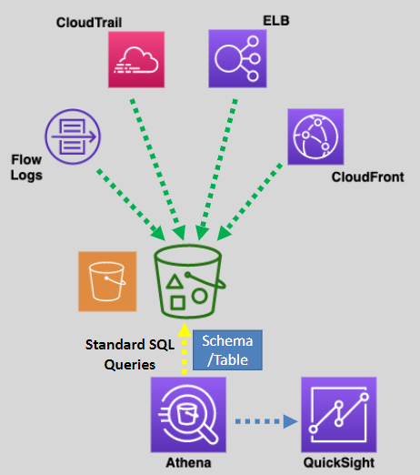

# AWS Athena: Simplified Guide for Beginners 🎯

Amazon Athena is a **serverless query service** that allows you to analyze data directly in **Amazon S3** using standard SQL. It's ideal for quick, ad-hoc analysis without the need to set up or manage infrastructure.

    

---

## 🌟 **What is AWS Athena?**

Think of Athena as a tool to quickly ask questions about your data stored in **S3** and get answers back using SQL. You don’t need to load the data anywhere or manage any servers—it’s all taken care of by AWS.

---

### 🛠️ **Key Features**

1. **Serverless**:

   - No need to manage any infrastructure. You simply run queries, and Athena takes care of the rest.

2. **Wide Data Format Support**:

   - Works with data stored in formats like **CSV**, **JSON**, **Apache Parquet**, **Avro**, and **ORC**.

3. **Schema-on-Read Technology**:

   - You define how your data is structured _after_ it’s stored in S3, making it flexible for diverse datasets.

4. **Data Visualization**:

   - Integrates with **Amazon QuickSight** to create dashboards and visualizations from your query results.

5. **Security**:

   - Can query **encrypted data** in S3 and encrypt query results for added security.

6. **Scalability**:

   - Automatically scales based on your query workload.

7. **Storage of Results**:

   - Query results are stored in **S3** in `.csv` format for easy access and further processing.

8. **Query Retention**:
   - Retains query history and results for **45 days** for easy reference.

---

---

## 🔄 **What Can You Do with Athena?**

1. **Ad-Hoc Queries**:

   - Perfect for exploring datasets or investigating issues in real time.

2. **Data Exploration**:

   - Query large datasets without needing to load them into a database.

3. **Business Intelligence (BI)**:
   - Combine with **QuickSight** to create reports and dashboards for your organization.

---

## ⚖️ **Athena vs Redshift Spectrum**

| **Feature**                                  | **Athena**                                         | **RedShift Spectrum**                                       |
| -------------------------------------------- | -------------------------------------------------- | ----------------------------------------------------------- |
| **Compute (Serverless?)**                    | Fully serverless.                                  | Serverless, but requires Redshift clusters (higher cost).   |
| **Complex Joins, Queries, and Aggregations** | Not ideal for heavy computations.                  | Perfect for complex queries and analytics.                  |
| **Ad-Hoc SQL Queries**                       | Ideal for quick, simple queries.                   | Not designed for this use case.                             |
| **Can Query Data in S3 Without Loading It**  | Yes.                                               | Yes.                                                        |
| **Use Case**                                 | Quick analysis of data in S3 for BI and reporting. | Ideal for advanced analytics with high computational needs. |

---

## 🧠 **When Should You Use Athena?**

1. **Quick Insights**:

   - Need answers from your S3 data _fast_ without setting up a database.

2. **Cost Efficiency**:

   - Ideal for small datasets or occasional queries since you only pay per query.

3. **Simpler Workloads**:
   - Great for applications that don’t require heavy computations or complex joins.

---

## ✅ **Conclusion**

Amazon Athena is the perfect tool for analyzing data in **S3** without the complexity of managing infrastructure. It’s **fast**, **cost-effective**, and works out of the box for ad-hoc queries and lightweight reporting. Whether you're analyzing logs, exploring data, or creating dashboards, Athena makes it easy to derive insights without being a data expert.
