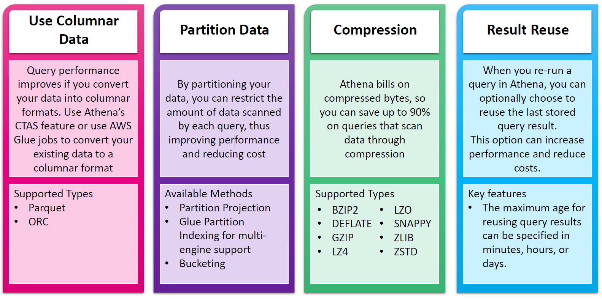

# 💸 Athena Queries Optimization

Amazon Athena is great out of the box—but if you're working with _tons_ of data, you’ll quickly realize that your queries could either sip data like a fine espresso ☕️ or gulp it like a fire hose 🌊. The trick? Optimization!

Athena charges based on the **amount of data scanned per query**. So if you're not careful, even a small query can rack up costs 💸 and wait times ⏱️.

`Optimization = speed + savings + smiles`.

---

<div style="text-align: center;"></div>

---

## 🧱 1. Use Columnar Data Formats 📦

### ✅ What It Is

Instead of storing data row-by-row (like CSV), use **columnar formats** like **Parquet** and **ORC**. They allow Athena to **read only the columns you need**, skipping the rest.

### 🚀 Why It Matters

- Faster query performance (skip irrelevant data)
- Less data scanned = lower cost
- Better compression

### 🛠️ How To Apply

You can convert data using:

- **AWS Glue ETL Jobs**
- **CTAS (Create Table As Select)** in Athena

```sql
CREATE TABLE my_table_parquet
WITH (
  format = 'PARQUET',
  external_location = 's3://my-bucket/optimized/'
)
AS SELECT * FROM my_raw_table;
```

---

## 🧩 2. Partition Your Data 🗂️

### ✅ What It Is

**Partitioning** splits your data into logical chunks (e.g., by `date`, `region`, `product_id`).

### 🚀 Why It Matters

- Athena reads only the partitions you query 🎯
- Scans less data = faster queries + reduced cost

### 🛠️ How To Apply

- Create partitions manually or with a **Glue Crawler**
- Or use **Partition Projection** (automatic inference)

```sql
-- Example manual partitioning
CREATE EXTERNAL TABLE sales_data (
  transaction_id string,
  amount double
)
PARTITIONED BY (year int, month int)
LOCATION 's3://my-bucket/sales_data/';
```

Then load partitions:

```sql
MSCK REPAIR TABLE sales_data;
```

---

## 🧃 3. Compress Your Data 💾

### ✅ What It Is

Compress your files using supported formats: **GZIP**, **SNAPPY**, **ZSTD**, and others.

### 🚀 Why It Matters

Athena charges per **compressed byte scanned**, not uncompressed. You can **save up to 90%**!

### 💡 Best Practice

Use **columnar + compression** for _maximum boost_ (e.g., Parquet + Snappy = 🥰).

---

## ♻️ 4. Reuse Query Results 🧠

### ✅ What It Is

Athena can **cache query results** and reuse them if the query is identical and the data hasn't changed.

### 🚀 Why It Matters

- Zero data scan = \$0 cost
- Instant results ⚡️

### 🛠️ How To Enable

- Enable result reuse in the workgroup settings.
- Set expiration (e.g., 1 hour, 1 day).

```bash
# UI-based toggle in Workgroup Settings
```

> 📌 **Tip:** Great for dashboards and repeated reports where data isn’t constantly changing.

---

## 🛠️ Bonus: Bucketing (Advanced) 🎲

If you need better performance on large joins, **bucketing** your data into hashed groups can help.

```sql
-- Bucketing isn’t always needed, but worth exploring for massive joins
```

---

## 🔬 Real-World Example: CSV vs Parquet

Imagine you're analyzing 1 million customer records:

| Format  | Data Size | Time to Query | Data Scanned | Cost     |
| ------- | --------- | ------------- | ------------ | -------- |
| CSV     | 500 MB    | 3.2 seconds   | 500 MB       | \$\$\$\$ |
| Parquet | 90 MB     | 0.8 seconds   | 90 MB        | 💸 (low) |

> 🧪 Parquet + compression + partitioning = 🔥 blazing fast queries!

---

## 🎯 Summary Cheat Sheet

| Optimization Technique | Benefit                        | Tools/Features Used              |
| ---------------------- | ------------------------------ | -------------------------------- |
| Columnar Format        | Faster scans, lower cost       | Parquet, ORC, CTAS, Glue Jobs    |
| Partitioning           | Scan only relevant data        | Manual, Glue Crawler, Projection |
| Compression            | Pay for compressed bytes only  | Snappy, GZIP, ZSTD, etc.         |
| Result Reuse           | Instant results, \$0 scan cost | Workgroup Settings               |

---

## 🤓 Final Thoughts

Optimizing queries in Athena isn’t rocket science—it’s just **smart data engineering**. Treat your Athena queries like race cars: give them the right fuel (columnar), clean tires (partitions), turbo (compression), and a shortcut to the finish line (result reuse).

> ⚠️ **Remember:** The less you scan, the less you pay. And the faster you get results. Your CFO and your users will thank you. 💸💙

---

Want to go deeper into **federated queries**, **UDFs**, or **Athena + Apache Iceberg**? Let me know and I’ll prep a new topic for that too!

Would you like this as a downloadable Markdown or PDF?
