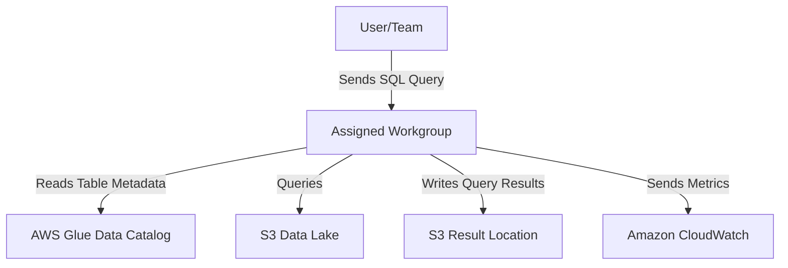

# 🧠 Workgroups in Amazon Athena: Isolate, Monitor, and Save

Amazon Athena is a query beast when it comes to analyzing your S3 data with SQL. But when you have **multiple users, teams, or applications** accessing Athena—things can get messy (and expensive 💸).

Enter: **Workgroups** 🚪—your ultimate tool to **organize**, **control**, and **optimize** your Athena usage.

---

## 🧾 What is a Workgroup in Athena? 🧑‍💻

> **Official Definition:**  
> A **workgroup** in Amazon Athena is a logical grouping of queries and users that lets you control **access**, set **data usage limits**, enforce **security policies**, and **track costs** separately.

Imagine having a separate whiteboard and marker for each team in a shared meeting room—clean, isolated, and nobody messes with anyone else’s work. That’s what workgroups do in Athena.

---

## 🏗️ Why Use Workgroups?

### 🔒 **Isolation**

Separate workloads by:

- Teams (e.g., Marketing vs. Finance)
- Applications (e.g., BI dashboards vs. Data Pipelines)
- Environments (e.g., Dev, Test, Prod)

### 💰 **Cost Controls**

- Prevent junior analysts from accidentally scanning 100 TB of logs 😅
- Set query-level or workgroup-level scan limits

### 📊 **Monitoring & Metrics**

- View per-workgroup stats in **CloudWatch**
- Track: queries run, bytes scanned, failures, execution time

### 🎯 **Access Control**

- IAM policies can restrict users to specific workgroups (like database schemas but for Athena!)

---

## 🛠️ How Workgroups Work: Under the Hood 🧰



---

## 🧪 Real-World Scenario

Let’s say your **Marketing** team needs access to ad data, and **Finance** needs sales data.

With workgroups:

- Marketing can query their data only
- Finance can’t peek into Marketing’s tables
- Each has separate result buckets
- Both are cost-monitored and capped 💸

---

## ⚙️ Setting Up a Workgroup in 2 Steps

### ✅ Step 1: Create the Workgroup

- Go to **Athena Console > Workgroups > Create Workgroup**
- Choose:
  - Query engine (e.g., Athena SQL or Apache Spark)
  - S3 result location
  - Engine version
  - Authentication method (IAM or IAM Identity Center)
  - Optional cost limits & CloudWatch logging

🎯 Example setting:

| Setting            | Value                          |
| ------------------ | ------------------------------ |
| Name               | `finance-team-wg`              |
| Engine             | Athena SQL                     |
| Result Bucket      | `s3://athena-finance-results/` |
| Query limit        | 1 GB/query                     |
| Workgroup limit    | 5 TB/day                       |
| CloudWatch Logging | Enabled ✅                     |

---

### ✅ Step 2: Apply IAM Policy

To control who can access this workgroup, attach a **resource-based IAM policy** to your users/roles:

```json
{
  "Version": "2012-10-17",
  "Statement": [
    {
      "Effect": "Allow",
      "Action": ["athena:StartQueryExecution", "athena:GetQueryExecution"],
      "Resource": ["arn:aws:athena:region:account-id:workgroup/finance-team-wg"]
    }
  ]
}
```

> 🔐 Bonus: Attach policies for **S3**, **Glue**, and **CloudWatch** if needed.

---

## 🧯 Workgroup Cost Control Features

Athena lets you proactively control query costs using built-in settings:

| Feature                   | Description                                           |
| ------------------------- | ----------------------------------------------------- |
| **Per-query limit**       | Cancel queries scanning > X GB                        |
| **Workgroup daily limit** | Cancel all queries after a threshold (e.g., 5 TB/day) |
| **Alarms (via SNS)**      | Trigger alerts when usage crosses limits              |
| **Disable workgroup**     | Auto-disable if limits are hit 🚨                     |

---

## 📈 Monitoring Workgroups with CloudWatch

Workgroup metrics available:

- `ProcessedBytes`
- `TotalQueries`
- `FailedQueries`
- `ExecutionTime`

📌 Viewable via:

- Athena Console
- CloudWatch Dashboards
- Programmatically (e.g., via CLI)

---

## 🧠 Best Practices Cheat Sheet

| Goal                     | Workgroup Feature                    |
| ------------------------ | ------------------------------------ |
| Limit team cost exposure | Per-query + Workgroup limits         |
| Track team usage         | Enable CloudWatch metrics            |
| Isolate workloads        | Create one workgroup per team or app |
| Secure data access       | Use IAM resource-level policies      |
| Debug slow queries       | Monitor execution time via metrics   |

---

## 🎉 Wrap-Up

Workgroups in Athena are like giving everyone their own **sandbox** 🪣:

- Keep costs in check 💸
- Improve security 🔐
- Gain visibility 📊
- Empower teams independently ⚙️

Whether you're running SQL queries or PySpark jobs, **organizing via workgroups is a must-do for production-grade Athena usage.**
