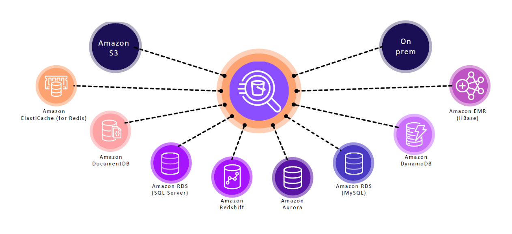
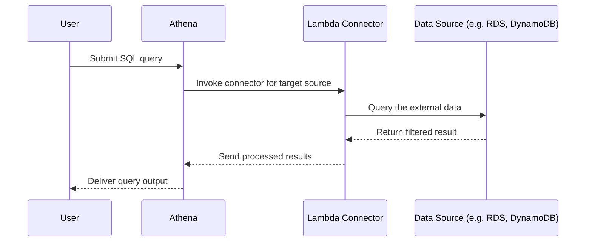

# 🌐 Federated Query in Amazon Athena: Query Across Data Sources Like a Boss

Welcome to the world of _“analyze-anything-from-anywhere”_ using **Athena Federated Queries**! 🎯  
Gone are the days when all your data lived happily in one single database. Now it’s scattered across:

- S3
- RDS / Aurora
- DynamoDB
- On-prem databases
- 3rd party APIs  
  …you name it.

So, how do you run a **single SQL query** that magically pulls data from all these places?

> ✨ **Athena Federated Queries** to the rescue!

---

---

## 🧾 What is a Federated Query? 📖

> **Official Definition:**  
> A _federated query_ in Amazon Athena lets you query **relational, non-relational, object, or custom data sources** without moving data. It executes SQL queries **in-place**, where the data actually resides.

That means you can join your **S3 logs** with **MySQL customer data** and **DynamoDB user events** in one query. 🤯

---

## ⚙️ How Does It Work Behind the Scenes? 🛠️

Here’s the magic under the hood:

### 🔌 Key Components

| Component             | Role                                                              |
| --------------------- | ----------------------------------------------------------------- |
| **Athena**            | SQL query executor                                                |
| **Lambda Function**   | Executes logic to connect to data source                          |
| **Connector**         | A plugin (Lambda code) that understands how to talk to the source |
| **Spill Bucket (S3)** | Temporary storage for intermediate results (required!)            |

---

## 🚀 Why Use Federated Queries?

### ✅ No ETL Needed

Query live data without moving or transforming it.

### ✅ One Query to Rule Them All

Join and filter across services like **S3**, **Aurora**, **DynamoDB**, and more in one SQL.

### ✅ Serverless + Scalable

Athena and Lambda handle everything—parallelism, retries, scaling.

---

## 🧪 Real-World Use Case: E-Commerce Platform Example 🛍️

Let's imagine an e-commerce platform with these data sources:

| Data Source | Location | Purpose         |
| ----------- | -------- | --------------- |
| `products`  | HBase    | Product catalog |
| `orders`    | Aurora   | Order data      |
| `sessions`  | DynamoDB | User sessions   |
| `logs`      | S3       | Access logs     |

Now your analyst wants to ask:  
**“Show me all orders from customers in session X, along with product details and recent access logs.”**

You write one **SQL** query in Athena → Lambda connectors translate the query → each data source responds → Athena joins and delivers results.

Boom. Done. ✅

---

## 🔌 Available Data Source Connectors

### 🧰 AWS Provides Pre-Built Connectors For

- RDS / Aurora (MySQL, PostgreSQL)
- DynamoDB
- Redshift
- CloudWatch Logs
- JDBC-compatible sources (MongoDB, Snowflake, etc.)

📦 You can deploy these from the **Athena Console** or the **Serverless App Repository**.

---

## ✍️ Want to Connect to Something Custom?

Use the [Athena Federated Query SDK](https://docs.aws.amazon.com/athena/latest/ug/connectors-overview.html) to write your own Lambda connector using:

- Java
- Python (via wrappers)
- Custom JDBC drivers

You can even wrap REST APIs or on-prem DBs using a secure VPC + Lambda combo.

---

## 📦 Setup Requirements Checklist

| Step                             | Description                                               |
| -------------------------------- | --------------------------------------------------------- |
| ✅ **Spill Bucket**              | S3 bucket for query output (must be versioned)            |
| ✅ **Connector Deployment**      | Deploy from Serverless App Repo or build your own         |
| ✅ **Glue Catalog Registration** | Register your external source via `CREATE EXTERNAL TABLE` |
| ✅ **Permissions**               | IAM role for Athena to invoke Lambda                      |
| ✅ **VPC Access (Optional)**     | For on-prem or private data sources                       |

---

## 🧠 Best Practices

| Tip                                          | Benefit                                              |
| -------------------------------------------- | ---------------------------------------------------- |
| Use **filter pushdown**                      | Reduce data scanned by filtering early in the source |
| Deploy **connectors in the same region**     | Reduce latency and cost                              |
| Enable **Spill bucket logging**              | Troubleshoot large queries                           |
| Set **timeouts and memory limits** on Lambda | Prevent runaway queries                              |

---

## 💬 Final Thoughts

Athena Federated Queries let you do the _impossible_ with simple SQL.

🔥 No more manual joins, no more data pipelines. Just plug, query, and play.

> Whether it’s **MySQL**, **MongoDB**, **S3**, or your grandpa’s Oracle server in the basement—Athena's got your back.

---

## 📌 Coming Up Next?

Wanna dive into **hands-on setup**, **building your own connector**, or explore **federated query performance optimization**?

Let me know, and we’ll go deep! 🛠️💡
