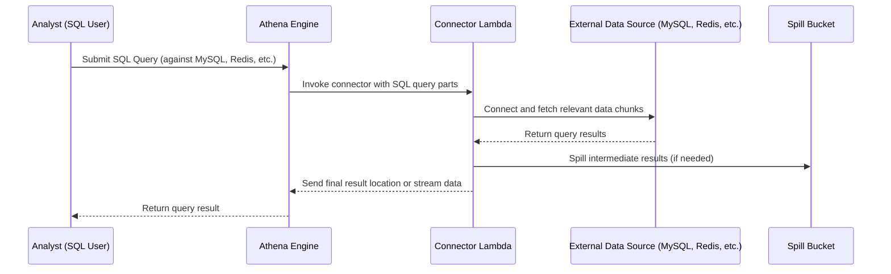

# 🧠 How Lambda Works with Federated Queries in Amazon Athena

_💬 “Isn’t Lambda limited to 15 minutes? So how can it handle big, long-running federated queries across databases?” — Great question, let's dive deep._

---

## 📚 Official Definition First

**Amazon Athena Federated Query** enables you to query data across multiple sources (relational, non-relational, on-prem, etc.) using standard SQL.  
To access non-S3 data, **Athena invokes data source connectors**, which are essentially **AWS Lambda functions** that **translate** and **proxy** the query execution.

---

## ⚙️ Behind the Scenes: How Federated Queries Use Lambda

Here’s what _actually_ happens when you run a federated query in Athena:



---

## ⏱️ The 15-Minute Lambda Timeout — How Is It Handled?

Here’s the **important part** you’re asking:

> 🧠 **“What if the query takes more than 15 minutes?”**

### ✅ Answer: Lambda never runs the **entire** query job in one shot

Instead, AWS Athena **splits the SQL query into smaller tasks**, and **each task is run as a separate Lambda invocation**.

Athena uses a **distributed query engine (based on Presto/Trino)**. That engine:

- Breaks down the query into stages and splits.
- Assigns a Lambda function (data source connector) to run each split.
- Coordinates and reassembles results internally.

Each **Lambda handles one chunk** of the data, runs for a **short duration (seconds to minutes)**, and exits.  
Athena **orchestrates the rest**.

So you never hit the Lambda 15-minute wall, **unless your split unit is too large** or the connector is poorly written (e.g., slow queries or huge data scans in one go).

---

## 📦 What's the Role of the Spill Bucket?

You’ll always need to configure a **spill bucket (S3)**. Why?

- Lambda functions are stateless with limited memory (up to 10GB).
- If result sets or intermediate data exceed that, **the Lambda spills to S3**.
- Athena then reads from that **spill location** to continue processing or finalize results.

📌 Think of it as **swap memory for your Lambda query jobs**.

---

## 🔌 What Are These Lambda “Connectors”?

They are Lambda functions using the **Athena Query Federation SDK**:

- Prebuilt ones: for RDS, Redshift, MongoDB, CloudWatch Logs, etc.
- Custom ones: if your data source isn’t supported, you can code your own!

Every connector:

- Translates SQL from Athena into native queries (e.g., MySQL syntax)
- Handles pagination and filtering (pushdown predicates)
- Sends only the **relevant rows/columns** back

---

## 🧪 Real Example: DynamoDB Connector Flow

Let’s say you query:

```sql
SELECT * FROM dynamo_part WHERE category = 'engine' LIMIT 10;
```

Lambda flow:

1. Athena triggers the DynamoDB connector Lambda.
2. Lambda applies the `WHERE category = 'engine'` clause directly to DynamoDB using its SDK.
3. If result size > 6MB, it writes chunks to your **spill bucket**.
4. Lambda exits.
5. Athena fetches results and continues.

---

## 🔐 IAM and Permissions

Each connector Lambda needs:

- IAM permissions to access the **data source** (e.g., RDS, DynamoDB)
- Access to write to the **spill bucket**
- Execution role for **CloudWatch logging** and Lambda execution

---

## 🚨 Troubleshooting Scenarios

| Problem        | Cause                                 | Solution                                       |
| -------------- | ------------------------------------- | ---------------------------------------------- |
| Lambda timeout | Query split too large or inefficient  | Optimize query, filter more, increase pushdown |
| Out of memory  | Result too big for Lambda             | Ensure connector supports spilling to S3       |
| Missing data   | Glue catalog not synced (e.g., Redis) | Define schema manually or use Glue crawlers    |

---

## 🧵 Summary: Key Points to Remember

- ✅ Athena federated queries use Lambda **only as connectors**, not for full processing.
- ✅ Lambda functions are **short-lived, parallel, stateless workers**.
- ✅ Query orchestration and result collation is done by Athena's **Presto/Trino engine**.
- ✅ Large results or joins use **S3 spill buckets** to offload temp data.
- ✅ You can use **prebuilt connectors** or write custom ones using the Athena SDK.
- ✅ Works with all types: **RDS, DynamoDB, Redshift, HBase, Redis, DocumentDB, and even CloudWatch Logs!**

---

## 🤓 Fun Engineer Fact

> “Athena makes Lambda feel like a **mini Spark worker**, running in parallel on-demand—except you don’t have to manage any cluster.” 🔥

---

Want me to create a **hands-on guide** with one federated query example from S3 + MySQL + DynamoDB in one SQL statement? Or maybe walk you through **writing your own Lambda connector** using the Athena SDK?

Let me know 👇
