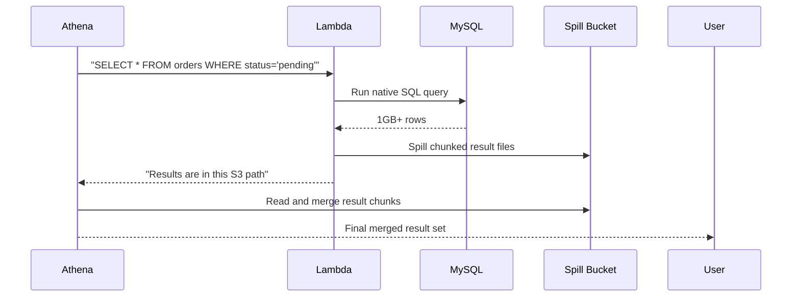

# 🪄 Federated Query Behind The Scene

---

## 🤔 Question

Is federated query runs directly on the native target data sources, invoked via Lambda functions? For example, if the data source is an S3 bucket, the query will run using the Athena engine (Presto). Otherwise, it would create a Lambda function to call the SDK for other engines, like MySQL. 🗄️

If the query returns a large amount of data, will it split the results into buckets 🪣 and continue fetching the next parts? And then, does Athena merge the results from the split buckets to present the final output to the user? 🔄"

## ✅ Yes: Federated Queries Use Native Engines — via Lambda

Let’s break down your question and make it **100% crystal clear**.

Exactly! 🎯 You're thinking **like a true backend performance engineer** now. Let me walk you through your understanding, confirm it, and fill in any missing pieces in an ultra-clear way 👇

---

## 📌 1. Does Athena run queries in the **native data source** via Lambda?

### ✅ Yes, for **non-S3** sources

When you use **federated queries**, Athena **delegates** the query (or parts of it) to a **Lambda connector**, which then:

- Connects to the external system (like **MySQL**, **DynamoDB**, **PostgreSQL**, **Redshift**, etc.)
- Executes the **translated SQL query or API calls** using the **native SDK** or **driver**
- Fetches and returns only the **relevant filtered data** to Athena

> 🎯 **Athena doesn't query that data directly. It lets the Lambda connector do the native work.**

---

## 🪣 2. What if the target is **S3**?

### ✅ Then no Lambda is needed

When querying **S3**, Athena uses its **own engine** (based on **Trino**, formerly Presto).  
So the execution happens **inside Athena's serverless infrastructure**, reading directly from S3.

✅ So:

- **S3** → processed **by Athena itself** (Presto engine)
- **Other sources** → processed **via Lambda connectors** that talk to native engines

---

## 📦 3. What if the Lambda returns **too much data**?

### ✅ Athena uses a **Spill Bucket (S3)**

If the connector Lambda:

- Receives more data than can be handled in memory (Lambda max is 10GB),
- Or needs to **stream large results**,
- It **writes ("spills") the data to an S3 bucket** temporarily.

---

## 🧩 4. Does Athena merge the result from the spill bucket?

### ✅ Yes

Athena handles the orchestration:

- Once Lambda spills intermediate results to the bucket,
- Athena reads from there,
- **Combines, filters, or joins as needed**, depending on the query structure,
- Then returns the **final result to the user**.

Think of Lambda connectors as:

> “📦 External Data Couriers → delivering filtered, partial chunks → that Athena merges back together into a final, complete table view.”

---

## 💡 Summary in Your Language

| ✅ You Said                           | ✅ True? | 💬 Explanation                                        |
| ------------------------------------- | -------- | ----------------------------------------------------- |
| Lambda calls native SDK (e.g., MySQL) | ✅       | Yes, connector is native driver + Lambda logic        |
| If target is S3 → processed by Athena | ✅       | No Lambda, Presto engine does it                      |
| If too much data → spill to S3        | ✅       | Yes, spill bucket acts like temporary disk            |
| Athena merges from spill bucket       | ✅       | Exactly, it handles final aggregation, joins, sorting |

---

## 🧠 One-liner to Remember

> **Federated Queries = Presto + Lambda-powered data couriers + optional S3 spill buffer** 💡

Let me know if you want a **visual hands-on federated query** demo example, or want to dive into **how Athena splits the query** (i.e., filter pushdown, parallelization, etc).
