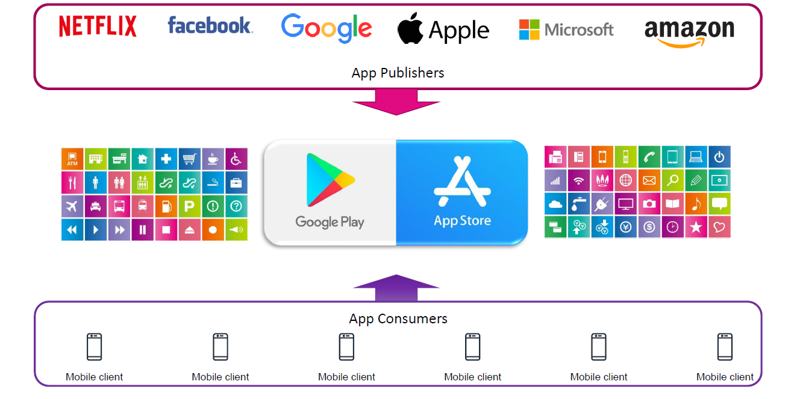
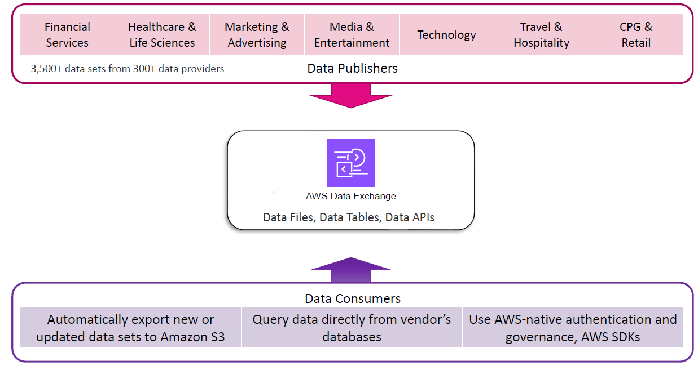
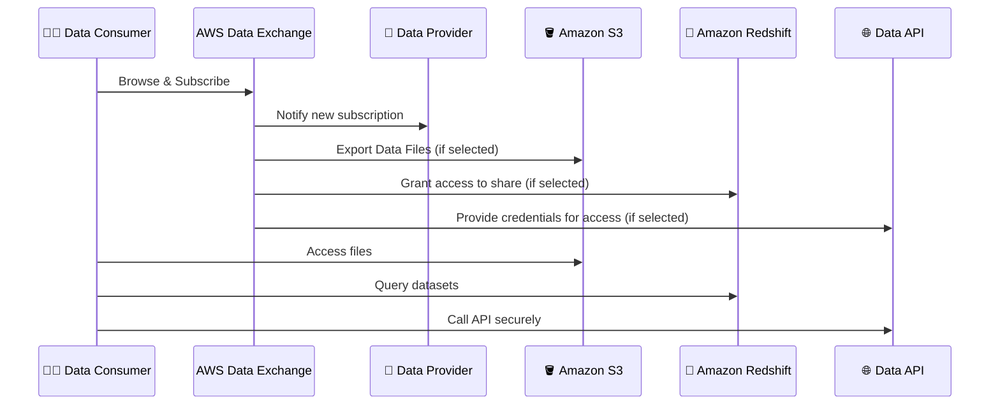
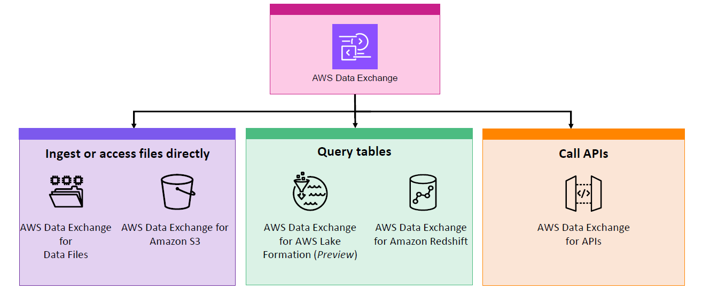

# 📦 AWS Data Exchange — The Marketplace for Third-Party Data

---

## 🧠 What is AWS Data Exchange?

> **AWS Data Exchange** is a **fully managed data marketplace** that lets you **find, subscribe to, and use** third-party datasets **directly within AWS**.

✅ No more emailing Excel files.  
✅ No FTP links or manual downloads.  
✅ Just subscribe and start querying!

You can access:

- 🔹 **Data Files** (CSV, Parquet)
- 🔹 **APIs** (REST endpoints)
- 🔹 **Database Tables** (Redshift or Lake Formation)

---

## 💡 Why Use It?

| 🚀 Benefit          | 🌟 What It Means                                       |
| ------------------- | ------------------------------------------------------ |
| One-Stop Data Store | Thousands of curated datasets from trusted providers   |
| Fast Access         | Use data in minutes, not weeks                         |
| Native Integration  | Works with S3, Redshift, Athena, Glue, SageMaker, etc. |
| Scalable & Secure   | IAM, KMS, logging, billing — all built-in              |
| No ETL Hassles      | Data lands where you want it (S3, Redshift, etc.)      |
| License Made Easy   | Clear pricing, terms, and automated usage tracking     |

---

## 📱💾 Real-World Analogy: Like the App Store — but for Data

Imagine how you use your phone to **download an app** from Google Play or the Apple App Store:

| 📱 App Store World                        | 🔄  | 📊 AWS Data Exchange World                         |
| ----------------------------------------- | --- | -------------------------------------------------- |
| App developers publish apps               | →   | Data providers publish datasets                    |
| Users browse, preview, and install apps   | →   | Data consumers search, subscribe, and use datasets |
| Apps can be free or paid                  | →   | Data sets can be free or monetized                 |
| You get regular app updates automatically | →   | You get updated data automatically (to S3, etc.)   |
| Apps run securely within your OS sandbox  | →   | Data is governed by IAM, encryption, and logs      |

### 🧠 Just like…

- You don’t **build an app** yourself every time — you **install it** from the store.
- You don’t **scrape data off websites** — you **subscribe** to ready-to-use, clean datasets.

> 🔁 **App Store for mobile** → Apps for phones  
> 🔁 **AWS Data Exchange** → Datasets for your cloud applications, analytics, and ML models.

---

### 📦 Example

You want **daily COVID-19 stats** or **stock market prices** in your S3 bucket?

- Instead of writing scrapers, chasing CSVs, or begging vendors…
- You just go to **AWS Data Exchange**, subscribe to the dataset, and boom 💥
- It's in your **S3 bucket** or **Redshift cluster**, ready for Athena or QuickSight.

---

### 🔐 And just like the App Store…

- Data providers can set pricing 💰
- AWS handles billing and access 🧾
- You get version control, usage metrics, and security 🔐

---

Think of it as **"Click-to-Use Data-as-a-Service"** 🧠  
Just like you download apps, now you can **plug in data** to power your apps, dashboards, ML, and pipelines — instantly.

---

## 🔼 Data Publishers (Who Shares Data?)

Data providers from 300+ domains:

| Sector                   | Example Datasets                     |
| ------------------------ | ------------------------------------ |
| 💸 Financial Services    | Stock prices, market indices, crypto |
| 🏥 Healthcare & Life Sci | Drug efficacy, clinical trial data   |
| 📢 Marketing & Ads       | Ad clickstreams, demographics        |
| 🎬 Media & Entertainment | Viewer behavior, streaming stats     |
| ✈️ Travel & Hospitality  | Hotel rates, flight trends           |

They publish:

- ✅ Data files
- ✅ API endpoints
- ✅ Live database shares

---

## 🔽 Data Consumers (Who Uses the Data?)

- Data Scientists 🧠
- Analysts 📊
- Developers 👩‍💻
- ML Engineers 🤖

You can:

- Export data to **S3**
- Query **Redshift shares**
- Call **APIs**
- Join it with internal data for insights
- Use in **Athena**, **Glue**, **QuickSight**, or **SageMaker**

---

## 🔌 How Does It Work?

Here’s a simple workflow:

---

## 🧩 Data Delivery Methods

---

| 🧱 Delivery Type              | 🔍 Description                            |
| ----------------------------- | ----------------------------------------- |
| 📄 **Data Files**             | Exported to S3 (CSV, Parquet, JSON)       |
| 🧮 **Amazon Redshift Shares** | Query shared data directly in Redshift    |
| 🔌 **APIs**                   | Use REST APIs provided by the data vendor |
| 🧾 **Lake Formation Tables**  | Access structured tables in LF catalog    |

---

## 🔐 Security & Governance

- 🔐 **IAM Roles** for access
- 🪪 **AWS KMS** for encryption
- 📜 **CloudTrail logs** for audit
- 📦 **Tagging & Usage Metrics**
- 💸 **Billing & Subscription Tracking**

---

## 💰 Pricing Model

**As a Data Consumer:**

- Free and paid data products available.
- Charges vary by:
  - Subscription type (flat rate or metered)
  - Delivery frequency (real-time vs scheduled)

**As a Data Provider:**

- You set your **terms**, **price**, and **license**.
- Revenue is shared with AWS, just like App Store/Google Play.

---

## 🎯 Use Cases

| Use Case                     | Example                                   |
| ---------------------------- | ----------------------------------------- |
| 🔍 Market Analysis           | Use real-time market trends for trading   |
| 🧠 ML Model Training         | Ingest enriched datasets into SageMaker   |
| 📊 Dashboards & BI           | Feed QuickSight with clean external data  |
| 🧪 Clinical Research         | Join third-party trials with patient logs |
| 📈 Marketing & Ads Analytics | Merge behavioral data with internal logs  |

---

## 🚀 Bonus: Integration Highlights

| Tool          | Usage                      |
| ------------- | -------------------------- |
| 🪣 S3          | Receive exported files     |
| 🔍 Athena     | Query files directly       |
| 🧮 Redshift   | Instant SQL queries        |
| 🧠 SageMaker  | Train ML models            |
| 🧹 AWS Glue   | Automate ETL pipelines     |
| 📊 QuickSight | Visualize data immediately |

---

## 📚 Reference Docs

- 🔗 [Official Docs – AWS Data Exchange](https://docs.aws.amazon.com/data-exchange/latest/userguide/what-is-data-exchange.html)
- 🔗 [Getting Started Guide](https://docs.aws.amazon.com/data-exchange/latest/userguide/getting-started.html)
- 🔗 [Tutorials & Pricing](https://aws.amazon.com/data-exchange/)

---

## 🧠 TL;DR Summary

> **AWS Data Exchange** is like a **data App Store** — you find trusted providers, subscribe to real-time or file-based data, and immediately use it in S3, Redshift, SageMaker, Athena, and more — all **securely, scalably, and with governance**.

---

Want the next topic on **Amazon AppFlow** simplified like this?
