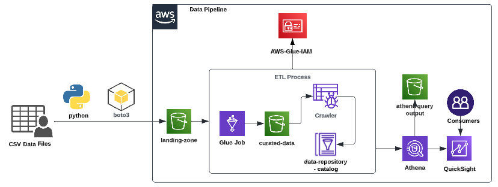

# AWS Data Pipeline: Simplifying Data Workflow Automation 🚀

AWS Data Pipeline is a **fully managed web service** designed to automate the **movement**, **transformation**, and **processing of data** across AWS services and on-premises systems. It provides a **scalable** and **flexible** way to build workflows for handling data efficiently.

---

  

---

## 🌟 **What is AWS Data Pipeline?**

AWS Data Pipeline is a service that allows you to:

- **Automate data workflows**: Move and process data without manual intervention.
- **Integrate data sources and destinations**: Connect data across AWS services like S3, RDS, DynamoDB, and Redshift.
- **Schedule and run jobs**: Execute tasks once or on a recurring schedule.

---

## 🛠️ **Key Features of AWS Data Pipeline**

1. **Data Movement**:

   - Easily transfer data between AWS services or between AWS and on-premises systems.

2. **Data Transformation**:

   - Perform **ETL (Extract, Transform, Load)** operations to prepare data for analytics or storage.

3. **Flexible Scheduling**:

   - Execute workflows **once** or **on a schedule**, such as hourly, daily, or monthly.

4. **Custom Pipelines**:

   - Use built-in pipeline definitions or create custom workflows tailored to your specific needs.

5. **Highly Scalable**:

   - Automatically scales resources to handle large data volumes.

6. **Error Handling**:
   - Automatically retries failed tasks and provides error notifications.

---

## 🔄 **How AWS Data Pipeline Works**

1. **Define a Pipeline**:

   - Specify the data sources, destinations, and transformations in a **pipeline definition**.

2. **Schedule and Execute**:

   - Set the frequency for running the pipeline (e.g., once, hourly, or daily).

3. **Monitor and Manage**:
   - AWS Data Pipeline monitors the progress and ensures each task is completed successfully. Errors are retried automatically or reported.

---

## 🔧 **Common Use Cases**

1. **Data Migration**:

   - Move data from on-premises systems or external sources to AWS services like S3, RDS, or Redshift.

2. **ETL (Extract, Transform, Load)**:

   - Prepare data for analytics by transforming raw data into structured formats.
   - Example: ETL data from S3 or DynamoDB into Redshift for business intelligence.

3. **Log Processing**:

   - Process unstructured data, such as logs and clickstreams, using EMR or custom scripts.

4. **Data Synchronization**:
   - Keep data synchronized between multiple AWS services or between on-premises systems and AWS.

---

## 🏗️ **Integration with AWS Services**

AWS Data Pipeline seamlessly integrates with:

- **Amazon S3**: Store and retrieve data.
- **Amazon RDS**: Process relational data.
- **Amazon DynamoDB**: Handle NoSQL data.
- **Amazon Redshift**: Load structured data for analytics.
- **Amazon EMR**: Process large datasets for ETL workflows.

---

## ✅ **Why Use AWS Data Pipeline?**

1. **Automation**:

   - Eliminates the need for manual data transfers or repetitive tasks.

2. **Flexibility**:

   - Supports a variety of data sources, formats, and destinations.

3. **Scalability**:

   - Handles large data volumes efficiently without additional configuration.

4. **Cost-Effective**:

   - Pay only for what you use, making it suitable for both small and large-scale workflows.

5. **Reliability**:
   - Built-in error handling and retry mechanisms ensure workflows run smoothly.

---

## 📚 **Conclusion**

AWS Data Pipeline is a versatile tool for automating and managing data workflows across AWS services and on-premises systems. Whether you’re migrating data, running ETL processes, or synchronizing data between sources, AWS Data Pipeline simplifies the process with **automation**, **scalability**, and **flexibility**. It’s an excellent choice for organizations looking to streamline their data handling processes and focus on deriving insights.
