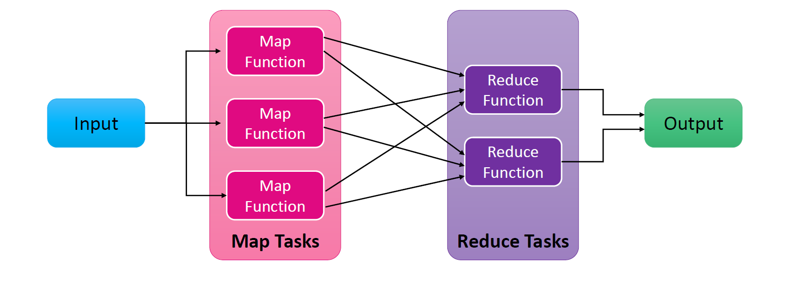
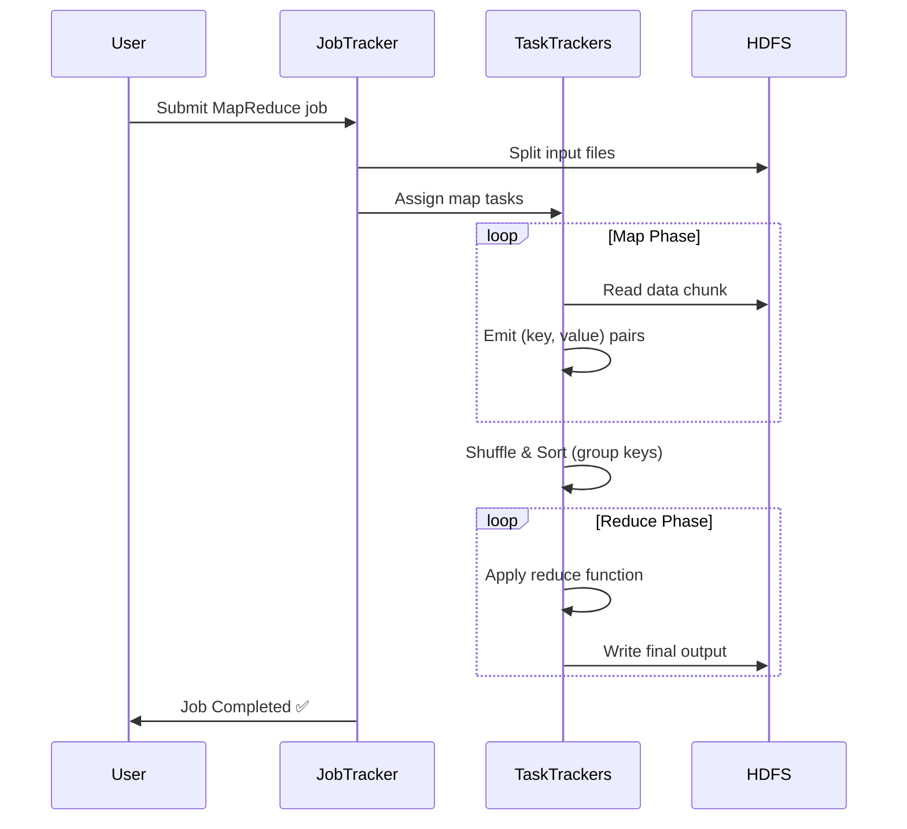
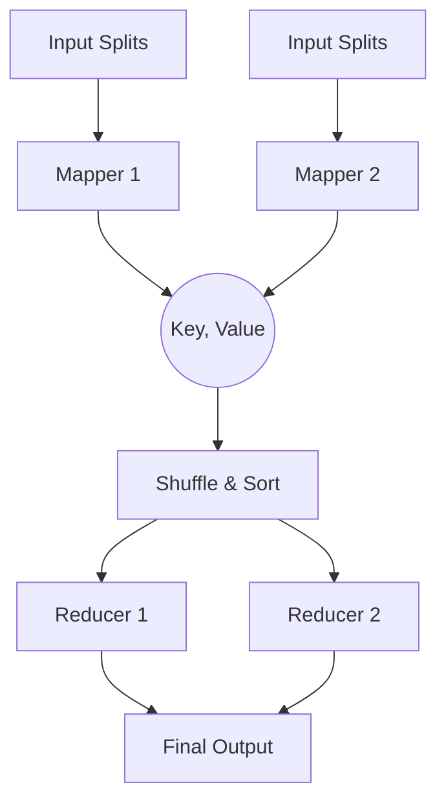

# 🗺️🔁 What is MapReduce?

<div style="text-align: center; border-radius: 8px; overflow: hidden; display: inline-block;">
    
</div>

---

## 📘 Official Definition

> **MapReduce** is a **programming framework** that allows you to **process large-scale data** in a **distributed and parallel** manner across clusters of computers.

Originally developed by **Google**, and later adopted by Apache Hadoop, it breaks down massive tasks into tiny chunks that can be executed in parallel.

---

## 🎯 Why Do We Need MapReduce?

Imagine analyzing **terabytes or petabytes** of data (logs, tweets, transactions, sensor data). Processing this amount of data on a **single machine** would take forever or simply fail.

💡 **MapReduce solves this by**:

- Splitting the task across **many machines** (parallelism)
- Processing data **closer to where it lives** (data locality)
- Handling **failures gracefully**

---

## 🧩 MapReduce = Map + Reduce

Let’s break it down:

| Phase     | Purpose                                    | Key Concept                        |
| --------- | ------------------------------------------ | ---------------------------------- |
| 🗺️ Map    | Transforms input data into key-value pairs | Think of it as data preprocessing  |
| 🔁 Reduce | Aggregates the key-value pairs             | Combines and summarizes the output |

---

## 🧵 Real-World Analogy: Word Count Example

Imagine you’re a teacher and you want to **count how many times each word appears in 100 books** 📚.

- You give **10 assistants** each 10 books.
- They read and write down counts like `("the", 500)`, `("apple", 20)`. (That's the **Map Phase**)
- Then, a few assistants combine all results: they add all `"the"` counts together. (That's the **Reduce Phase**)

Result? ✅ You get total word counts without reading all books yourself.

---

## 🔄 Sequence Diagram: MapReduce Workflow



---

## 🛠️ MapReduce Process: Step-by-Step

Let’s go deeper into how it works 👇

### 1️⃣ Input Splitting

- Input data is split into **blocks** (e.g., 128 MB each).
- Each block is processed in parallel.

### 2️⃣ Map Phase

- Each Mapper processes a split and produces **(key, value)** pairs.
- E.g., from a line `"apple banana apple"` → emits:
  - `("apple", 1)`
  - `("banana", 1)`
  - `("apple", 1)`

### 3️⃣ Shuffle & Sort Phase (Magic 🧙‍♂️ happens here)

- The framework **groups values by key** across all mappers.
- All values for `"apple"` from all mappers go to the same reducer.

### 4️⃣ Reduce Phase

- Each Reducer **sums or aggregates** values by key.
- For `"apple"` → `1 + 1 + 1 + 1 + 1 = 5`

### 5️⃣ Output Phase

- Final results are stored in HDFS or another distributed file system.

---

## 🖼️ Visual Diagram



---

## 🔍 Sample Code (Pseudo Code – Word Count)

```java
// Mapper
map(String key, String value):
    for word in value.split(" "):
        emit(word, 1)

// Reducer
reduce(String key, Iterator values):
    sum = 0
    for value in values:
        sum += value
    emit(key, sum)
```

---

## 📦 Where is MapReduce Used?

- Hadoop (classic)
- Amazon EMR (Elastic MapReduce)
- Log analysis
- Big data ETL pipelines
- Web crawling/indexing
- Fraud detection at scale

---

## ✅ Pros of MapReduce

- 🧠 **Simple programming model**
- 🧑‍🤝‍🧑 **Massive parallelism**
- 💥 **Fault-tolerant**
- 📦 **Scales to petabytes of data**

---

## ⚠️ Limitations

- 🐢 **Slow for real-time**: Not suitable for low-latency use cases
- 🔁 **Batch-oriented**: Not designed for streaming
- ⛓️ **High disk I/O**: Data is written between steps

---

## 🚀 Modern Alternatives

| Tool             | Use Case                         | Real-Time?        |
| ---------------- | -------------------------------- | ----------------- |
| **Apache Spark** | In-memory distributed processing | ⚠️ Near real-time |
| **Apache Flink** | Real-time stream + batch         | ✅ Yes            |
| **AWS Glue**     | Serverless ETL on AWS            | ⚠️ Not real-time  |
| **Apache Beam**  | Unified batch + stream model     | ✅ With runners   |

---

## 🧠 Final Thoughts

> MapReduce was revolutionary for **big data batch processing**.  
> While newer tools like **Spark and Flink** offer more performance and flexibility, understanding MapReduce helps you grasp the foundation of distributed computing!
