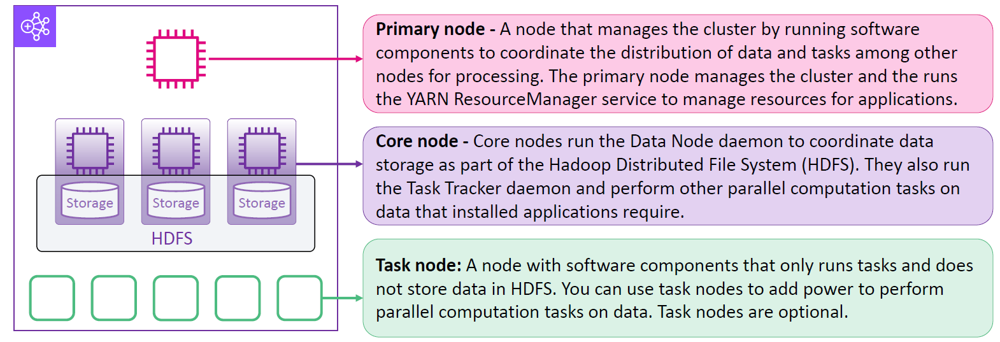
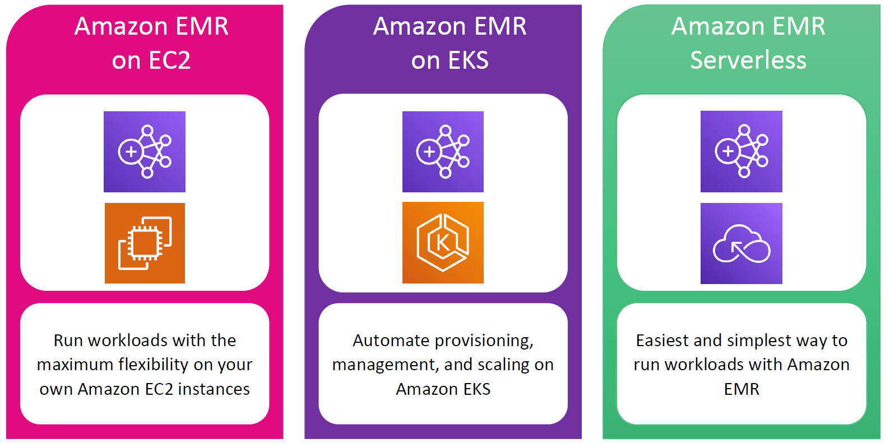
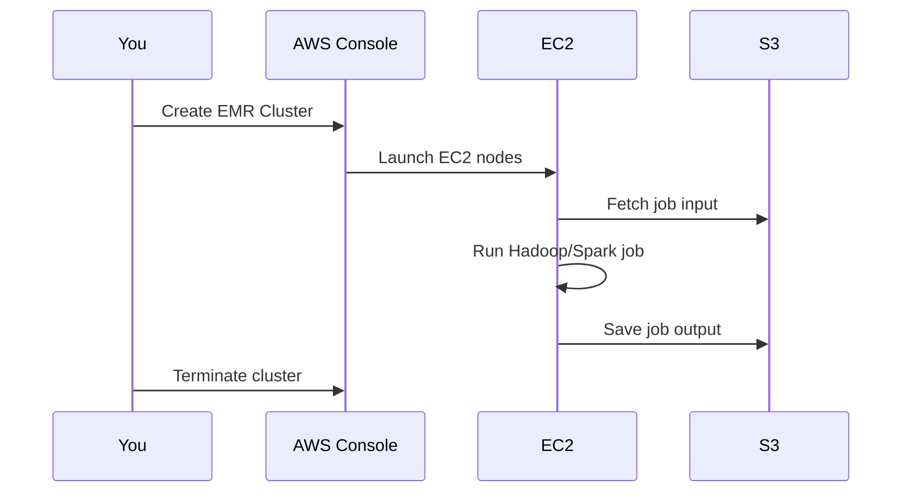

# ☁️🔥 What is Amazon EMR?

Amazon **EMR (Elastic MapReduce)** is a **managed big data platform** by AWS that allows you to **process massive amounts of data quickly and easily** using popular open-source frameworks like:

- **Apache Hadoop**
- **Apache Spark**
- **Apache Hive**
- **Apache HBase**
- **Presto**
- And more!

👉 Think of EMR as your **big data processing factory** in the cloud, ready to spin up hundreds of machines to crunch your data, then shut them down when the job is done.

---

## 📚 Why Use Amazon EMR?

Traditional on-premises big data setups are hard:

- ❌ Hardware setup
- ❌ Cluster management
- ❌ Patching, scaling, failover

**Amazon EMR** simplifies this:

- ✅ No upfront hardware
- ✅ Automated provisioning & scaling
- ✅ Pay-as-you-go
- ✅ Support for multiple processing engines

---

## 🧠 EMR Architecture

    

---

### 🎯 Primary Node (Master)

- Controls the cluster
- Runs **YARN ResourceManager**
- Manages job scheduling, cluster state

### 🧱 Core Nodes

- Store data via **HDFS**
- Run **DataNode** and **TaskTracker**
- Perform computations + storage

### ⚙️ Task Nodes (Optional)

- Run only **tasks**
- No storage
- Used to **scale out** computations

---

## 🚀 Deployment Modes

| Deployment Mode   | Best For                                   | Managed?  | Use Case                           |
| ----------------- | ------------------------------------------ | --------- | ---------------------------------- |
| 🖥️ EMR on EC2     | Full control over instances                | ❌ Manual | Long-running or complex clusters   |
| 🐳 EMR on EKS     | Container-based workloads                  | 🟡 Semi   | Modern container-based apps        |
| ⚡ EMR Serverless | Quick, one-time jobs without infra worries | ✅ Yes    | Ad-hoc processing, no admin needed |

---

    

---

## 💾 Storage Options in EMR

### 1️⃣ HDFS (Hadoop Distributed File System)

- **Fast** (local to cluster)
- **Temporary** (goes away when cluster shuts down)
- Ideal for **intermediate results, caching**

### 2️⃣ EMRFS (EMR File System)

- Connects Hadoop to **Amazon S3**
- Data **persists** after cluster termination
- **Decouples** compute from storage
- Ideal for **long-term storage & multiple clusters**

---

## 🏗️ Example: Word Count on EMR with Spark

1. Upload a `.txt` file to S3 (let’s say 10 GB of logs)
2. Start an EMR cluster with Spark
3. Run a Spark job to count word frequencies
4. Store output back into S3
5. Terminate the cluster

Result? ✅ Scalable, cost-efficient data processing.

---

## ⚖️ Benefits of Amazon EMR

| Benefit                | Why it matters                        |
| ---------------------- | ------------------------------------- |
| ⏱️ Fast provisioning   | Create clusters in minutes            |
| 💸 Cost-effective      | Pay only for what you use             |
| 🧠 Less admin work     | AWS manages patching, infra, scaling  |
| 🔄 Integration         | Works with Glue, Athena, S3, Redshift |
| 🛠️ Flexible frameworks | Supports Hadoop, Spark, Hive, Presto  |
| ⚡ Serverless option   | Zero infrastructure headache          |

---

## 🧪 Deployment Flow

---

## 🧰 Common EMR Use Cases

- ✅ **Log Analysis** using Spark
- ✅ **ETL Pipelines** with Hive & Hadoop
- ✅ **Machine Learning** preprocessing
- ✅ **Graph processing** with Apache Giraph
- ✅ **Genomics** or large scientific datasets

---

## 🔐 Security and Governance

- Integrated with **IAM**, **VPC**, **KMS**
- **Kerberos authentication** supported
- **Tagging**, **logging**, **CloudWatch metrics**

---

## 🧠 Summary

**Amazon EMR** is like spinning up your own **data-crunching supercomputer farm**—but with zero hardware and instant scaling. Whether you want control (EC2), flexibility (EKS), or simplicity (serverless), EMR gives you the tools to process your data efficiently.
