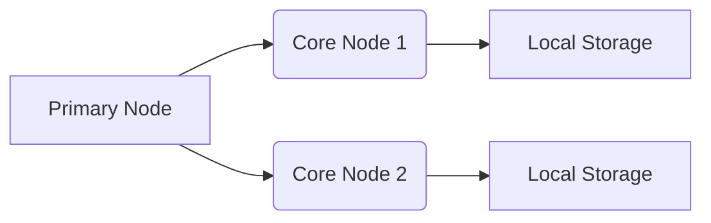

# 💾🛠️ Storage Options in Amazon EMR

> “Where should we keep our big data while it’s getting cooked and after it's done?” 🍳📦

When you're working with **Amazon EMR (Elastic MapReduce)**, storing and accessing data efficiently is **critical**. Your cluster is like a team of chefs (EC2 instances), and these chefs need a **kitchen (storage)** to work with your ingredients (data).

---

## 📦 1. HDFS (Hadoop Distributed File System)

### 📍 What is it?

HDFS is the **default file system** that comes with EMR clusters running on EC2. It **combines the local storage of core nodes** to form a distributed storage system.

### ✅ Advantages

- **🔥 Fast Access** – Data lives close to the processing engine
- **🧠 Data Awareness** – EMR knows _where_ the data is, and it schedules jobs close to the data for efficiency
- **💡 Ideal for:**
  - Caching intermediate results between steps
  - Disk I/O-intensive workloads
  - Iterative reads on the same dataset

### ❌ Disadvantages

- **💔 Ephemeral (Temporary)** – When the cluster shuts down, the data is gone 🫥
- Not suitable for long-term storage

---

## 🪣 2. EMRFS (EMR File System - S3 Backed)

### 📍 What is it?

EMRFS is a connector that allows **Hadoop & EMR to use Amazon S3** like a file system.

### ✅ Advantages

- **🧊 Persistent** – Data survives even if the cluster is terminated
- **📡 Decouples compute from storage** – You don’t need to keep core nodes alive just to store data
- **🔁 Reusable across multiple clusters** – Different EMR clusters can reuse the same data
- **💡 Ideal for:**
  - Large datasets
  - Data that’s read once per run
  - Retaining results for auditing, sharing, or ML model training

### ❌ Disadvantages

- **🐢 Slightly Slower** – Reading from S3 is slower than local HDFS
- Performance may vary, though **S3 Directory Buckets** improve it a lot

---

## 🧪 Example Use Case

Let’s say you’re running a job that:

1. Reads user activity logs from S3
2. Cleans and transforms the logs
3. Writes a summary report back to S3

> Use **EMRFS (S3)** here — because you need data to **persist**, and the job only **reads once** per run.

But if step 2 has 4 sub-steps like:

- Clean → Join → Aggregate → Format

And you want to **cache** intermediate results between those steps for speed?

> Use **HDFS** inside EMR for step-by-step caching ⚡

---

## 🗃️ Legacy & Local Storage Options (👴 Just FYI)

| Storage Type         | Description                    | Usage               |
| -------------------- | ------------------------------ | ------------------- |
| `file://`            | Local instance storage         | Rarely used         |
| `s3://`              | Legacy S3 access               | Replaced by EMRFS   |
| `s3n://` or `s3a://` | Old-style S3 access connectors | Not recommended now |

---

## 🛣️ Accessing Data in EMR

| File System | URI Example                      |
| ----------- | -------------------------------- |
| HDFS        | `hdfs://path/to/data`            |
| EMRFS (S3)  | `s3://my-bucket/folder/file.csv` |
| Local       | `file:///tmp/data.txt`           |

---

## 🔍 Quick Comparison

| Feature                | HDFS                          | EMRFS (S3)                    |
| ---------------------- | ----------------------------- | ----------------------------- |
| Speed                  | 🚀 Fast (local disk)          | 🐢 Slower (over network)      |
| Durability             | 💥 Temporary                  | ✅ Durable (S3)               |
| Use After Cluster Ends | ❌ Lost                       | ✅ Still Available            |
| Best Use Case          | Caching, iterative jobs       | Long-term storage, data reuse |
| Cost Efficiency        | ❌ Pay for EC2 storage always | ✅ Pay only for S3 used       |

---

## 🤹 When to Use What?

| Scenario                                 | Use            |
| ---------------------------------------- | -------------- |
| Intermediate step caching                | **HDFS**       |
| Re-running the same dataset repeatedly   | **HDFS**       |
| Keeping final job output for days/months | **EMRFS (S3)** |
| Sharing data across clusters             | **EMRFS (S3)** |
| Running short-term analysis jobs         | **EMRFS (S3)** |

---

## 🧠 Summary

Amazon EMR gives you **flexibility in storage**:

- Choose **HDFS** when performance and intermediate processing speed matter.
- Choose **EMRFS** (S3) when **durability, reusability, and cost-efficiency** are priorities.

The beauty? **You can use both at the same time** in the same EMR job 👏
