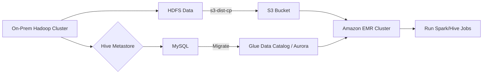

# 🧳🚀 Migrating Your On-Prem Hadoop Cluster to **Amazon EMR**

Migrating from your legacy, on-premises **Hadoop** environment to **Amazon EMR** can be a game-changer for scalability, cost savings, and operational simplicity—but like any move, it helps to understand the landscape 🗺️.

---

## 🏁 Why Migrate to Amazon EMR?

| Traditional Hadoop Challenges | Amazon EMR Benefits                   |
| ----------------------------- | ------------------------------------- |
| 🏗️ Complex cluster setup      | 🔧 Fully managed cluster provisioning |
| 💡 High maintenance overhead  | ☁️ Seamless AWS integration           |
| 🚪 Limited scalability        | 📈 Elastic scale-out/in               |
| 💵 CapEx infrastructure       | 💸 Pay-as-you-go model                |
| ⚙️ Manual patching            | 🔄 Auto-patching and upgrades         |

You get **Hadoop, Spark, Hive, Presto**, and other frameworks **fully managed**, running on EC2, EKS, or even **Serverless**.

---

## 🛠️ Migration Approaches and Support

### 🧭 AWS Migration Programs

AWS offers hands-on help through:

- 🧑‍🏫 **Expert Guidance** from AWS partners
- 🛠️ **Tools** for ingestion, transformation, and job migration
- 💰 **Financial incentives** (e.g., AWS credits) to offset costs

Use cases include:

- Hadoop & Spark Migration
- Data Warehouse to Amazon Redshift
- Elasticsearch to Amazon OpenSearch

AWS even offers [Self-Service Migration Guides](https://aws.amazon.com/emr/) and **Virtual Onsite Workshops**.

---

## 📦 Migrating Hive Metastore

> "What happens to my Hive tables, schemas, and metadata?"

Hive uses a **Metastore** (HMS) to store table schemas and metadata. If you’re using Hive, Impala, Presto, Hudi, or Spark SQL, you're already depending on it.

### 🧱 Options on EMR

| Option                       | Description                                     | Use Case                                                               |
| ---------------------------- | ----------------------------------------------- | ---------------------------------------------------------------------- |
| **Internal Metastore**       | Stored on **MySQL** in the EMR **Primary Node** | 🧪 Temporary jobs, ephemeral clusters                                  |
| **Amazon Glue Data Catalog** | Fully managed and scalable                      | 🔁 Multi-cluster support, Redshift & Athena integration                |
| **Amazon Aurora / RDS**      | External, self-managed metastore                | 🧩 Complex, open-source ecosystem support (e.g., Apache Ranger, Atlas) |

### ⚠️ Beware

- Internal metastore data is lost when the cluster is terminated (ephemeral).
- External metastore = persistent and shareable.

---

## 🛣️ Moving Data to EMR

You’ll likely need to move **TBs of data** from HDFS or local systems to **Amazon S3 or HDFS in EMR**.

### 📤 Use `s3-dist-cp` (Distributed Copy)

```bash
hadoop jar /usr/lib/hadoop/lib/emr-s3-dist-cp.jar \
  --src s3://my-source-bucket \
  --dest hdfs:///input-data \
  --srcPattern .*\.csv
```

- Parallelized copy (via MapReduce)
- Faster and optimized for S3
- Preinstalled in EMR
- Can be used as an EMR **step** or run from the **primary node**

### 🛠️ Other Tools

| Tool                  | Purpose                      |
| --------------------- | ---------------------------- |
| **AWS DataSync**      | Fast file transfers to S3    |
| **AWS DMS**           | For structured DB migrations |
| **Open-source tools** | Apache Nifi, Airflow, etc.   |

---

## 🧪 Realistic Scenario: Migrating a Hive + Spark Setup

### Before Migration

- Hadoop 2.7 on-prem
- Hive Metastore in MySQL
- Spark jobs running nightly
- Storage: HDFS

### Migration Plan

1. **Set up Amazon EMR cluster**
   - Choose EC2 or EMR Serverless
2. **Migrate Hive Metastore**
   - Dump and import into Amazon Aurora or Glue Catalog
3. **Copy Data**
   - Use `s3-dist-cp` to move raw files to S3
4. **Convert Jobs**
   - Update Spark job configs for new S3 input/output paths
5. **Validate**
   - Run jobs on EMR, compare with previous outputs

---

## 🧠 Pro Tips for Migration

✔️ Start small: Migrate one job or one department first  
✔️ Use Glue Catalog to avoid metadata loss  
✔️ Retain job history and logs in Amazon CloudWatch  
✔️ Build CI/CD pipelines to deploy EMR jobs  
✔️ Clean up and shut down on-prem infra once validated

---

## 📊 Diagram: Migration Flow



---

## 🏁 Summary

Migrating to Amazon EMR can:

- 💰 Save cost and effort
- 🔧 Simplify infrastructure
- 🌩️ Leverage powerful AWS analytics tools (e.g., Glue, Athena, Redshift)

With the right tools (`s3-dist-cp`, Glue, Aurora), **moving to EMR is smoother than you think**.

Would you like a guided example on migrating a Hive table or a full EMR lab? Let me know and I’ll prepare one!
