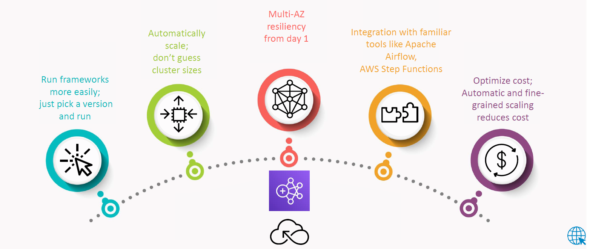
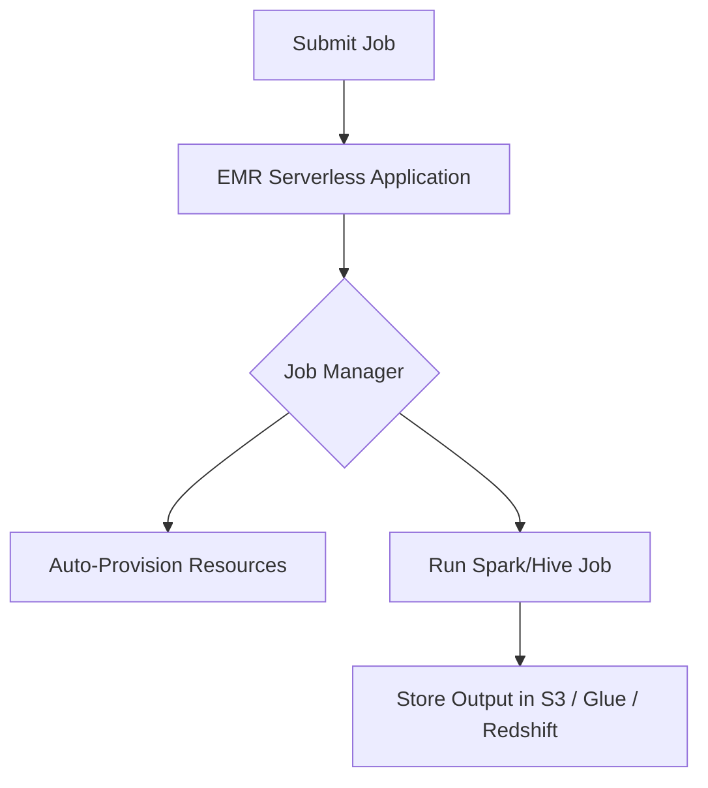

# ☁️🧠 **Amazon EMR Serverless**

**The Simplest Way to Run Big Data Applications without Managing Clusters!**



---

## 🧾 What Is Amazon EMR Serverless?

> **Amazon EMR Serverless** is a **serverless deployment option** in Amazon EMR that makes it easy to run **big data applications** without configuring, managing, or scaling clusters manually.

You just **submit your Spark or Hive jobs**, and EMR Serverless does the rest:

- ✅ Automatically provisions resources
- ✅ Automatically scales in/out
- ✅ Only charges for what you use
- ✅ No cluster setup required!

---

## 💡 Why Serverless for Big Data?

Running Apache Spark or Hive often means:

- Choosing EC2 instances
- Managing cluster configurations
- Worrying about idle resources

**EMR Serverless changes the game** by making this all disappear — you simply define **your job**, and AWS runs it **on-demand**.

---

## ⚙️ Supported Frameworks

| Framework          | Supported  |
| ------------------ | ---------- |
| 🟨 Apache Spark    | ✅ Yes     |
| 🐝 Apache Hive     | ✅ Yes     |
| 📅 Others (coming) | 🚧 Not yet |

---

## 🏗️ Architecture Overview



---

## ⚙️ How It Works

1. **Create EMR Serverless Application**
   - Define the framework (e.g., Spark)
2. **Submit Job**
   - Provide script (e.g., Python/SQL) & input/output
3. **EMR Serverless Provisions Resources**
   - Just the right amount of vCPUs & memory
4. **Job Runs**
   - EMR handles retries, scaling, and fault tolerance
5. **Results Saved**
   - To S3, Glue, Redshift, etc.

---

## 🚀 Features & Benefits

| Feature                      | Description                                                   |
| ---------------------------- | ------------------------------------------------------------- |
| 🔄 **Auto Scaling**          | Automatically scales based on job size & demand               |
| 💸 **Pay-as-you-go**         | You only pay for **vCPU-seconds** and **memory-seconds** used |
| ☁️ **No Cluster Management** | No EC2, no instance sizing, no cluster lifespan headaches     |
| 📈 **High Availability**     | Built-in fault tolerance and retry logic                      |
| 🔐 **Secure**                | Runs in your VPC with IAM-based access controls               |

---

## 📁 Storage & Data Sources

| Data Source                  | Integration           |
| ---------------------------- | --------------------- |
| 🪣 **Amazon S3**              | ✅ Fully Supported    |
| 📘 **AWS Glue Data Catalog** | ✅ For Hive Metastore |
| 🧮 **Amazon Redshift**       | ✅ Via connectors     |
| 🔗 **Custom JDBC / APIs**    | 🛠️ With Spark         |

---

## 🛠️ How to Set It Up

### 🎛️ Step 1: Create EMR Serverless Application

```bash
aws emr-serverless create-application \
  --name "MySparkApp" \
  --type SPARK \
  --release-label emr-6.9.0
```

### 📥 Step 2: Submit a Job

```bash
aws emr-serverless start-job-run \
  --application-id <app-id> \
  --execution-role-arn <role> \
  --job-driver '{
      "sparkSubmit": {
        "entryPoint": "s3://my-bucket/scripts/my-script.py"
      }
  }' \
  --configuration-overrides '{
    "monitoringConfiguration": {
      "s3MonitoringConfiguration": {
        "logUri": "s3://my-bucket/logs/"
      }
    }
  }'
```

### 📊 Step 3: Monitor Job

Check logs in **S3** or use the **EMR console** for real-time job status, metrics, and failures.

---

## 🧪 Example Use Case: Spark ETL Job

Imagine a Python script that:

1. Reads CSV files from `s3://sales-raw/`
2. Cleans and filters the data
3. Writes to `s3://sales-cleaned/`

You don't have to spin up clusters, just submit and let EMR Serverless scale for you! Perfect for:

- 🔁 Recurring jobs
- 🧪 A/B experiments
- 🧹 Data cleaning pipelines

---

## AWS EMR Serverless Workshop

### [Getting started with Amazon EMR Serverless](https://docs.aws.amazon.com/emr/latest/EMR-Serverless-UserGuide/getting-started.html)

## 💸text Pricing

You pay based on:

- **vCPU-seconds**
- **Memory-seconds**
- **Storage-seconds** (for intermediate shuffle)

Example:

- Run a Spark job that takes 5 minutes with 4 vCPUs and 8 GB RAM
- You’re billed **only for those 5 minutes** of compute and memory

📍 No charges for idle time!

---

## 📚 When to Use EMR Serverless

✅ Use it when:

- You have **spiky or unpredictable workloads**
- You want to **run jobs on demand**
- You don’t want to manage EC2 clusters

🚫 Avoid if:

- You need custom configurations or rare frameworks
- You require a **persistent cluster**

---

## 🧠 Summary

> **Amazon EMR Serverless** lets you run Spark and Hive without managing infrastructure. It’s the ultimate "just run my job" solution for big data.

### TL;DR

- ⚙️ Submit code
- ☁️ AWS runs it
- 🧼 You pay only for usage
- 😌 No servers, no clusters, no stress
