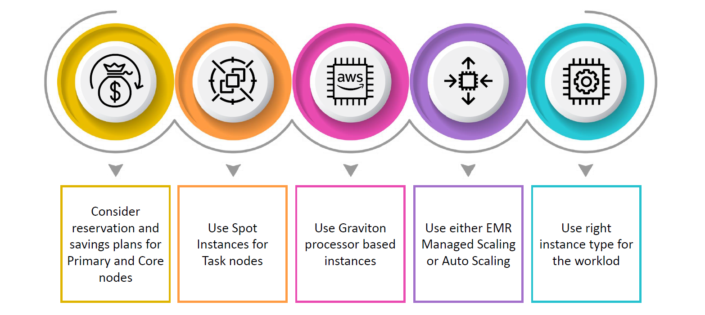
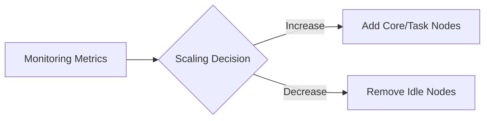

# 💰🚀 **Cost Optimization in Amazon EMR**

**Smart Ways to Save Big While Running Big Data Workloads!**

---

Amazon EMR (Elastic MapReduce) is a powerful managed platform to process vast amounts of data using frameworks like Hadoop, Spark, Hive, and more. But processing big data can get expensive _if you're not smart about it_.

This topic helps you master the **best practices for cost optimization** when running **Amazon EMR on EC2**. Let's break it down 🔍

---

    

---

## 📚 Prerequisite: Understand EMR Node Roles

Before optimizing costs, you need to understand how EMR clusters work.

Each EMR cluster consists of 3 types of nodes:

| Node Type   | Role                              | Can Be Optimized With             |
| ----------- | --------------------------------- | --------------------------------- |
| **Primary** | Controls cluster + job scheduling | Reserved Instances / Savings Plan |
| **Core**    | Store HDFS + process data         | Reserved Instances / Savings Plan |
| **Task**    | Process data only (no HDFS)       | Spot Instances 💸✅               |

✅ You can save big by **targeting each node with a different cost strategy**.

---

## 💸 Strategy 1: Use Spot Instances for Task Nodes

Spot Instances can be **up to 90% cheaper** than On-Demand pricing.

- **Task nodes** are perfect candidates, as they don't store HDFS data.
- If a Spot node gets reclaimed, your job might slow down a little, but no data will be lost.

📌 Set up task nodes with **instance fleets or instance groups** and configure Spot/On-Demand mixes.

---

## 🧾 Strategy 2: Reserve Primary & Core Nodes

Use **Reserved Instances (RI)** or **Savings Plans** for:

- **Primary Nodes** (they're always needed)
- **Core Nodes** (they run long and manage HDFS)

👍 RIs or Savings Plans can save **up to 72%** compared to On-Demand.

🕰️ Ideal if you have steady, long-term workloads.

---

## 📊 Strategy 3: Enable Auto Scaling or EMR Managed Scaling

### 🎯 Auto Scaling

- You define scaling rules based on metrics like YARN memory usage.
- Helps **scale in/out** core/task nodes based on demand.

### ⚙️ EMR Managed Scaling

- Let AWS do the scaling automatically.
- Perfect for **hands-free cost efficiency**.

---

## 🚀 Strategy 4: Use Graviton Processor-Based Instances

Amazon EMR supports **AWS Graviton processors** — ARM-based CPUs that deliver **20–40% better price-performance** than x86-based EC2s.

| Workload Type      | Graviton Instance Type |
| ------------------ | ---------------------- |
| Compute-heavy      | `c6g`                  |
| Memory-heavy       | `r6g`                  |
| Balanced workloads | `m6g`                  |

✅ No code changes needed — compatible with Spark, Hive, Presto, and Hadoop.

---

## 💾 Strategy 5: Use Amazon S3 Instead of HDFS (via EMRFS)

- Avoid adding too many **core nodes** just for storage.
- Use **EMRFS** to store data in **Amazon S3**, which decouples storage from compute.
- You **pay only when your job runs**, and data stays safe after cluster shutdown.

🧠 Combine with **Spot Task Nodes** for ultra-low-cost workloads!

---

## 🧼 Bonus Tips & Tricks

- 🧹 **Auto-cleanup** unused clusters with **AWS Data Lifecycle Manager**
- 📊 Use **Amazon CloudWatch** to monitor underutilized resources
- 📁 Store logs in S3 with **lifecycle rules** to avoid long-term costs
- 🦾 **EMR Serverless** is great for intermittent jobs — pay **only** when the job runs

---

## ✅ Summary Table: EMR Cost Optimization Tactics

| Strategy                           | Savings Potential   | Best For                          |
| ---------------------------------- | ------------------- | --------------------------------- |
| Spot Instances for Task Nodes      | 🔥 Huge (up to 90%) | Flexible, stateless jobs          |
| Reserved Instances / Savings Plans | 🧠 High (up to 72%) | Long-running core & primary nodes |
| Auto/Managed Scaling               | 📉 Medium           | Fluctuating workloads             |
| **Use Graviton Instances**         | 🚀 Medium (20–40%)  | All workloads                     |
| EMRFS + S3                         | 💾 Smart Savings    | Decoupled storage + reusability   |

---

## 🎯 Final Thoughts

Cost optimization in Amazon EMR is not just about choosing cheaper EC2 types — it's about:

- 📊 Understanding your **cluster roles and workloads**
- 💸 Applying the right **pricing models**
- ⚙️ Leveraging built-in **AWS automation features**
- 🔄 Decoupling compute and storage where needed

💡 The smart mix of **performance + cost control** will help you run big data at **cloud scale without cloud bills**.
