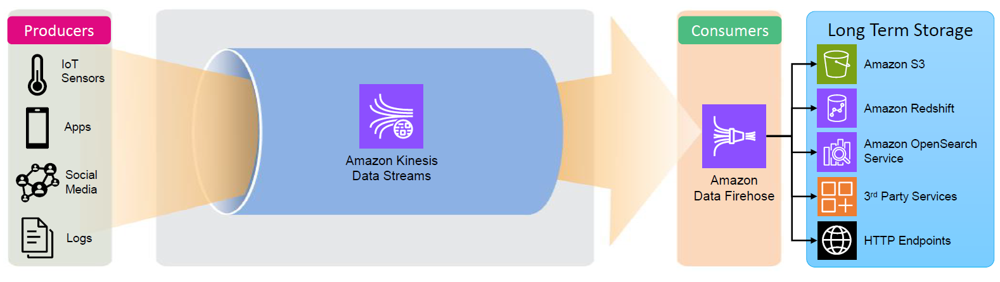
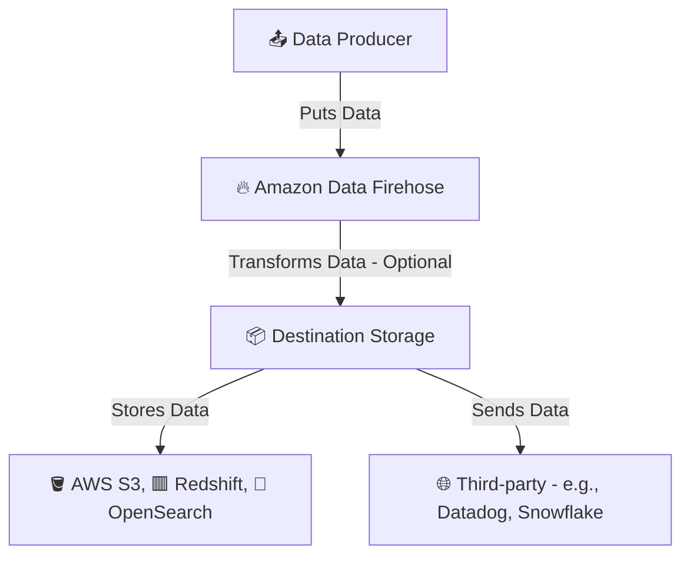
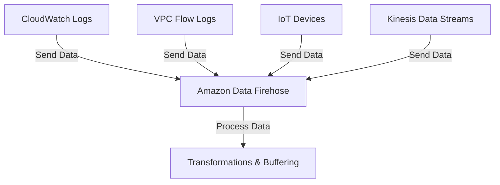
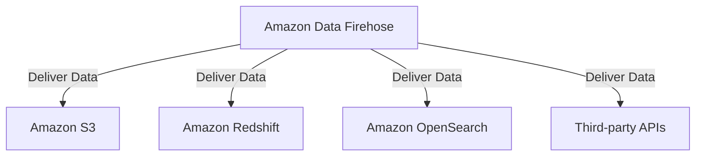

# 🚀 **Amazon Data Firehose: The Pipeline That Never Sleeps**

  

## 🔥 **Introduction: What is Amazon Data Firehose?**

Imagine a **firehose** 🧯—a powerful pipe that **continuously** transports water from a source to a destination. Now, replace **water** with **streaming data** and you get **Amazon Data Firehose**!

Amazon Data Firehose is a **fully managed streaming data delivery service** that **collects, transforms, and loads** data in real-time into AWS destinations like **Amazon S3, Amazon Redshift, OpenSearch, and third-party services** like Datadog and Snowflake.

### 🎯 **Key Features:**

- ✅ **No Servers to Manage** → Fully managed by AWS (serverless).
- ✅ **Automatic Scaling** → Handles fluctuations in data volume effortlessly.
- ✅ **Supports Data Transformation** → Convert data formats (JSON → Parquet, ORC, etc.).
- ✅ **Integrates with AWS & Third-Party Services** → Deliver to S3, Redshift, OpenSearch, and HTTP endpoints.
- ✅ **Compression & Encryption** → Optimized for storage and security.

---

## 🏗 **How Amazon Data Firehose Works**

---

Amazon Data Firehose sits **between** your **producers** (data sources) and your **destinations**, ensuring a **smooth** and **scalable** data flow.

- ⚠️ **Amazon Data Firehose**: Limited to **one** destination per delivery stream.
- 🎯 Destinations like **🪣 AWS S3, 🟥 Redshift, and 🔎 OpenSearch** are categorized as AWS-native storage services.
- 🌐 **Third-party tools** such as **Datadog** and **Snowflake** are external integrations.

---

## ⚡ **How is Amazon Data Firehose Different from Kinesis Data Streams?**

| 🔍 **Feature**        | 🌊 **Amazon Data Firehose**                                     | 🚀 **Kinesis Data Streams (KDS)**                                          |
| --------------------- | --------------------------------------------------------------- | -------------------------------------------------------------------------- |
| **Use Case**          | Stream data **directly** to storage (S3, Redshift, OpenSearch). | Store and process **real-time streaming data** with consumer applications. |
| **Processing Model**  | **Push-based** → Automatically delivers data to destination.    | **Pull-based** → Consumers fetch data manually.                            |
| **Offset Management** | **No need to manage offsets**.                                  | **Consumers must track offsets** manually.                                 |
| **Latency**           | **60 sec - 5 min** (optimized for batch processing).            | **Milliseconds** (real-time streaming).                                    |
| **Auto-Scaling**      | Fully **serverless** and auto-scales.                           | Requires **manual shard scaling**.                                         |
| **Transformations**   | Supports format conversion & Lambda transformations.            | No built-in transformations.                                               |
| **Common Use Cases**  | Log analytics, data lake ingestion, event streaming.            | Real-time analytics, monitoring, fraud detection.                          |

---

## 🌊 **Amazon Data Firehose Architecture: The Components**

  

### 🎯 **1. Data Sources (Producers)**

Amazon Data Firehose supports multiple **data sources**:

- **AWS Services** (CloudWatch Logs, VPC Flow Logs, IoT Core, MSK)
- **Kinesis Data Streams**
- **Custom Applications** (via AWS SDK, AWS CLI, or Kinesis Agent)

---

---

### 🔄 **2. Data Processing & Transformation**

Before sending data to the final destination, Firehose **processes data**:  
✅ **Transforms Data** → Convert JSON to **Parquet/ORC** (for efficient storage).  
✅ **Applies Compression** → GZIP, Snappy, ZIP (for cost optimization).  
✅ **Encrypts Data** → KMS integration for secure data transfer.  
✅ **Invokes AWS Lambda** → Enrich or clean data before storing.

---

### 🎯 **3. Data Destinations**

Amazon Data Firehose **seamlessly integrates** with:

- **Amazon S3** → Store raw data for data lakes & batch processing.
- **Amazon Redshift** → Load structured data for analytics.
- **Amazon OpenSearch** → Power log analytics & monitoring.
- **HTTP Endpoints** → Send data to third-party services (Datadog, Splunk, Snowflake).

---

  

---

## 🛠 **Setting Up Amazon Data Firehose (Step-by-Step)**

### **Step 1️⃣: Create a Data Firehose Stream**

- 1️⃣ Go to **AWS Console** → **Kinesis** → **Create Firehose**
- 2️⃣ Select **Data Source** (Direct PUT, Kinesis Streams, or MSK).
- 3️⃣ Choose **Destination** (S3, Redshift, OpenSearch, HTTP).

---

### **Step 2️⃣: Enable Transformations (Optional)**

- ✅ Use **AWS Lambda** to clean or enrich data.
- ✅ Convert data formats (CSV/JSON → Parquet/ORC).
- ✅ Apply compression (GZIP, Snappy) before delivery.

---

### **Step 3️⃣: Configure Buffering & Security**

- ✅ Set **buffer size** (1MB-128MB) and **buffer interval** (60-900 sec).
- ✅ Enable **encryption** (AWS KMS).
- ✅ Define **IAM roles** for Firehose to access destinations.

---

### **Step 4️⃣: Test & Monitor Data Flow**

- ✅ Use **Kinesis Data Generator** to simulate data.
- ✅ Monitor via **AWS CloudWatch Metrics**.
- ✅ Adjust buffer settings for optimal performance.

---

## ⚠️ **Common Challenges & Best Practices**

| 🚨 **Issue**                           | ✅ **Best Practice**                                                |
| -------------------------------------- | ------------------------------------------------------------------- |
| **High Latency in Delivery**           | Reduce **buffer size** and **buffer interval** for faster delivery. |
| **Data Format Mismatch**               | Enable **format conversion** (Parquet/ORC) for compatibility.       |
| **Data Loss During Transformation**    | Use **CloudWatch Logs** to debug AWS Lambda functions.              |
| **Slow Query Performance in Redshift** | Use **COPY command** instead of INSERT.                             |

---

## 🚀 **Real-World Use Cases**

### 🏢 **1. Log Analytics & Monitoring**

- Collect **VPC Flow Logs & CloudTrail Logs**
- Send data to **Amazon OpenSearch** for real-time analysis

### 📊 **2. Data Warehousing**

- Load streaming data into **Amazon Redshift** for analytics
- Convert CSV/JSON into **Parquet** for faster queries

### 🌍 **3. IoT Data Ingestion**

- Collect sensor data from **IoT devices**
- Store data in **S3 for batch processing**

---

## 🔥 **Final Takeaways: Why Use Amazon Data Firehose?**

- ✅ **Fully Managed & Serverless** → No infrastructure headaches.
- ✅ **Handles Data Transformation** → Format conversion, enrichment.
- ✅ **Seamlessly Integrates with AWS Services** → S3, Redshift, OpenSearch.
- ✅ **Auto-Scales with Zero Administration** → No need to manage shards.
- ✅ **Optimized for Batch Processing** → Designed for cost-efficient data ingestion.

---

## 🎯 **Conclusion: Is Firehose Right for You?**

| ⚡ **Use Amazon Data Firehose if…**                                          | 🚀 **Use Kinesis Data Streams if…**                          |
| ---------------------------------------------------------------------------- | ------------------------------------------------------------ |
| You need **zero-administration** and auto-scaling.                           | You need **real-time stream processing** with low latency.   |
| Your data will be **stored in S3, Redshift, OpenSearch, or HTTP endpoints**. | Your consumers need **custom applications to process data**. |
| You need **serverless format conversion & enrichment**.                      | You need **manual offset management & fine-tuned control**.  |
