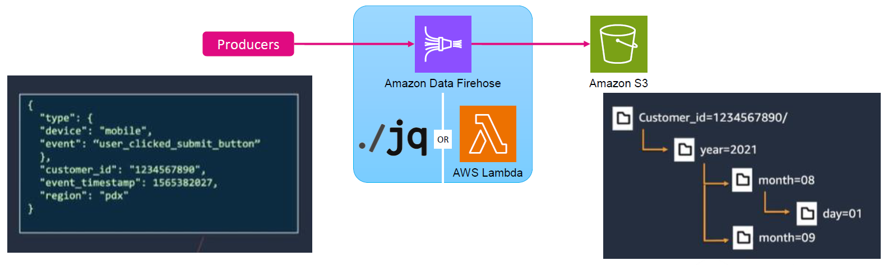
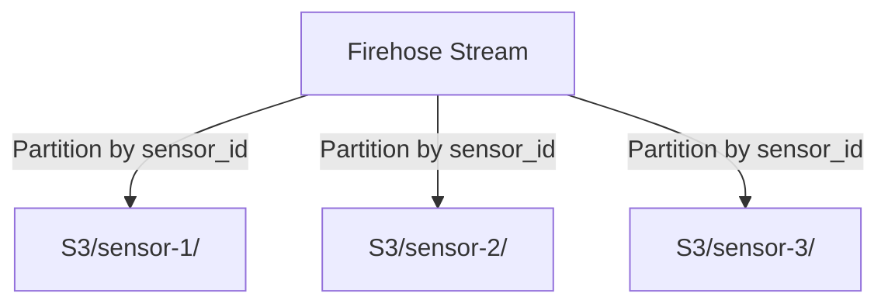

# 🚀 **Dynamically Partitioning Streaming Data in Amazon S3 with Firehose**

<div style="text-align: center;">
  
</div>

## 🔥 **What is Dynamic Partitioning?**

Imagine you are running an **IoT system** that receives millions of sensor readings every day. Instead of dumping all data into a **single folder** in Amazon S3, you **automatically** organize it into **subfolders** based on categories like **sensor ID, date, or location**. This is called **Dynamic Partitioning**!

- ✅ **Partitions data automatically** → No need for extra post-processing.
- ✅ **Improves query performance** → Faster searches using tools like **Amazon Athena**.
- ✅ **Reduces cost & enhances security** → Query only the required partitions, saving storage and compute costs.

---

## ⚙️ **Why Use Dynamic Partitioning?**

| 🎯 **Benefit**             | 🏆 **Why It Matters**                                                            |
| -------------------------- | -------------------------------------------------------------------------------- |
| **Automated Organization** | No need to manually sort data later.                                             |
| **Faster Queries**         | Services like **Amazon Athena** can efficiently filter and query data.           |
| **Lower Costs**            | Query only the relevant data, reducing **S3 storage** and **Athena scan costs**. |
| **Enhanced Security**      | Use **IAM policies** to restrict access based on partition prefixes.             |
| **Zero Post-Processing**   | Eliminates the need for separate batch jobs to reorganize data.                  |

---

## 🛠 **How to Enable Dynamic Partitioning in Amazon Data Firehose?**

### **Step 1️⃣: Define the Partition Key**

Partition keys define how data is **organized** in S3.  
Example keys:

- **Event Timestamp** → Partition by year/month/day.
- **Customer ID** → Partition by customer.
- **Sensor ID** → Partition by device type.

Example JSON Data:

```json
{
  "sensor_id": "sensor-1",
  "temperature": 22.5,
  "status": "OK",
  "timestamp": "2025-03-19T12:30:00Z"
}
```

---

### **Step 2️⃣: Enable Dynamic Partitioning in Firehose**

- ✅ Go to **AWS Console** → **Amazon Kinesis** → **Data Firehose**
- ✅ Choose **Amazon S3** as the destination.
- ✅ Select **Enable Dynamic Partitioning**
- ✅ Define **Partition Key** → Example: `$.sensor_id`
- ✅ Configure **Buffer Size & Interval**



---

### **Step 3️⃣: Send Data & Validate in S3**

Use **Kinesis Data Generator** or **AWS SDK** to send test data.  
🔥 Firehose automatically partitions data into structured folders:

```txt
s3://my-bucket/sensor_id=sensor-1/
s3://my-bucket/sensor_id=sensor-2/
s3://my-bucket/sensor_id=sensor-3/
```

---

## ⚠️ **Best Practices & Challenges**

| 🚨 **Issue**                        | ✅ **Solution**                                            |
| ----------------------------------- | ---------------------------------------------------------- |
| **Partition key not found in JSON** | Ensure **correct JQ expressions** are used.                |
| **Slow queries in Athena**          | Convert data into **Parquet** for better performance.      |
| **Partitioning too granular**       | Avoid creating **too many partitions** (e.g., per second). |
| **IAM permissions issue**           | Ensure Firehose has **write access** to S3.                |

---

## 🎯 **Real-World Use Cases**

- ✅ **IoT Sensor Data** → Partition by **sensor ID** for efficient monitoring.
- ✅ **E-Commerce Transactions** → Partition by **customer ID** to analyze purchase history.
- ✅ **Security Logs** → Partition by **log type** for faster threat detection.

---

## 🔥 **Final Thoughts: Why Use Dynamic Partitioning?**

- ✅ **Automates data organization** → No need for manual sorting.
- ✅ **Speeds up queries** → Optimized for **Amazon Athena**.
- ✅ **Reduces costs** → Query only **relevant partitions**.
- ✅ **Improves security** → Restrict access based on partitioned paths.
