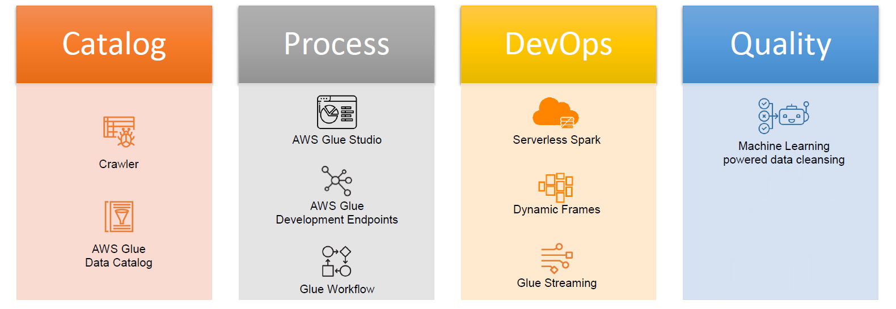
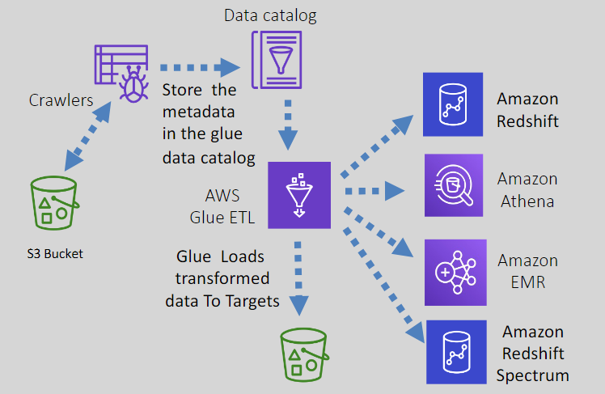
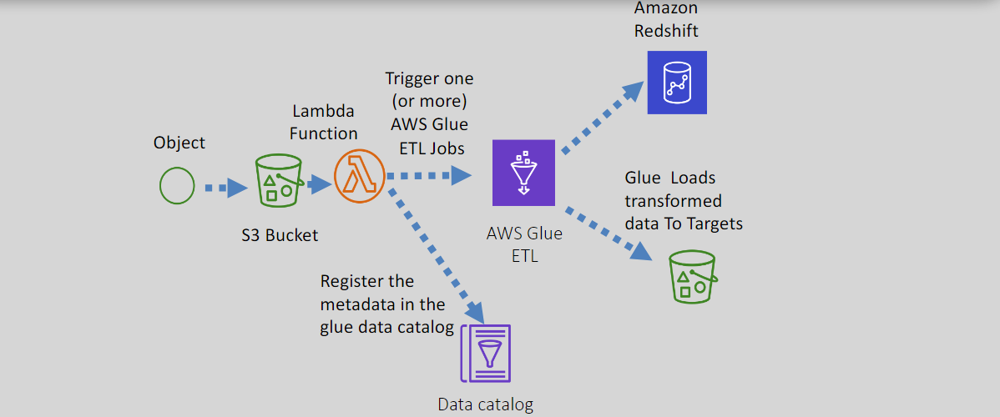
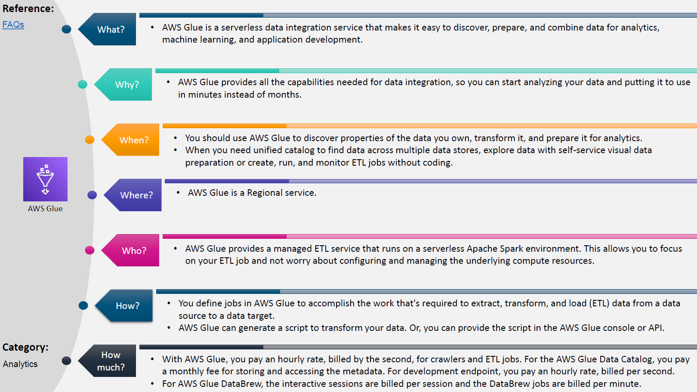

# **🧑‍🔧 AWS Glue: Fully Managed Serverless ETL Service**

AWS Glue is a **serverless data integration service.** that provides all the capabilities needed for data integration, so you can start
analyzing your data and putting it to use in minutes instead of months.

---

  

---

## 🌟 **Key Features of AWS Glue**

1. **Serverless**:

   - No infrastructure to manage—AWS handles everything.
   - Scales automatically to meet your workload demands.

2. **Data Preparation**:

   - Automates the time-consuming tasks of **scanning**, **categorizing**, **cleaning**, and **enriching data**.
   - Can infer the schema and move data between different stores.

3. **Persistent Metadata Storage**:

   - Provides a **Data Catalog** to store and manage metadata for datasets stored in Amazon S3.

4. **Built on Apache Spark**:

   - AWS Glue runs on **serverless Apache Spark**, a distributed processing engine, to handle complex transformations and big data workloads.

5. **Secure**:
   - Protects data both **in-transit** and **at-rest** using encryption.

---

## 🛠️ **AWS Glue Components**

1. **Data Sources**:

   - AWS Glue works with structured, semi-structured, and unstructured data from:
     - **Amazon S3**
     - **RDS (Relational Databases)**
     - **JDBC Databases**
     - **Kinesis**
     - **DynamoDB**
     - **OpenSearch**
     - **Kafka**

2. **Crawlers**:

   - Automatically **scan** the data sources, **infer schemas**, and populate the **Data Catalog**.

3. **Data Catalog**:

   - Acts as a **metadata repository** that stores table definitions, schemas, and connections to the data.

4. **Job Authoring**:

   - Automates the creation of **ETL jobs** and suggests Python or Scala code for data transformations.

5. **Data Targets**:

   - After processing, the transformed data can be stored in:
     - **Amazon S3**
     - **RDS**
     - **JDBC databases**

6. **Query Integrations**:
   - Works seamlessly with tools like:
     - **Amazon EMR**
     - **Athena**
     - **Redshift**
     - **Redshift Spectrum**

---

## 🔄 **Common Use Cases**

1. **Querying a Data Lake**:

   - Run **serverless queries** against an S3 data lake.

2. **Building a Data Warehouse**:

   - Consolidate data from **disparate sources** into a single warehouse for analytics.

3. **Data Discovery**:

   - Use crawlers and the Data Catalog to **understand and organize stored data**.

4. **Event-Driven ETL Pipelines**:
   - Combine **AWS Glue** with **AWS Lambda** to create **event-driven workflows** that respond to data changes.

---

  

---

  

---

## ✅ **Why Use AWS Glue?**

1. **Save Time**:

   - Automates the tedious process of data preparation for analytics.

2. **Serverless**:

   - No infrastructure to maintain—AWS manages everything.

3. **Seamless Integration**:

   - Works seamlessly with other AWS services like **S3**, **Redshift**, **Athena**, and **EMR**.

4. **Scalable and Flexible**:
   - Automatically scales to handle large datasets and workloads.

---

## 📚 **Conclusion**

AWS Glue simplifies the process of preparing and moving data for analytics. Whether you're building a **data lake**, consolidating **disparate data sources**, or creating **event-driven workflows**, Glue provides the tools you need. With its **serverless architecture**, built-in **Data Catalog**, and tight integration with other AWS services, Glue empowers organizations to focus on analytics and insights rather than managing infrastructure.

---

  

---
