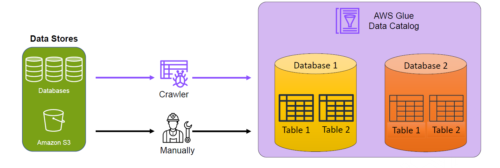
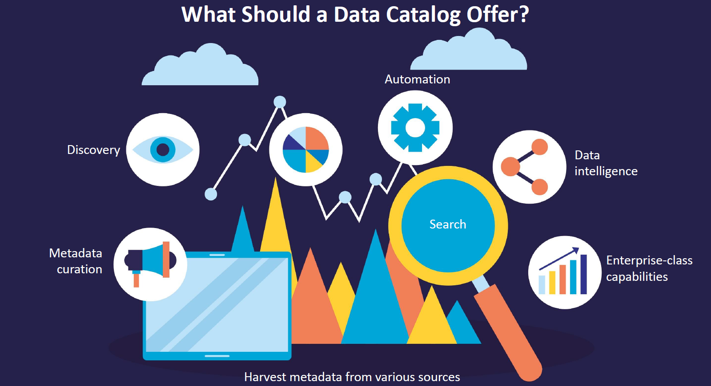
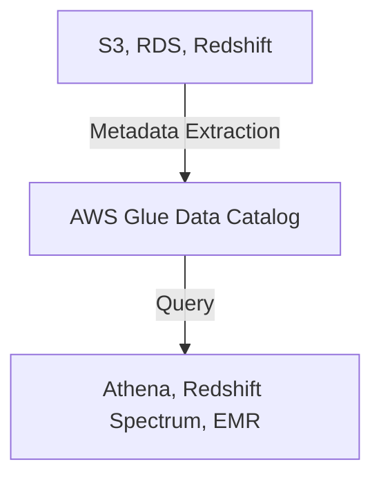
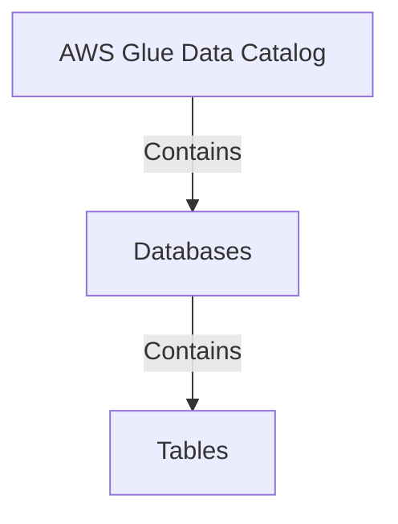
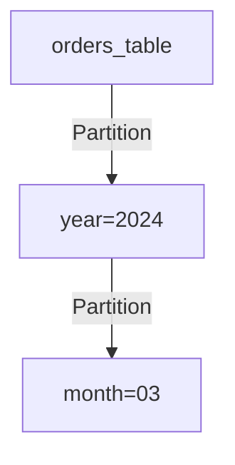
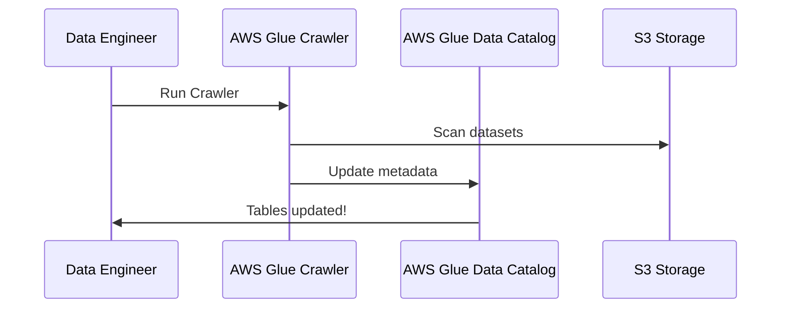

# 📚 **AWS Glue Data Catalog: The Brain of Your Data Lake**

AWS Glue **Data Catalog** is the **metadata backbone** of AWS analytics, acting as a **centralized repository** where all your data assets are **organized, indexed, and searchable**. Think of it as **a massive library catalog**, but instead of books, it catalogs datasets across **S3, RDS, Redshift, and more**.

> The Glue Catalog is an index to the location, schema, and runtime metrics of your data.
>
> - **Databases** → A set of associated table definitions, organized into a logical group.
> - **Tables** → The metadata definition that represents your data, including its schema.
> - **Apache Hive Compatibility** → The AWS Glue Data Catalog is an Apache Hive metastore-compatible catalog, meaning it can replace a traditional Hive Metastore.

---

<div style="text-align: center;">
  
</div>

---

## 🚀 **What is AWS Glue Data Catalog?**

<div style="text-align: center;">
  
</div>

---

AWS Glue **Data Catalog** is a **fully managed metadata repository** that allows you to:

- ✅ **Discover and organize datasets** stored across AWS services.
- ✅ **Store metadata (schema, table details, partitions, location, etc.).**
- ✅ **Enable schema evolution** to handle data structure changes.
- ✅ **Power Athena, Redshift Spectrum, and EMR for SQL-based queries.**

🔹 **Why is it important?**  
Without a **Data Catalog**, finding datasets in S3 is like **looking for a needle in a haystack**. AWS Glue **adds structure and searchability** to your data lake.

<div style="text-align: center">



</div>

💡 **Best Practice**: Always keep the **Data Catalog updated** to ensure query accuracy.

---

## 🏗️ **Key Components of AWS Glue Data Catalog**

AWS Glue Data Catalog consists of **Databases, Tables, Partitions, Crawlers, and Schema Evolution**, as illustrated in the reference image below:

### 📌 **1️⃣ Databases** (Folders for Tables)

A **Database** in AWS Glue **does not store actual data**; it simply groups related **tables** together.

🔹 **Example:**

- `sales_db` → Contains tables like `customers`, `orders`, `transactions`.
- `marketing_db` → Contains tables like `campaigns`, `ads`, `leads`.

<div style="text-align: center">



</div>

💡 **Best Practice**: Name databases **logically** based on business domains.

---

### 📌 **2️⃣ Tables** (Metadata Descriptions)

Each **Table** in AWS Glue **represents a dataset** and contains:

- **Schema (column names & types)**
- **Data location (e.g., S3 path: `s3://my-data/orders` )**
- **Partition keys** (e.g., `year=2024/month=03`)
- **SerDe (Serializer/Deserializer) format**

🔹 **Example Table (orders_table)**

| Column Name | Data Type | Description               |
| ----------- | --------- | ------------------------- |
| order_id    | STRING    | Unique order ID           |
| customer_id | STRING    | Customer ID               |
| amount      | FLOAT     | Order value               |
| order_date  | TIMESTAMP | When the order was placed |

💡 **Best Practice**: Use **columnar formats (Parquet, ORC)** for faster querying.

---

### 📌 **3️⃣ Partitions** (Improves Query Performance)

Instead of **scanning all data**, AWS Glue **partitions data** to improve query performance.

🔹 **Example Partitioning (orders_table)**

| Partition Key | Data Stored In                            |
| ------------- | ----------------------------------------- |
| year=2024     | `s3://my-data/orders/year=2024/`          |
| month=03      | `s3://my-data/orders/year=2024/month=03/` |

<div style="text-align: center">



</div>

💡**Best Practice**: **Partition by frequently queried columns** (e.g., `date`, `region`).

---

### 📌 **4️⃣ Crawlers** (Automated Data Discovery)

A **Crawler** scans data sources **automatically** and updates the Data Catalog **without manual intervention**.

🔹 **How a Crawler Works**:

- 1️⃣ Connects to **S3, RDS, Redshift, DynamoDB**.
- 2️⃣ Reads **schema & partitions**.
- 3️⃣ Updates the **Glue Data Catalog**.

<div style="text-align: center">



</div>

💡**Best Practice**: Schedule **Crawlers** to run periodically **to keep metadata fresh**.

---

### 📌 **5️⃣ Schema Evolution** (Handling Data Changes)

Data **structures change over time**. AWS Glue can **automatically detect schema changes** and **update the Data Catalog**.

🔹 **Example:**

- **Day 1:** Table has `customer_id, order_id, amount`.
- **Day 30:** A new column `discount` is added.
- **AWS Glue updates schema automatically**.

💡**Best Practice**: Enable **schema versioning** to track changes.

---

## ⚡ **How AWS Glue Data Catalog Powers Analytics**

Once the Data Catalog is set up, it enables **serverless querying, machine learning, and data transformation** across AWS services.

### 🔥 **Query with AWS Athena**

- Write **SQL queries** on **S3 data** like a traditional database.
- No need for **data movement**; AWS Athena reads directly from Glue Data Catalog.

```sql
SELECT * FROM sales_db.orders WHERE year = 2024;
```

💡**Best Practice**: Use **compressed formats (Parquet, ORC)** for cost savings.

---

### 🔥 **Integration with Redshift Spectrum**

- Redshift Spectrum **queries S3 data directly** using Glue Data Catalog.
- Enables **hybrid queries** on **both Redshift and Data Lake**.

```sql
SELECT COUNT(*) FROM spectrum.sales_db.orders WHERE amount > 100;
```

💡**Best Practice**: **Use partitioning** to avoid scanning unnecessary data.

---

### 🔥 **AWS Glue ETL Processing**

- Use **AWS Glue Jobs** to transform and move data.
- Converts **raw JSON/CSV** into optimized **Parquet or ORC**.

```python
import sys
from awsglue.transforms import *
from awsglue.utils import getResolvedOptions
from pyspark.context import SparkContext
from awsglue.context import GlueContext

sc = SparkContext()
glueContext = GlueContext(sc)

datasource0 = glueContext.create_dynamic_frame.from_catalog(database="sales_db", table_name="orders")
```

💡**Best Practice**: Convert data **to columnar formats** for efficient querying.

---

## 🏁 **Final Thoughts: Why Use AWS Glue Data Catalog?**

📌 **AWS Glue Data Catalog is essential for organizing and managing datasets in AWS.**  
📌 **It enables seamless querying with Athena, Redshift Spectrum, and Glue ETL.**  
📌 **Crawlers automate schema detection, reducing manual effort.**

| Feature                   | Benefit                                    |
| ------------------------- | ------------------------------------------ |
| Centralized Metadata      | Stores schema, partitions, and locations   |
| Automates Discovery       | Crawlers detect new data automatically     |
| Powers Analytics          | Enables Athena & Redshift Spectrum queries |
| Supports Schema Evolution | Handles data structure changes             |
