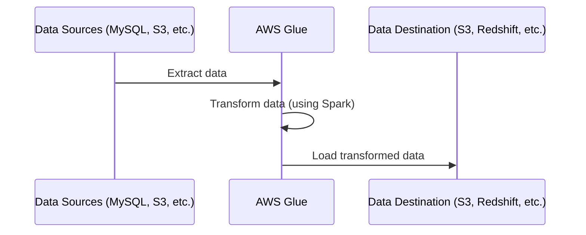

# 🏗 **AWS Glue ETL: Creating Jobs Like a Pro!**

> "ETL jobs are like cooking: **Extract (gather ingredients), Transform (cook the dish), Load (serve it on a plate)**. And AWS Glue is your personal **chef**!" 👨‍🍳🔥

**What is an AWS Glue ETL Job?**

An **ETL job** in AWS Glue is a **serverless, automated process** that:

- ✅ **Extracts** data from sources (like MySQL, S3, DynamoDB).
- ✅ **Transforms** data using **Apache Spark** (filters, joins, aggregations).
- ✅ **Loads** the cleaned data into **S3, Redshift, or another data store**.

AWS Glue **removes the headache** of managing Spark clusters and handles **everything automatically**. You just **define the job** and AWS Glue does the rest. 😎

---

<div style="text-align: center;">



</div

---

## 🎯 **Types of AWS Glue ETL Jobs**

AWS Glue gives you **3 ways** to create ETL jobs:

| Job Type                             | Description                                  |
| ------------------------------------ | -------------------------------------------- |
| **Visual ETL (Glue Studio)** 🎨      | Drag-and-drop interface for **no-code** ETL. |
| **Notebook (Jupyter / Zeppelin)** 📒 | Interactive development using **PySpark**.   |
| **Script Editor (Python/Scala)** 💻  | Write **custom Spark jobs** using Glue API.  |

Let’s explore each method **step by step**. 🏗

---

## 🎨 **Method 1: Creating ETL Jobs Using AWS Glue Studio (No Code!)**

> **"Why code when you can just drag and drop?"** 😏

### ✅ **When to Use Glue Studio?**

- If you **hate coding** (or want a break 😆).
- If you need a **quick ETL job** without writing PySpark.
- If you love **visual workflows**.

### 🔹 **1️⃣ Open AWS Glue Studio**

- 1️⃣ Navigate to **AWS Glue Console → Glue Studio**
- 2️⃣ Click **“Create Job”** → Choose **Visual with a blank canvas**

### 🔹 **2️⃣ Add Source Tables**

- Click **Add Node → Source**
- Choose **AWS Glue Catalog**
- Select **your database and table**
- Click **Apply** ✅

### 🔹 **3️⃣ Perform Transformations**

- Click **Add Transformation** → Choose **Join**
- Join `sales` with `customers` on `customer_id`
- Click **Add Transformation** → Choose **Filter**
- Condition: `sales_quantity > 0`

### 🔹 **4️⃣ Load Data into Amazon S3**

- Click **Add Target** → Choose **Amazon S3**
- Select **Parquet format** for better performance.
- Click **Apply** ✅

### 🔹 **5️⃣ Run & Monitor the Job**

- Click **Run Job**
- Check status in **AWS Glue Console → Jobs → Run Details**

🎯 **Congrats!** You just built an ETL pipeline **without writing a single line of code!** 🎉

---

## 📒 **Method 2: Creating ETL Jobs Using Notebooks (PySpark Interactive Mode!)**

> **"You love coding? AWS Glue has got you covered!"** 👨‍💻

### ✅ **When to Use Notebooks?**

- If you need **interactive development** before creating an ETL job.
- If you want to **debug data transformations** before deployment.
- If you love **Jupyter/Zeppelin notebooks**.

### 🔹 **1️⃣ Launch AWS Glue Notebook**

- 1️⃣ Navigate to **AWS Glue Console → Notebooks**
- 2️⃣ Click **“Create Notebook”**
- 3️⃣ Choose **IAM Role** and **Spark Engine**
- 4️⃣ Click **Start Notebook** 🚀

### 🔹 **2️⃣ Load Data into a Dynamic Frame**

```python
import sys
from awsglue.context import GlueContext
from awsglue.transforms import *

glueContext = GlueContext(spark.sparkContext)
sales_df = glueContext.create_dynamic_frame.from_catalog(database="glue_workshop", table_name="sales")
```

### 🔹 **3️⃣ Perform Joins & Transformations**

```python
customers_df = glueContext.create_dynamic_frame.from_catalog(database="glue_workshop", table_name="customers")

joined_df = Join.apply(sales_df, customers_df, 'customer_id', 'customer_id')
filtered_df = Filter.apply(joined_df, lambda x: x["sales_quantity"] > 0)
```

### 🔹 **4️⃣ Write the Data to S3**

```python
glueContext.write_dynamic_frame.from_options(filtered_df,
    connection_type="s3",
    connection_options={"path": "s3://glue-output-bucket/"},
    format="parquet")
```

### 🔹 **5️⃣ Save & Convert Notebook to ETL Job**

Once your **PySpark notebook** runs **successfully**, you can **convert it into an AWS Glue job** for **scheduled execution**. 🎯

---

## 💻 **Method 3: Creating ETL Jobs Using Script Editor (Advanced Users!)**

> **"For those who love absolute control over their ETL jobs!"** 🔥

### ✅ **When to Use the Script Editor?**

- If you need **full customization**.
- If you’re using **external libraries or advanced Spark operations**.
- If you want to **run Glue jobs on a schedule**.

### 🔹 **1️⃣ Open AWS Glue Script Editor**

- 1️⃣ Navigate to **AWS Glue Console → Jobs → Create Job**
- 2️⃣ Choose **"Script Editor"**
- 3️⃣ Select **Python (PySpark) or Scala**
- 4️⃣ Click **Create**

### 🔹 **2️⃣ Write a Custom ETL Job in PySpark**

```python
from awsglue.context import GlueContext
from awsglue.transforms import *

glueContext = GlueContext(spark.sparkContext)

# Load Data
sales_df = glueContext.create_dynamic_frame.from_catalog(database="glue_workshop", table_name="sales")

# Transform Data
sales_filtered = Filter.apply(sales_df, lambda x: x["sales_quantity"] > 0)

# Write to S3
glueContext.write_dynamic_frame.from_options(
    sales_filtered,
    connection_type="s3",
    connection_options={"path": "s3://my-bucket/output/"},
    format="parquet"
)
```

### 🔹 **3️⃣ Configure Job Settings**

| Setting               | Value                |
| --------------------- | -------------------- |
| **Glue Version**      | 4.0 (Latest)         |
| **Worker Type**       | `G.2X`               |
| **Number of Workers** | 10                   |
| **Logging**           | Enabled (CloudWatch) |
| **Retries**           | 3                    |

✅ **Best Practice**: Enable **retry logic** in case of failures.

### 🔹 **4️⃣ Run & Monitor the Job**

- Click **Run Job**
- Check logs in **CloudWatch**
- Check output in **S3**

🔥 **Boom!** You just created a fully automated **AWS Glue ETL job** using PySpark!

---

## 🎯 **Final Thoughts: Which Method Should You Use?**

| Method                               | Use Case                                          |
| ------------------------------------ | ------------------------------------------------- |
| **Visual ETL (Glue Studio)** 🎨      | Best for **drag-and-drop** ETL jobs.              |
| **Notebooks (Jupyter/Zeppelin)** 📒  | Best for **interactive development & debugging**. |
| **Script Editor (PySpark/Scala)** 💻 | Best for **advanced ETL jobs with custom logic**. |
