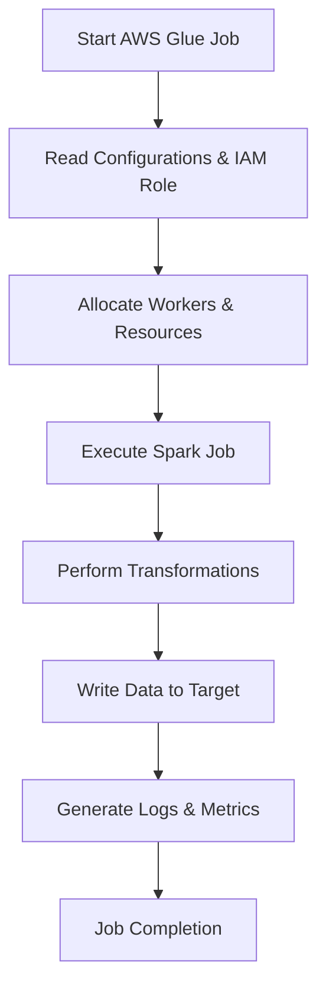

# 🚀 **AWS Glue ETL Job Details: A Complete Guide!**

## 🔍 **Introduction**

AWS Glue ETL jobs allow you to **Extract, Transform, Load (ETL)** data seamlessly across various sources. To run an optimized job, you need to configure it properly. This guide groups **all job details settings** into related categories for better clarity.

---

## 🛠 **1. Job Identity & Basic Setup**

This section defines **what the job does** and **how it runs**.

### 📌 **Basic Job Information**

- **Name** → Unique identifier for the job.
- **Description** (Optional) → Up to **2048 characters** to describe the job.
- **IAM Role** 🔐 → AWS Glue **assumes this role** to access:
  - Data sources (S3, RDS, DynamoDB)
  - Temporary storage
  - Scripts & dependencies  
    Ensure the **IAM role has the necessary permissions** like `AmazonS3ReadOnlyAccess` and `AWSGlueServiceRole`.

### 🏗 **Job Type & Glue Version**

- **Job Type** → Set automatically based on data sources:
  - **Batch ETL**
  - **Streaming ETL**
  - **Ray-based ETL**
- **Glue Version** → Controls the **runtime version**:
  - **Glue 5.0 (Latest)** → **Spark 3.4.1, Python 3.10**
  - **Glue 4.0** → **Spark 3.3.0, Python 3.10**
  - **Glue 3.0** → **Spark 3.1.1, Python 3.7**  
    Newer versions offer **better performance and feature support**.

---

## 🚀 **2. Compute Resources & Performance**

AWS Glue **allocates compute resources** dynamically. These settings optimize **cost and performance**.

### ⚙️ **Worker Configuration**

- **Worker Type** → Defines the compute power per worker:

  - `G.1X` → **4 vCPUs, 16 GB RAM** (Standard)
  - `G.2X` → **8 vCPUs, 32 GB RAM** (Faster Processing)
  - `G.8X` → **32 vCPUs, 128 GB RAM** (Heavy Workloads)
  - `Z.2X` → Optimized for **Ray-based ETL Jobs**
  - `G.025X` → **Cost-effective for small jobs**

- **Auto-Scale Workers** → AWS Glue dynamically **scales workers up and down** to optimize cost.  
  ✅ _Requires Glue 3.0+._

- **Requested Number of Workers** → Maximum number of workers Glue should allocate.  
  ✅ _Higher values mean faster execution but higher cost._

### 💰 **Cost Optimization**

- **Flex Execution** → Runs on **spare AWS capacity** for cost savings but **may experience delays**.
- **Usage Profile** → Allows fine-tuning for **cost vs. performance trade-offs**.

### ⏳ **Job Timeout & Retries**

- **Job Timeout** (Minutes) → Sets **maximum execution time**.
  - **Glue 5.0 Default:** **480 minutes (8 hours)**
  - **Glue 4.0 and below:** **2,880 minutes (48 hours)**
  - **Streaming jobs:** _No timeout by default._
- **Number of Retries** 🔄 → Defines how many **times Glue should retry if a job fails**.
  - Default: `0 retries`
  - Recommended: `2-3 retries` to handle temporary failures.

### ⚡ **Job Run Queuing & Concurrency**

- **Job Run Queuing** → Allows **pending jobs to be queued** instead of failing when resources are unavailable.
- **Maximum Concurrency** → Controls how many instances of the **same job can run simultaneously**.

---

## 📊 **3. Monitoring & Observability**

Glue offers **built-in monitoring & logging** for debugging and optimization.

### 🔍 **Logs & Monitoring**

- **Job Metrics** → Enable **AWS CloudWatch metrics** for monitoring.
- **Job Observability Metrics** → Provides **extra CloudWatch metrics** for deep analysis.
- **Continuous Logging** → Writes **real-time logs to CloudWatch**.
- **Delay Notification Threshold** ⏰ → Triggers an **alert if the job runs longer than expected**.

### 🔥 **Spark UI & Debugging**

- **Spark UI Logs** → Stores **detailed Spark execution logs**.
- **Spark UI Logs Path** → Defines **where Spark logs are stored in S3**.
- **Logging Mode**:
  - **Standard** (Default) → Logs appear in Glue Console.
  - **Legacy** → Uses old Spark logging format.
  - **Standard & Legacy** → Stores logs in **both formats**.

---

## 🗄 **4. Data Processing & State Management**

AWS Glue offers **features to track data changes** and optimize processing.

### 🎯 **Job Bookmark**

- **Enable** → Glue **remembers processed data** for incremental ETL jobs.
- **Pause** → Updates state but does **not use bookmarks**.
- **Disable** → **Processes everything from scratch** on each run.

### 📌 **Generate Job Insights**

- AWS Glue **analyzes job runs** and provides insights on:
  - **Optimizing execution**
  - **Finding errors and failures**
  - **Improving performance**

### 🔗 **Generate Lineage Events**

- Captures **data flow lineage** for visualization in **Amazon DataZone** or **Amazon SageMaker**.

---

## 🔐 **5. Security & Access Controls**

AWS Glue **secures** data and execution environments.

### 🔑 **Security Configuration**

- Defines **encryption settings** for scripts and data.
- Uses **AWS KMS keys** for **encryption**.

### 🛡️ **Server-Side Encryption (SSE)**

- Enables **S3-SSE encryption** for Glue **job outputs**.

### 🗄️ **Glue Data Catalog as Hive Metastore**

- Uses **Glue Data Catalog** as the **Hive Metastore**.

### 🌐 **Network & Connections**

- **VPC, Subnets, Security Groups** → Required for **connecting to RDS, Redshift, and private data sources**.

---

## 📚 **6. Libraries & External Dependencies**

AWS Glue supports **custom libraries and dependencies**.

### 📦 **External Library Paths**

- **Python Library Path** 🐍 → Attach **custom Python libraries**.
- **Dependent JARs Path** 🏺 → Attach **Spark JAR dependencies**.
- **Referenced Files Path** 📂 → Attach **configuration files or scripts**.

---

## 🏗 **AWS Glue ETL Job Execution Flow** (Mermaid Diagram)

Here's how AWS Glue ETL jobs execute step by step.

