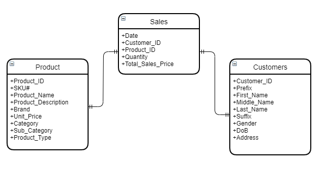
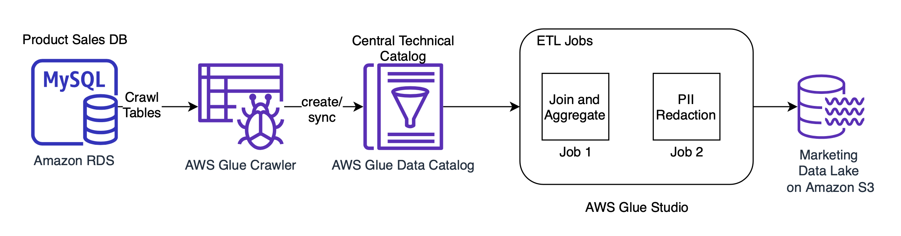
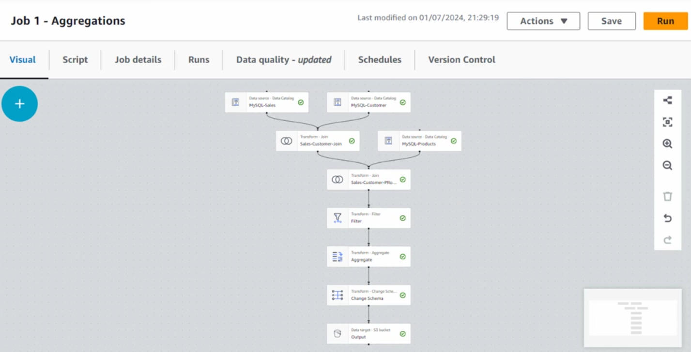

# 🚀 **AWS Glue ETL Workshop: Building a Data Pipeline with AWS Glue**

> "Data is the new oil, but you need a **refinery** to process it—**AWS Glue is that refinery!**"

This workshop **guides you step-by-step** in setting up an **end-to-end data pipeline** using **AWS Glue** to extract, transform, and load (ETL) data from a MySQL database into Amazon S3.

By the end of this, you’ll have **mastered AWS Glue** and will be **ready to build real-world ETL pipelines like a pro!** 💪

---

## 🏗 **[Workshop Architecture](https://catalog.us-east-1.prod.workshops.aws/workshops/0cba1e21-10d6-4e8e-b35f-a09338ee68d9/en-US/introduction)**

Company ABC is an online pet product retailer. They have recently launched a new product line for pets. They were expecting it to be a great success but sales from some regions were below their expectation. Marketing research suggests that limited awareness about the product in those regions is the main reason for inadequate sales. To address this problem, they want to start a targeted mail campaign in those regions that shows potential for increased sales. The team needs a fast turnaround, they don’t have much time to write code and manage infrastructure. At the same time, to avoid using any Personal Identifiable Information (PII) in their mail campaign, any customer PII data need to be redacted from their mailing list.

### **Actions**

As a member of the ABC data engineering team, you are tasked to extract customer, product, and sales data. Following the extract you transform that data and create a dataset that has sales performance data for pet product categories by zip codes where specific product types need to be marketed. Sensitive data also needs to be redacted before allowing downstream analytics.

### **Data Model**

The data model provided from the sales MySQL database is provided here:

<div style="text-align: center;">
  
</div>

### **Workshop Architecture**

<div style="text-align: center;">
  
</div>

### **Workshop Solution with Visual ETL**



---

## 🎯 **Workshop Goals**

In this hands-on workshop, we will:  
✅ **Extract Data from an Amazon RDS MySQL Database**  
✅ **Use AWS Glue Crawler to Discover the Schema**  
✅ **Store Metadata in the AWS Glue Data Catalog**  
✅ **Transform and Aggregate Data using AWS Glue ETL**  
✅ **Store the Processed Data in Amazon S3**  
✅ **Query the Data Using Amazon Athena**

---

## 🛠 **Step 1: Setting Up the MySQL Database**

### 🔹 **1️⃣ Deploy Amazon RDS (MySQL)**

- We use **Amazon RDS Aurora MySQL**, which contains:  
  ✅ `products` → Stores product details.  
  ✅ `sales` → Records sales transactions.  
  ✅ `customers` → Contains customer info.

💡 **Best Practice**: Use **AWS CloudFormation** to deploy the RDS database **automatically**.

---

## 📂 **Step 2: Setting Up the AWS Glue Data Catalog**

The **AWS Glue Data Catalog** is a **metadata repository** that organizes databases and tables.

### 🔹 **2️⃣ Create the Glue Database**

- Navigate to **AWS Glue Console → Databases → Create New Database**
- Database Name: **`glue_workshop`**
- Click **Create** ✅

### 🔹 **3️⃣ Create the AWS Glue Crawler**

- Navigate to **AWS Glue Console → Crawlers → Create Crawler**
- **Name**: `workshop_crawler`
- **Data Source**: **JDBC Connection to MySQL**
- **Target Database**: `glue_workshop`
- **Tables to Crawl**: `customers`, `sales`, `products`
- **Schedule**: **On-Demand**
- **IAM Role**: Select an IAM Role with **Glue & S3 permissions**
- Click **Create & Run** 🚀

💡 **Best Practice**: Use **AWS Secrets Manager** to store **database credentials securely**.

---

## 🏗 **Step 3: Creating the AWS Glue ETL Job**

### 🔹 **4️⃣ Add Source Tables**

- Navigate to **AWS Glue Studio → Create New ETL Job**
- Click **Visual ETL**
- Add Source Tables: **`customers`**, **`sales`**, **`products`**
- Select **Glue Catalog** as the source

---

### 🔄 **5️⃣ Join Tables**

We will **join the three tables** using:

- `customer_id` → Join **Sales & Customers**
- `product_id` → Join **Sales & Products**

#### **How to Perform the Join in AWS Glue Studio**

1️⃣ **Click “Add Join” → Select Sales Table**  
2️⃣ **Join with Customers Table on `customer_id`**  
3️⃣ **Join with Products Table on `product_id`**  
4️⃣ **Set Join Type**: **Inner Join**

💡 **Best Practice**: Use **Inner Joins** to remove NULL values.

---

### 🎯 **6️⃣ Filtering Data**

We only need **valid sales records** where **quantity > 0**.

1️⃣ **Click “Add Transformation” → Choose “Filter”**  
2️⃣ **Set Condition**: `quantity > 0`

💡 **Best Practice**: Apply **filters early** to reduce **data size and processing time**.

---

### 📊 **7️⃣ Aggregate Data**

We will **group data by zip code** and **sum total sales**.

1️⃣ **Click “Add Transformation” → Choose “Aggregate”**  
2️⃣ **Group By** → `zip_code`  
3️⃣ **Aggregate Column** → `SUM(total_sales_price)`

💡 **Best Practice**: Store aggregated data in **columnar formats like Parquet**.

---

## 📂 **Step 4: Loading Transformed Data into Amazon S3**

### **🔹 Store Data in S3**

We now **store the processed data** in **Amazon S3**.

1️⃣ **Click “Add Target” → Choose “Amazon S3”**  
2️⃣ **Set Output Format** → **Parquet**  
3️⃣ **Specify S3 Target** → `s3://glue-workshop/aggregated_sales/`

💡 **Best Practice**: Partition data by `year/month/day` to optimize queries in **Athena**.

---

## ⚙️ **Step 5: AWS Glue ETL Job Configuration**

| **Setting**           | **Value**            |
| --------------------- | -------------------- |
| **Glue Version**      | 4.0 (Latest)         |
| **Worker Type**       | `G.2X`               |
| **Number of Workers** | 10                   |
| **Timeout**           | 60 min               |
| **Logging**           | Enabled (CloudWatch) |
| **Job Bookmarking**   | Enabled              |

💡 **Best Practice**: Use **job bookmarking** to **avoid duplicate processing**.

---

## 🚀 **Step 6: Running & Monitoring the Job**

After saving the job, click **"Run"**.

- Monitor progress in **AWS Glue Console → Jobs → Run Details**.
- View **Spark logs** in **AWS CloudWatch**.
- Check output files in **Amazon S3**.

---

## 🎯 **Final Step: Querying Data in Amazon Athena**

Once the **aggregated sales data** is stored in S3, we can use **Amazon Athena** to query it.

```sql
SELECT zip_code, SUM(total_sales_price)
FROM aggregated_sales
GROUP BY zip_code
ORDER BY SUM(total_sales_price) DESC;
```

💡 **Best Practice**: Use **Athena + Glue Data Catalog** for **serverless SQL querying**.

---

## 🏆 **Final Thoughts: Why Use AWS Glue ETL?**

📌 **Serverless** → No infrastructure management.  
📌 **Visual ETL** → Drag-and-drop interface.  
📌 **Supports Streaming ETL** → Integrates with **Kinesis & Kafka**.  
📌 **Optimized for Big Data** → Uses **Apache Spark** for distributed computing.
