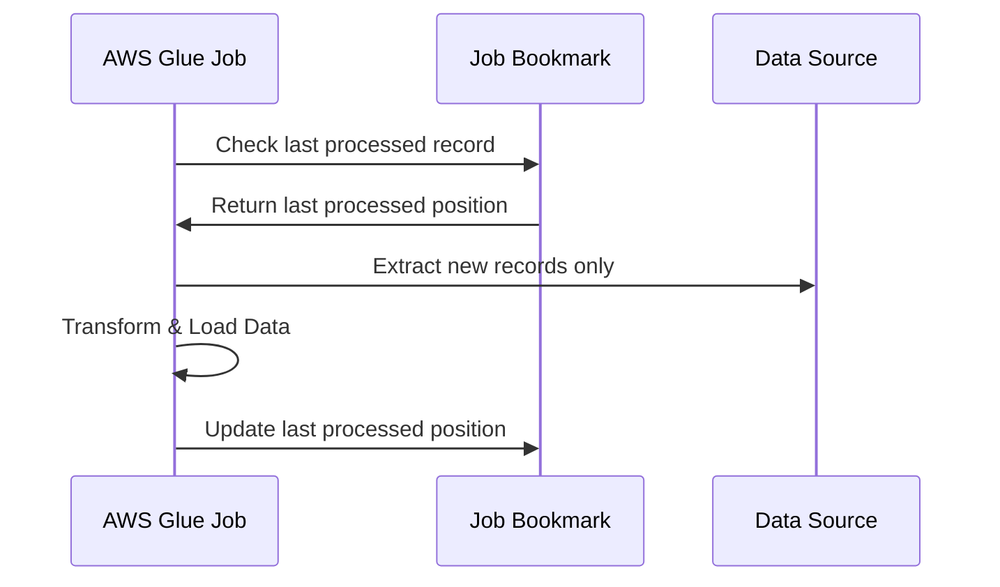
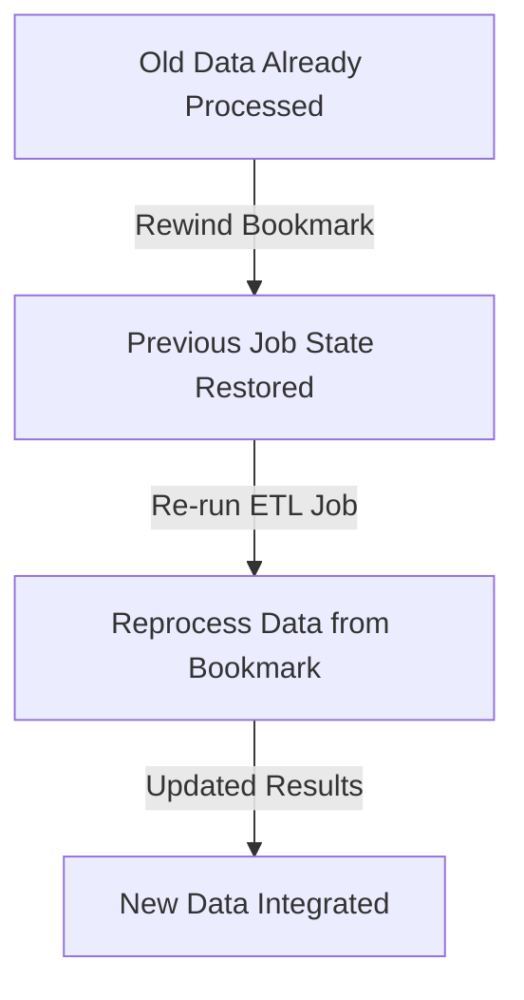

# 🔖 **AWS Glue Job Bookmark**

AWS Glue **Job Bookmark** is a powerful feature that helps **track processed data** to avoid **reprocessing old data** when running ETL jobs multiple times. It ensures **incremental processing**, making your jobs **efficient, cost-effective, and faster**.

This guide **breaks down job bookmarks**, their **working mechanism**, and how to **rewind and manage them effectively**.

---

## 🎯 **1. What is an AWS Glue Job Bookmark?**

**Job Bookmark** is AWS Glue’s way of **remembering what data it has already processed**.  
Think of it as **a sticky note inside your job** 📌—it **marks the last processed data point** so that when the job runs again, it **only picks up new data**.

📌 **Why is this important?**

- **Avoids redundant processing** → Saves time & compute costs 💰.
- **Enables incremental ETL** → Only new or modified records are processed.
- **Supports backfilling** → You can rewind and process older data if needed.

---

## ⚙️ **2. How Job Bookmarks Work?**

Every time an AWS Glue **Spark ETL job** runs, it stores a **bookmark** (state information) containing:

- ✅ **Last processed record**
- ✅ **Partition progress**
- ✅ **Timestamp of last processed data**

Next time the job runs, AWS Glue:

1. **Reads the job bookmark** → Knows where it left off last time.
2. **Extracts only new data** → Skips already processed records.
3. **Processes the data** and updates the **bookmark state**.

---

## 🔄 **3. AWS Glue Job Bookmark Modes**

AWS Glue Job Bookmarks can be **enabled, disabled, or paused** based on job requirements.

| **Mode**       | **Behavior**                                                                    |
| -------------- | ------------------------------------------------------------------------------- |
| **Enable** ✅  | Tracks and updates bookmarks **(default for incremental jobs)**.                |
| **Pause** ⏸    | Stops updating bookmarks **(remembers last state but doesn’t track new data)**. |
| **Disable** ❌ | Ignores bookmarks **(always processes all data from scratch)**.                 |

### 🎯 **When to Use Each Mode?**

✔️ **Enable** → When you want to process **new data only**.  
✔️ **Pause** → When debugging **without updating bookmarks**.  
✔️ **Disable** → When you need a **full reprocess of all data**.

---

## ⏪ **4. Rewinding Job Bookmarks (Backfilling Old Data)**

AWS Glue **allows rewinding job bookmarks** to reprocess previously processed data.  
Think of it as a **"time machine"** ⏳ for your ETL jobs!

### 🔄 **Why rewind job bookmarks?**

- **Data Backfilling** → If a job failed before, you can **re-run from a previous state**.
- **Schema Changes** → Reprocess old data **with a new transformation logic**.
- **Historical Analysis** → Rerun ETL for past data without modifying new bookmarks.

### 🔄 **How to Rewind a Job Bookmark?**

1. **Go to AWS Glue Console**
2. **Find the ETL Job** → Click **Edit**
3. **Choose "Rewind Job Bookmark"**
4. **Select the previous job run** to restore
5. **Save & Run the job** → It will **reprocess data from that point** onwards.

---

## 🚀 **5. Best Practices for Job Bookmarks**

✅ **Always enable bookmarks** for incremental ETL processing.  
✅ **Use rewinds** for backfilling historical data without reprocessing everything.  
✅ **Avoid disabling bookmarks** unless you need a **full dataset reload**.  
✅ **Combine bookmarks with partitioning** to make queries **faster**.  
✅ **Monitor job logs** in **AWS CloudWatch** to track bookmark progress.

---

## 🎯 **6. When Should You Use AWS Glue Job Bookmarks?**

📌 **Use bookmarks if**:

- ✔️ You are running **daily/hourly incremental ETL**
- ✔️ You want to **avoid duplicate processing**
- ✔️ Your data source **grows continuously**

📌 **Don’t use bookmarks if**:

- ❌ You need **full dataset reprocessing** every time.
- ❌ Your job is **not incremental** (e.g., simple one-time ETL).

---

## 🏆 **Final Thoughts**

AWS Glue **Job Bookmarks** are a **game-changer** for ETL efficiency.  
They **eliminate duplicate processing**, **save money**, and **simplify incremental data loads**.
