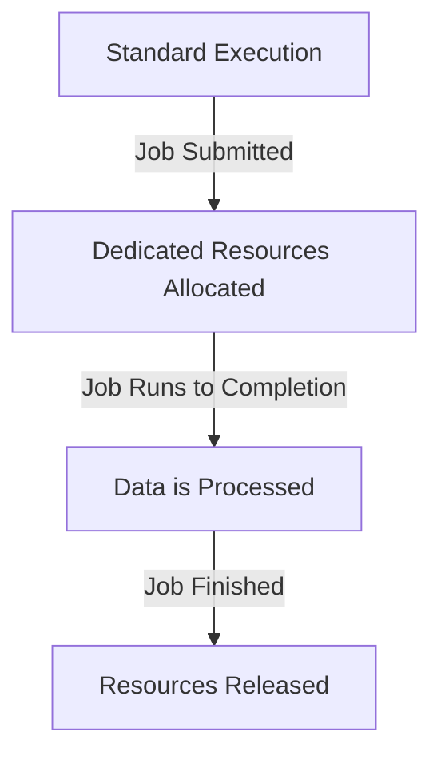
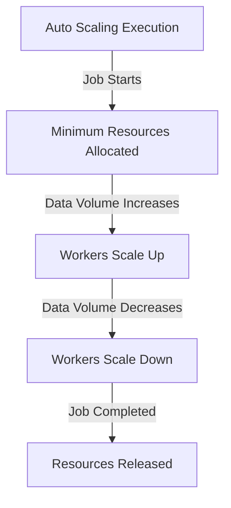
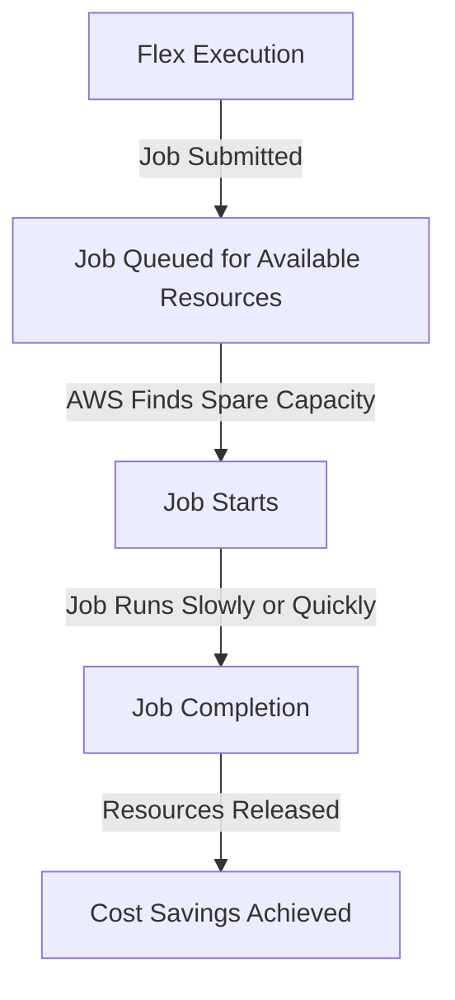

# 🚀 **AWS Glue Job Execution Types**

AWS Glue provides **three execution types** for running ETL jobs, each optimized for **performance, cost, and scalability** needs. Choosing the right execution type is crucial for balancing **cost and performance** in your ETL workflows.

---

## 🎯 **1. Understanding AWS Glue Execution Types**

AWS Glue runs ETL jobs on **compute nodes** (called **workers**), which process data transformations. The **execution type** defines **how AWS Glue allocates these resources**.

There are **three main execution types**:

| **Execution Type**           | **How It Works?**                                                                    | **Best For**                                          |
| ---------------------------- | ------------------------------------------------------------------------------------ | ----------------------------------------------------- |
| **🏎️ Standard Execution**    | AWS Glue holds all compute resources for the entire job run                          | Time-sensitive workloads with strict SLAs             |
| **⚡Auto Scaling Execution** | AWS Glue dynamically scales the number of workers up/down                            | Unpredictable workloads that vary in size             |
| **💸 Flex Execution**        | AWS Glue runs the job on AWS **spare (spot instance) capacity** (slower but cheaper) | Cost-sensitive jobs that don’t need instant execution |

---

## 🏎️ **2. Standard Execution: Dedicated & Fastest**

### 🔹 **How It Works?**

- AWS Glue **reserves computing resources** (workers) for the entire job duration.
- Job starts **immediately** and runs **on dedicated resources** until completion.
- No scaling occurs during job execution.

### 🔹 **Use Cases**

- ✅ **When speed & reliability matter**
- ✅ Workloads with **strict SLAs**
- ✅ **Time-sensitive ETL jobs** that must start immediately
- ✅ **Jobs with downstream dependencies** (e.g., another job must run after completion)

💡 **Example Scenario**:

- 📌 A retail company needs to **process customer transactions in real-time** every 30 minutes.
- 📌 The data must be **available ASAP** for reporting.
- 📌 **Solution?** Use **Standard Execution** to ensure fast startup & dedicated resources.

### 🔹 **Pros & Cons**

✅ **Pros:**

- Fastest startup time.
- Reliable and predictable execution.
- Ensures jobs complete without resource limitations.

❌ **Cons:**

- **Expensive**—you pay for all workers, even if they are underutilized.
- **No auto-scaling**—fixed number of workers is allocated.

---

---

## ⚡ **3. Auto Scaling Execution: Cost-Optimized Scaling**

### 🔹 **How It Works?**

- AWS Glue **dynamically adjusts** the number of workers based on workload demand.
- Jobs start with **minimum resources** and scale up/down as needed.
- **Optimizes cost** by reducing idle resources.

### 🔹 **Use Cases**

- ✅ **Batch jobs with unpredictable data sizes**
- ✅ **Jobs processing small files** (many small tasks → dynamic scaling helps)
- ✅ **Workloads with multiple stages** that have different compute demands
- ✅ **Writing large data into Amazon Redshift or databases**

💡 **Example Scenario**:

- 📌 A company ingests **varying amounts of IoT sensor data** daily.
- 📌 Some days, there are **millions of records**, while others have **thousands**.
- 📌 **Solution?** Auto Scaling **dynamically adjusts** resources based on the incoming data size.

### 🔹 **Pros & Cons**

✅ **Pros:**

- **Lower cost** than Standard Execution.
- Adapts to unpredictable data sizes.
- **Removes unused workers**, reducing unnecessary charges.

❌ **Cons:**

- Slightly **slower start-up time** due to dynamic scaling.
- Not suitable for jobs that require **fixed resources upfront**.

### **🔗 Workshop for Auto Scaling**

[Reference](https://aws.amazon.com/blogs/big-data/introducing-aws-glue-auto-scaling-automatically-resize-serverless-computing-resources-for-lower-cost-with-optimized-apache-spark/)

---

---

## 💸 **4. Flex Execution: Cheapest but Unpredictable**

### 🔹 **How It Works?**

- AWS Glue runs the job **on spare AWS capacity** instead of dedicated EC2 instances.
- **Jobs may experience delays** if no spare resources are available.
- **Greatly reduces costs** but **variable execution times**.

### 🔹 **Use Cases**

- ✅ **Non-urgent workloads** (e.g., runs overnight or on weekends)
- ✅ **One-time bulk data ingestion** (e.g., migrating historical data)
- ✅ **Test environments & pre-production**
- ✅ **Cost-sensitive workloads** that don’t need instant execution\*\*

💡 **Example Scenario**:

- 📌 A company needs to **reprocess 10 years of financial records** for compliance.
- 📌 There is **no strict deadline**—it can take **a few hours or even a day**.
- 📌 **Solution?** Use **Flex Execution** to minimize costs.

### 🔹 **Pros & Cons**

✅ **Pros:**

- **Cheapest** execution type—great for cost-sensitive workloads.
- Uses AWS **spare capacity**, reducing costs.

❌ **Cons:**

- **Unpredictable start time**—job might wait for capacity to free up.
- **Slower execution** due to resource availability.

---

---

## 📊 **5. Cost Comparison of Execution Types**

| **Execution Type**         | **Run Time** | **Max Workers Used** | **Cost (\$ per job run)** |
| -------------------------- | ------------ | -------------------- | ------------------------- |
| **Standard Execution**     | 8 min        | 10                   | \$0.56                    |
| **Auto Scaling Execution** | 8 min        | Up to 10 (dynamic)   | \$0.49                    |
| **Flex Execution**         | 13 min       | 10                   | \$0.35                    |

**Key Takeaways:**

- 📌 **Standard Execution** is **fastest but most expensive**.
- 📌 **Auto Scaling** **reduces cost** by **removing idle workers**.
- 📌 **Flex Execution** is **cheapest**, but **execution times are variable**.

---

## ⚙️ **6. How to Configure Execution Type in AWS Glue?**

- **Step 1:** Go to **AWS Glue Console**
- **Step 2:** Open **ETL Job Configuration**
- **Step 3:** Under **Execution Type**, choose one of:

  - ✅ **Standard Execution**
  - ✅ **Auto Scaling Execution**
  - ✅ **Flex Execution**

- **Step 4:** Adjust **worker settings** if needed
- **Step 5:** Save & Run the Job! 🚀

---

## 🎯 **7. Which Execution Type Should You Choose?**

| **Scenario**                                           | **Best Execution Type** |
| ------------------------------------------------------ | ----------------------- |
| 🚀 **Fastest execution, no scaling**                   | Standard Execution      |
| ⚡ **Scalable workload with unpredictable data sizes** | Auto Scaling Execution  |
| 💰 **Cost-efficient & non-urgent workloads**           | Flex Execution          |
| 📉 **Data ingestion with varying load**                | Auto Scaling Execution  |
| 🛠️ **Pre-production & test jobs**                      | Flex Execution          |

---

## 🏆 **Final Thoughts: Optimize Your Glue Jobs!**

AWS Glue **Execution Types** allow you to balance **speed, cost, and scalability** based on your ETL needs.

- ✅ Use **Standard Execution** for **time-sensitive & dedicated workloads**.
- ✅ Use **Auto Scaling Execution** for **dynamic workloads & unpredictable data sizes**.
- ✅ Use **Flex Execution** for **low-cost jobs where timing doesn’t matter**.
