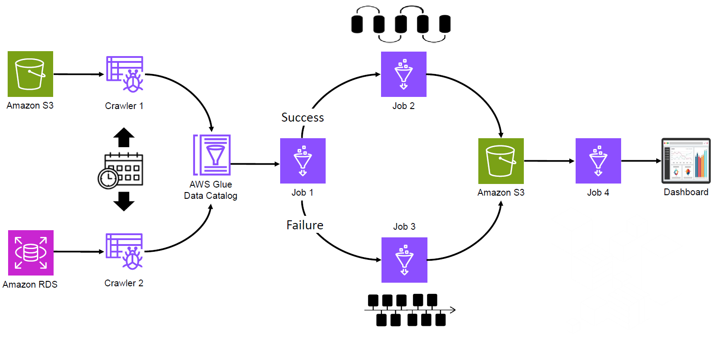
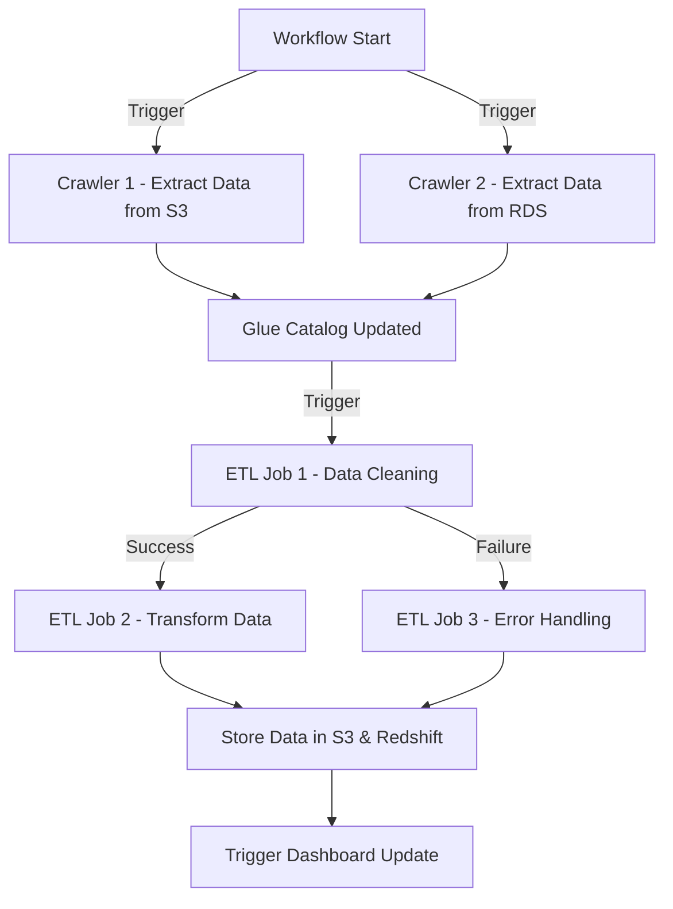
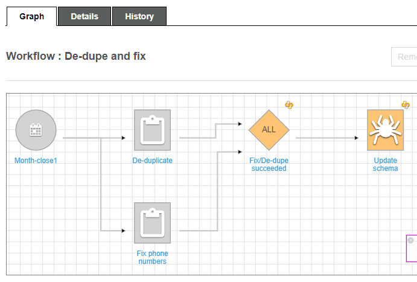
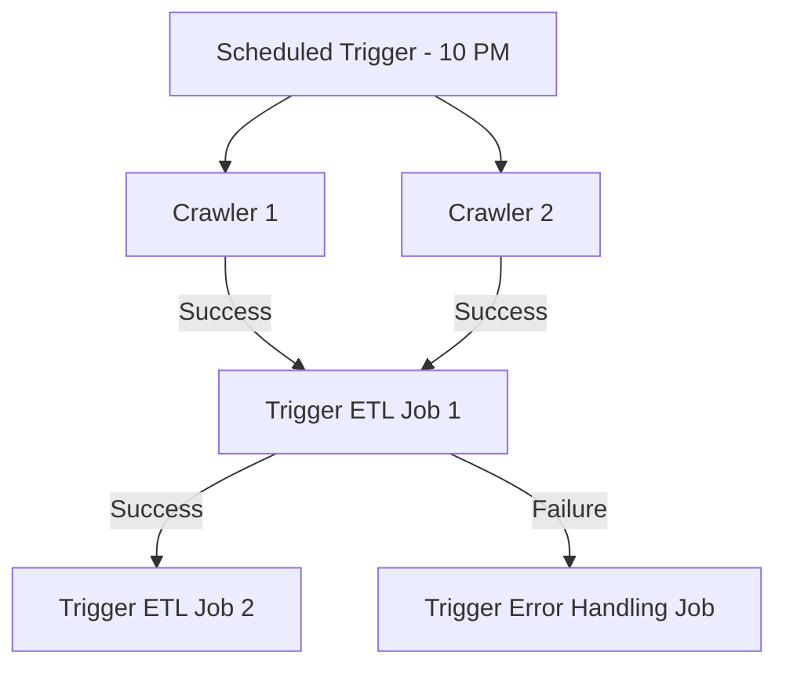
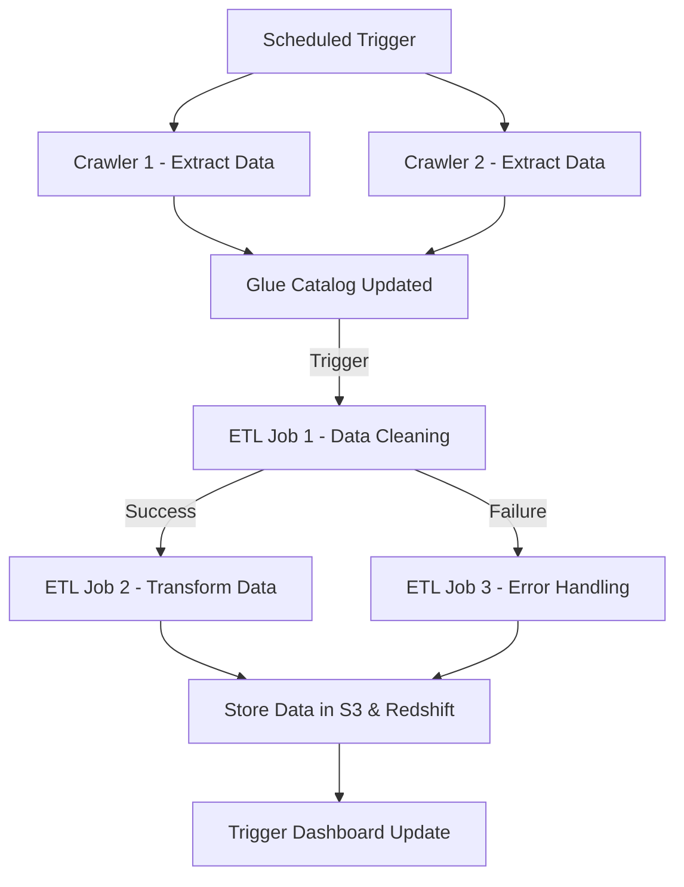
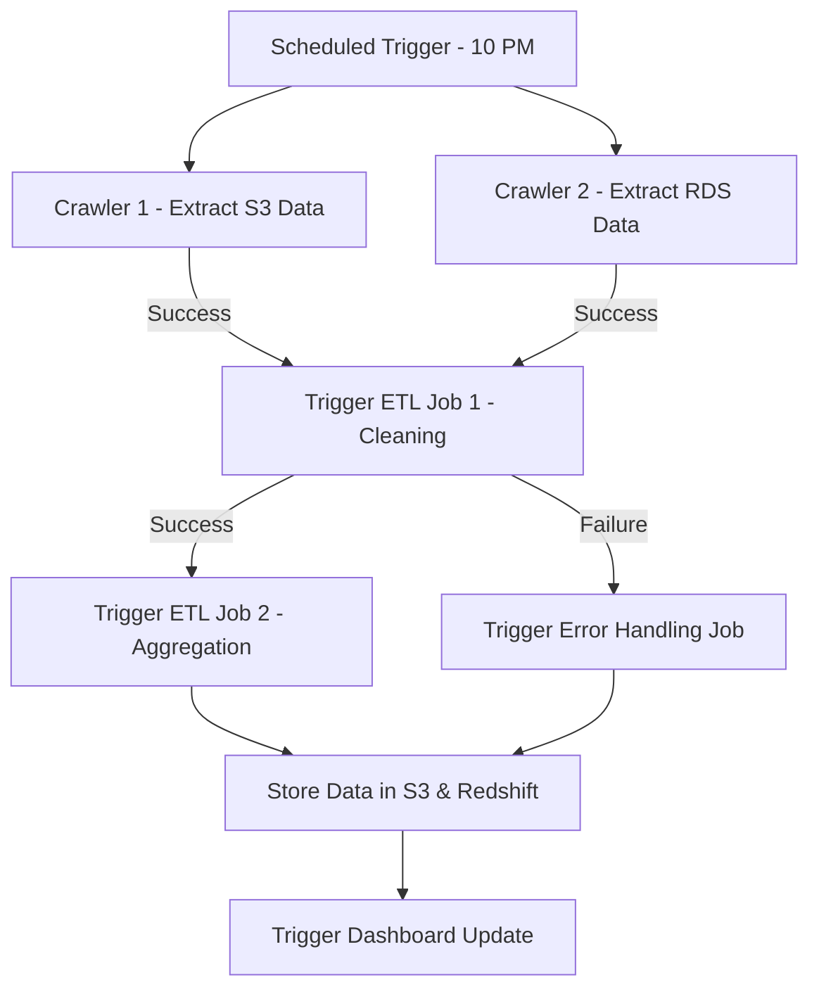

# 🔄 **AWS Glue Workflows: Orchestrating ETL Processes Like a Pro** 🚀

AWS Glue Workflows **orchestrate** complex ETL pipelines by coordinating **crawlers, jobs, and triggers** into a **single execution flow**. Instead of manually scheduling jobs, workflows **automate** the execution order, ensuring seamless data processing.

---

    

---

## 🎯 **1. What is an AWS Glue Workflow?**

A **Glue Workflow** is a **container** that organizes a set of related **jobs, crawlers, and triggers** into a **single, trackable execution pipeline**.

Instead of executing jobs **manually or separately**, workflows allow you to:

- ✅ **Schedule** ETL processes **automatically**
- ✅ **Run jobs sequentially or in parallel**
- ✅ **Trigger specific jobs based on conditions** (success/failure)
- ✅ **Monitor and troubleshoot failures** in a **visual** way

📝 **Think of it like an orchestral conductor** 🎻—controlling when instruments (ETL jobs) start and stop in a coordinated flow.

---

## 🤔 **2. Why Use AWS Glue Workflows?**

### 🔹 **Problem Without Workflows**

- 🔴 Manually scheduling jobs is tedious.
- 🔴 Managing dependencies between jobs is hard.
- 🔴 Failures require **manual intervention**.

### 🔹 **Solution: Glue Workflows**

- ✅ **Fully automated execution**—no manual triggers required.
- ✅ **Ensures correct sequence**—jobs execute **only when dependencies are met**.
- ✅ **Handles failures automatically**—can **rerun** failed jobs or trigger recovery jobs.
- ✅ **Better visibility**—monitor execution visually from the **Glue console**.

### 💡 **Real-Life Scenario**

**A retail company processes daily sales data from multiple sources (S3 & RDS).**

- They need to **clean, transform, and load** the data into Redshift every night.
- If a job **fails**, it should retry or notify the admin.
- **Solution?** AWS Glue Workflow **automates** this process.

---

## 🔑 **3. AWS Glue Workflow Components**

    

---

A Glue Workflow consists of **two key components**:

| Component       | Description                                         |
| --------------- | --------------------------------------------------- |
| **🟢 Triggers** | Decide **when** a job or crawler should start.      |
| **🟣 Nodes**    | Represent **jobs or crawlers** within the workflow. |

### 🔹 **1️⃣ Triggers (Event Listeners)**

Triggers define **when** a workflow component should start.

#### **Trigger Types:**

- 🕒 **Scheduled**: Runs at a fixed interval (e.g., daily at 10 PM).
- ⚡ **Event-based**: Starts when a **crawler or job finishes** (Success or Failure).
- 📌 **On-demand**: Manually triggered by a user.

💡 **Example:**

- Run **Crawler 1** & **Crawler 2** at **10 PM every day**.
- Once crawlers finish successfully → **Trigger ETL Job 1**.
- If **Job 1 fails** → **Trigger an error-handling job** instead.

---

### 🔹 **2️⃣ Nodes (Crawlers & Jobs)**

Each node represents a **step** in the workflow:

| **Node Type**   | **Description**                                                |
| --------------- | -------------------------------------------------------------- |
| **🟢 Crawlers** | Extract metadata & create tables in the **Glue Data Catalog**. |
| **🟣 Jobs**     | Perform **ETL transformations** using Spark, Python, or Scala. |

💡 **Example Workflow Structure:**

- **Trigger 🕒** → Run **Crawlers** to extract metadata.
- **Trigger 🕒** → Run **ETL Jobs** to clean & transform data.
- **Trigger 🕒** → Store transformed data in **S3 or Redshift**.
- **Trigger 🕒** → Update **Dashboards** for reporting.

---

---

## 🛠 **4. How to Create an AWS Glue Workflow?**

### **Step-by-Step Guide**

### ✅ **1️⃣ Create the Workflow**

- 1️⃣ Open **AWS Glue Console** → **Workflows**
- 2️⃣ Click **"Add Workflow"**
- 3️⃣ Enter a **Workflow Name** (e.g., `Daily-ETL-Workflow`)

### ✅ **2️⃣ Add a Trigger**

- 1️⃣ Click **"Add Trigger"**
- 2️⃣ Select **Trigger Type** (e.g., Scheduled)
- 3️⃣ Define **Frequency** (e.g., Every Night at 10 PM)

### ✅ **3️⃣ Add Crawlers**

- 1️⃣ Click **"Add Node"** → Select **"Crawler"**
- 2️⃣ Choose **Crawlers** that extract metadata

### ✅ **4️⃣ Add Jobs**

- 1️⃣ Click **"Add Node"** → Select **"Job"**
- 2️⃣ Choose **ETL Jobs** (e.g., data cleaning, transformation)

### ✅ **5️⃣ Define Job Dependencies**

- 1️⃣ Click **"Add Trigger"** → Choose **"Start After Previous Job"**
- 2️⃣ Configure **Success/Failure conditions**

### ✅ **6️⃣ Save & Run the Workflow!** 🎉

---

## 🚀 **5. AWS Glue Workflow in Action**

💡 **Example: Sales Data Processing Workflow**  
A retail company processes **daily sales data** and updates **dashboards**.

🔹 **Workflow Components:**

- 1️⃣ **Trigger 🕒** → Start at 10 PM daily
- 2️⃣ **Crawlers 🟢** → Extract metadata from S3 & RDS
- 3️⃣ **ETL Job 1 🟣** → Clean & transform data
- 4️⃣ **ETL Job 2 🟣** → Aggregate data & write to Redshift
- 5️⃣ **ETL Job 3 🟣** → Update dashboard

### **📌 Full Workflow Execution Flow:**

---

## 🎯 **6. When to Use AWS Glue Workflows?**

- ✅ **Data pipelines with multiple steps**
- ✅ **Jobs that depend on other jobs (chained execution)**
- ✅ **Error handling & recovery scenarios**
- ✅ **Automated ETL execution on a schedule**
- ✅ **Reducing manual work in managing ETL jobs**

---

## 🏆 **7. Summary: Glue Workflow = ETL Automation Superpower**

- 🔄 **Workflows** automate ETL job execution in AWS Glue.
- 🎯 **Key Components**: Triggers (Schedule/Event) & Nodes (Jobs/Crawlers).
- 💡 **Use workflows to simplify orchestration** of **complex ETL pipelines**.
- 🚀 **Eliminate manual job scheduling** & **ensure jobs run in correct sequence**.
