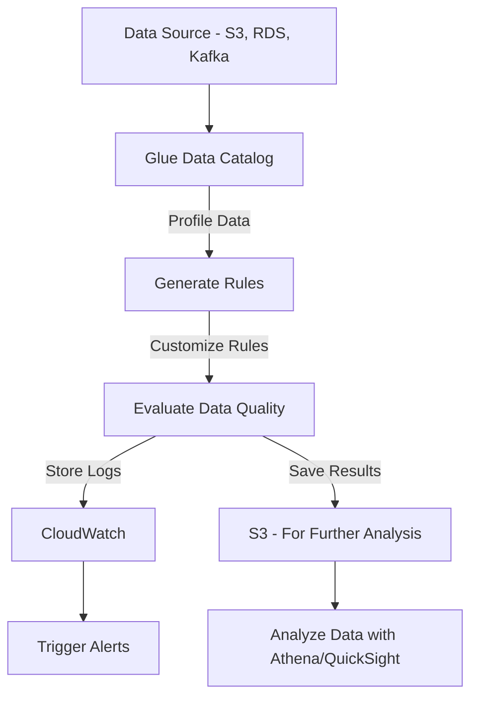
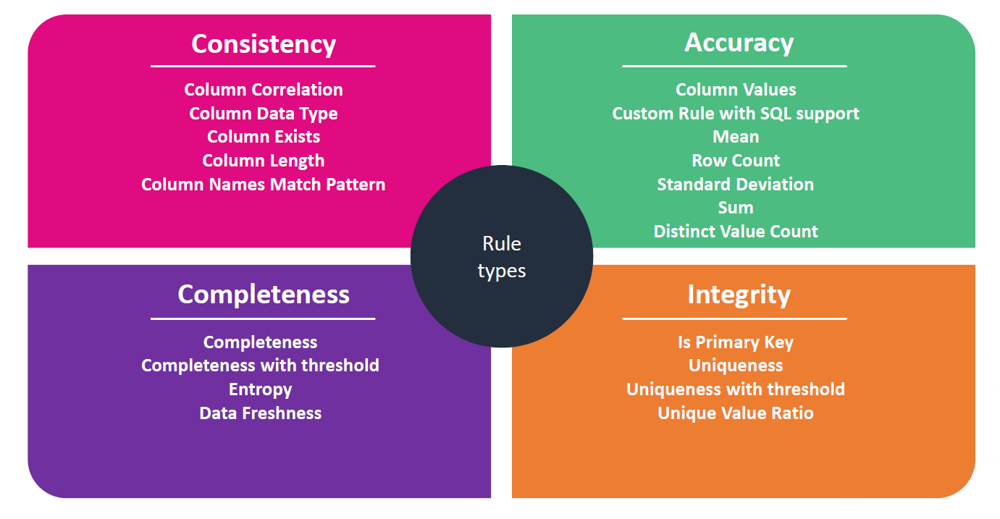
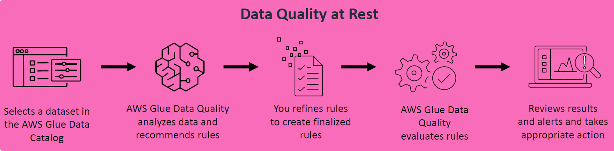
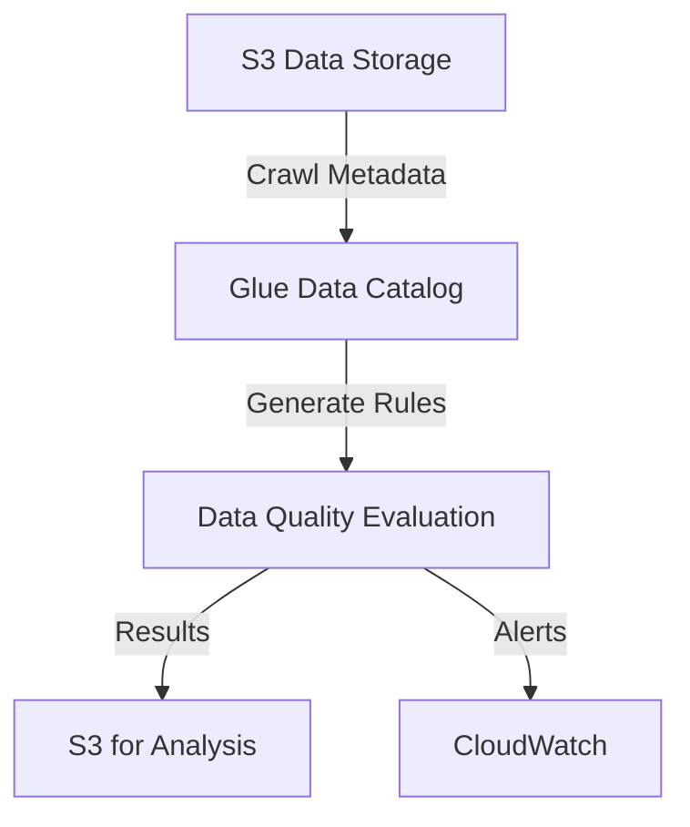
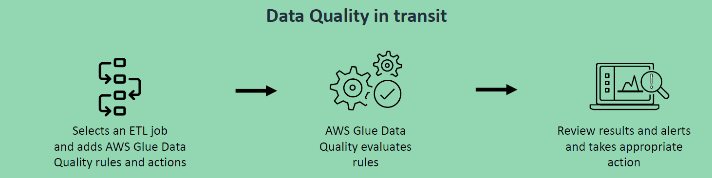
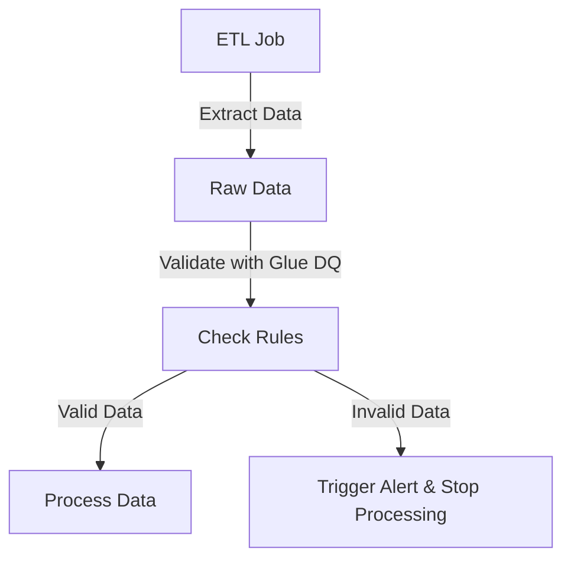

# 📊 **AWS Glue Data Quality**

**"Garbage in, garbage out."** 🚮➡️🚀 In data pipelines, poor-quality data leads to **incorrect analytics, faulty machine learning models, and bad business decisions**. AWS Glue Data Quality ensures your ETL pipelines process **accurate, complete, and consistent** data.

---

  

---

## 🏆 **1. What is AWS Glue Data Quality?**

AWS Glue **Data Quality** (DQ) is a **serverless, pay-as-you-go** service that automates **data validation** in your ETL pipelines.

- 🔹 **Automatically profiles** your data
- 🔹 **Recommends quality rules** (or lets you define custom ones)
- 🔹 **Monitors and validates data** before it's processed
- 🔹 **Supports real-time (in-transit) & stored (at-rest) data checks**
- 🔹 **Uses Amazon’s Open Source DQ library** (handling petabytes of data!)

🛠 **Key Benefits:**

- ✅ **Prevent bad data from entering your analytics pipeline**
- ✅ **Ensure consistency across multiple data sources**
- ✅ **Save time** by automating data validation
- ✅ **Reduce errors in AI/ML models due to poor-quality inputs**

---

## 🤔 **2. Why is Data Quality Important?**

💡 Gourmet Meal requires quality Ingredients.

  

---

💡 **Think of data like cooking ingredients** 🥦🥩🍞.  
If your ingredients **aren’t fresh**, your meal won’t turn out well.

### 📌 **Without Data Quality Checks:**

- ❌ **Duplicate or missing values** → Misleading reports 📉
- ❌ **Inconsistent formats** → Data integration failures 💥
- ❌ **Corrupt or incorrect data** → Incorrect decisions 🤦‍♂️

### 📌 **With AWS Glue Data Quality:**

- ✅ **Ensures high-quality data** → Trustworthy analytics
- ✅ **Reduces risk** → Catches errors before they impact business
- ✅ **Automates validation** → No need for manual checks

### 🔍 **Real-Life Example:**

A **retail company** pulls customer transactions from multiple sources (S3, MySQL, Kafka).

- **Without validation:** Duplicate or corrupt records lead to **incorrect sales reports**.
- **With AWS Glue Data Quality:** The pipeline **automatically filters out** incorrect data.

---

## 🔧 **3. How AWS Glue Data Quality Works?**

AWS Glue DQ uses **3 steps** to validate data:

- 1️⃣ **📊 Data Profiling:** Analyze the dataset & generate recommended rules.
- 2️⃣ **🛠️ Rule Creation:** Customize & fine-tune validation rules.
- 3️⃣ **🚀 Data Quality Execution:** Run rules on **stored data (at-rest)** or **streaming data (in-transit)**.

### 🛠 **AWS Glue Data Quality Workflow**

---

## 🏗️ **4. Types of Data Quality Checks**

  

---

AWS Glue provides **25+ built-in rules** to validate data. These rules ensure:

| ✅ **Check Type** | 🔍 **Purpose**                              |
| ----------------- | ------------------------------------------- |
| **Completeness**  | Are there missing/null values?              |
| **Uniqueness**    | Are there duplicate records?                |
| **Consistency**   | Do formats match across datasets?           |
| **Integrity**     | Do relationships (e.g., foreign keys) hold? |
| **Accuracy**      | Are values within an expected range?        |

🔹 **Example Rules:**

- ✅ **Column must not have NULL values**
- ✅ **All values must follow a date format (YYYY-MM-DD)**
- ✅ **Price values must be greater than 0**
- ✅ **Each Order ID must be unique**

---

## 🔄 **5. AWS Glue Data Quality Use Cases**

AWS Glue supports **data validation in two modes**:

| **Use Case**           | **Scenario**                              |
| ---------------------- | ----------------------------------------- |
| **Data at Rest** 🏛️    | Validate stored datasets before analysis. |
| **Data in Transit** 🚀 | Validate data during ETL processing.      |

### 📌 **1️⃣ Data at Rest** (Stored Data Validation)

  

---

- ✅ **Scenario:** You store data in **S3, RDS, or Redshift** and want to **validate it before analytics**.
- ✅ **How it works?**
  - 🔹 **Step 1:** Data is loaded into the **Glue Data Catalog**.
  - 🔹 **Step 2:** AWS Glue **profiles the dataset** & generates validation rules.
  - 🔹 **Step 3:** Results are stored in **S3 or CloudWatch** for monitoring.

---

---

### 📌 **2️⃣ Data in Transit** (Real-Time ETL Validation)

  

---

- ✅ **Scenario:** You are **running an ETL job** and want to **validate data before processing**.
- ✅ **How it works?**
  - 🔹 **Step 1:** Define **validation rules** in the Glue ETL Job.
  - 🔹 **Step 2:** AWS Glue **checks data against rules** before transformation.
  - 🔹 **Step 3:** **Clean data is processed**, while **bad data triggers alerts**.

---

---

## 🛠 **6. Hands-On Example: Setting Up Data Quality in AWS Glue**

### ✅ **Step 1: Enable Data Quality in AWS Glue**

- 1️⃣ **Go to AWS Glue Console** → Click **Data Quality Rules**
- 2️⃣ Select **a Glue Table**
- 3️⃣ Click **"Generate Recommended Rules"**
- 4️⃣ **Customize Rules** (if needed)
- 5️⃣ Click **"Run Evaluation"**

### ✅ **Step 2: Add Data Quality Checks in ETL Jobs**

- 1️⃣ Open **AWS Glue Studio** → Create/Edit an **ETL job**
- 2️⃣ Click **Transformations** → Add **"Data Quality Rule"**
- 3️⃣ Define **rules (e.g., column must not be NULL)**
- 4️⃣ Save & Run **the ETL job**

### ✅ **Step 3: Monitor Results in CloudWatch**

- 1️⃣ Open **AWS CloudWatch Logs**
- 2️⃣ Search for **Glue Data Quality Logs**
- 3️⃣ Set up **Alerts** for failures

---

## 📌 **7. Summary: Why AWS Glue Data Quality is a Game Changer**

- ✅ **Ensures high-quality, clean, and reliable data**
- ✅ **Automates validation, reducing manual work**
- ✅ **Prevents bad data from corrupting analytics**
- ✅ **Works for both stored data (at rest) and streaming data (in transit)**
- ✅ **Seamlessly integrates with AWS Glue ETL pipelines**
