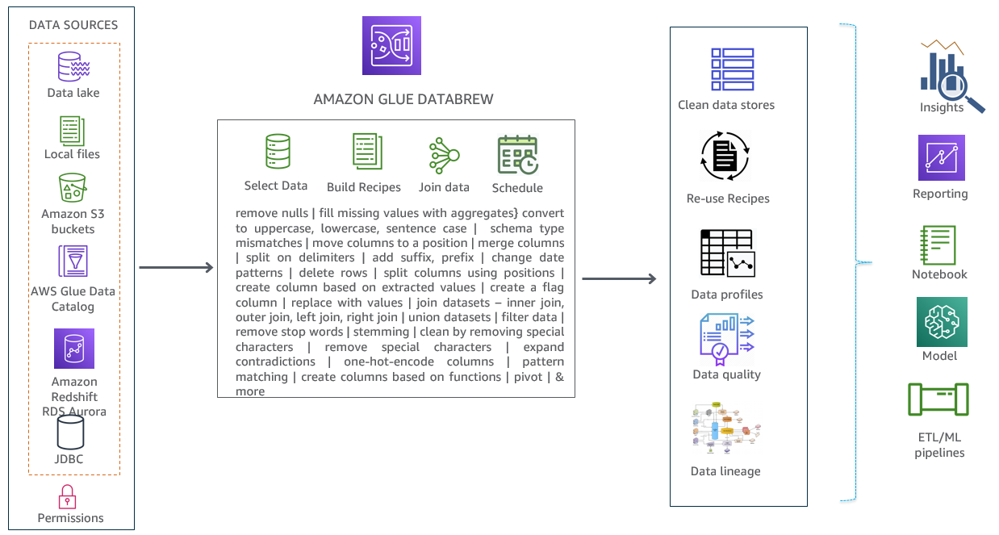
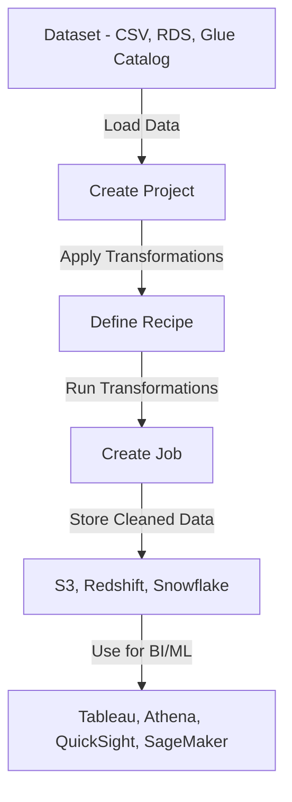

# 🧪 **AWS Glue DataBrew**

**Data cleaning is 80% of the job in data science. Why not make it easy?**

AWS Glue DataBrew is a **no-code, visual data preparation tool** that helps data analysts and scientists **clean, transform, and normalize data** for analytics & ML. Think of it as **Excel on steroids** with 250+ pre-built transformations!

---

[🔗 Official Document So Awesome!](https://catalog.us-east-1.prod.workshops.aws/workshops/6532bf37-3ad2-4844-bd26-d775a31ce1fa/en-US/10-introduction)

  

---

## 🏆 **1. What is AWS Glue DataBrew?**

AWS Glue DataBrew is a **visual data preparation tool** that allows users to **clean and transform data** using a **spreadsheet-like UI** with **point-and-click** interactions—**no coding required!**

🔹 **Key Features:**

- ✅ **Visual data transformation** (no-code approach)
- ✅ **250+ built-in transformations** (normalize, filter, split, aggregate, etc.)
- ✅ **Supports S3, RDS, Glue Catalog, Redshift, Snowflake, and more**
- ✅ **Creates “recipes” for repeatable transformations**
- ✅ **Integrates with AWS Glue ETL for automated processing**
- ✅ **Tracks data lineage** (visual workflow tracking)
- ✅ **Data profiling** for quality analysis

---

## 🎯 **2. Why Use DataBrew? Who Should Use It?**

### 🔍 **Why DataBrew?**

Most data analysts spend **80% of their time** cleaning and preparing data before they can analyze it.  
Instead of writing **SQL or Python scripts**, DataBrew **automates** this process with an **interactive UI**.

### 👨‍💻 **Who Should Use It?**

- ✅ **Data Analysts** → Prepping reports, normalizing data
- ✅ **Data Scientists** → Cleaning ML training datasets
- ✅ **BI & Business Teams** → Quick ad-hoc data transformations
- ✅ **ETL Engineers** → Automating cleaning before loading data

**💡 If you need to clean data but don’t want to write Python or SQL, AWS Glue DataBrew is for you!**

---

## 🔑 **3. Core Concepts in DataBrew**

| 🏷️ **Term**      | 📌 **Definition**                                                       |
| ---------------- | ----------------------------------------------------------------------- |
| **Project**      | The entire workspace where you perform data preparation tasks.          |
| **Dataset**      | The structured or semi-structured data source (S3, RDS, JDBC, etc.).    |
| **Recipe**       | A series of transformation steps applied to a dataset.                  |
| **Job**          | Runs a recipe or data profiling task on a dataset.                      |
| **Data Lineage** | Tracks changes and transformations applied to data.                     |
| **Data Profile** | A summary of data quality (nulls, distributions, missing values, etc.). |

🛠 **Example:**  
A data analyst wants to clean customer data before loading it into Redshift:

- ✅ **Dataset:** CSV file in S3
- ✅ **Project:** "Customer Cleanup"
- ✅ **Recipe:** Convert dates, remove duplicates, split names
- ✅ **Job:** Run the recipe & save output to S3

---

## ⚙️ **4. How AWS Glue DataBrew Works**

**Step-by-step DataBrew process:**

---

## 🚀 **5. Hands-on Example: Cleaning CitiBike Data**

### **Scenario:**

- 📌 You are analyzing **CitiBike trip data** (New York bike rentals) from S3.
- 📌 The dataset has **dirty data** (special characters, inconsistent date formats).
- 📌 You want to **clean & prepare it for analysis**.

### **Step 1: Load Data into DataBrew**

- 1️⃣ **Go to AWS Glue DataBrew Console**
- 2️⃣ Click **Create Dataset** → Choose **S3**
- 3️⃣ Select **CitiBike.csv** file → Click **Create Dataset**

### **Step 2: Create a DataBrew Project**

- 1️⃣ Click **Create Project** → Name it **"CitiBike Cleanup"**
- 2️⃣ Select the **CitiBike Dataset**
- 3️⃣ Click **Create**

### **Step 3: Apply Transformations (Create a Recipe)**

- ✅ **Convert timestamp to string**
- ✅ **Split date and time into separate columns**
- ✅ **Remove special characters from station names**
- ✅ **Filter out trips with missing values**
- ✅ **Group by month & count total trips**

**All actions are recorded as steps in a "Recipe"!**

### **Step 4: Run the Job & Export Clean Data**

- 1️⃣ Click **Create Job** → Choose **Recipe Job**
- 2️⃣ Select **S3 as Output**
- 3️⃣ Choose format **CSV or Parquet**
- 4️⃣ Click **Run Job** 🎉

---

## ⚡ **6. DataBrew vs AWS Glue ETL: What’s the Difference?**

| Feature                 | AWS Glue DataBrew 🧪                  | AWS Glue ETL 🚀                |
| ----------------------- | ------------------------------------- | ------------------------------ |
| **Purpose**             | Visual data preparation               | Large-scale ETL processing     |
| **User Type**           | Data analysts, BI teams               | Data engineers, ETL developers |
| **Code Required?**      | ❌ No coding needed                   | ✅ Requires Python/Scala/Spark |
| **Use Case**            | Cleaning, transforming small datasets | Complex, large-scale ETL jobs  |
| **Output Destinations** | S3, Redshift, Glue Catalog            | S3, Redshift, DynamoDB, Athena |

> 💡 **Use DataBrew when you need quick, no-code transformations**.  
> 💡 **Use AWS Glue ETL when handling large-scale transformations with Spark**.

---

## 📌 **7. Summary: Why AWS Glue DataBrew is a Game Changer**

- ✅ **No-code data preparation** for BI & ML
- ✅ **250+ built-in transformations** (filter, split, join, normalize, etc.)
- ✅ **Supports multiple data sources** (S3, RDS, Glue Catalog, Redshift, etc.)
- ✅ **Easy automation with recipes & jobs**
- ✅ **Perfect for data analysts & scientists**
