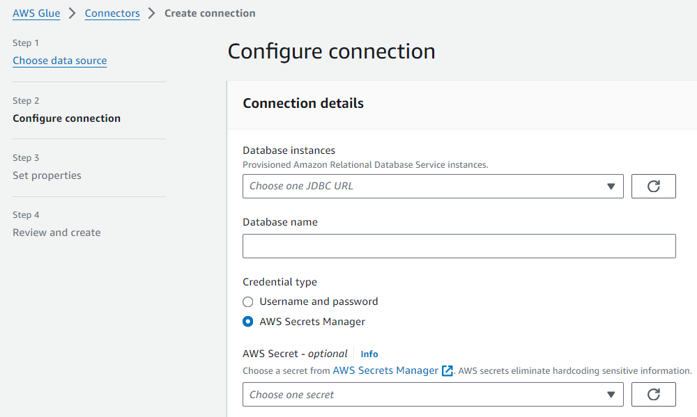
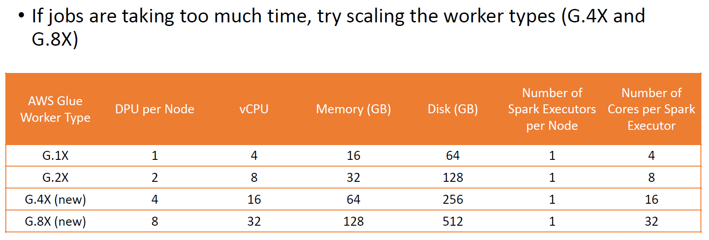
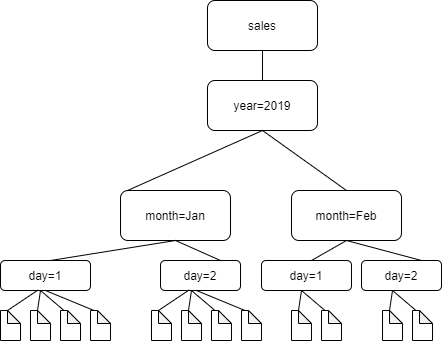

# 🚀 **AWS Glue Additional Features: Unlocking Advanced Capabilities**

AWS Glue provides several **powerful features** to enhance security, performance, and efficiency in ETL workflows. These features ensure **secure credential storage, optimized network access, better job performance, partition-aware crawling, and centralized schema management**.

---

## 🔐 **1. Storing Credentials in AWS Secrets Manager**

<div style="text-align: center"></div>

---

### ❌ **The Problem**

Many ETL jobs require database credentials (username & password). Storing them in **plain text** in scripts is **risky and insecure**!

### ✅ **The Solution: AWS Secrets Manager**

Instead of hardcoding credentials, AWS Glue integrates with **AWS Secrets Manager** to securely store and retrieve database credentials **on demand**.

### 🛠 **How to Use It in AWS Glue?**

- 1️⃣ **Go to AWS Glue Console** → Navigate to **Connections**
- 2️⃣ Click **Create Connection**
- 3️⃣ Choose a **data source** (JDBC, RDS, CosmosDB, etc.)
- 4️⃣ **Enable AWS Secrets Manager** for authentication
- 5️⃣ AWS Glue **retrieves credentials dynamically** at runtime

💡 **Benefit:** 🔒 No more hardcoded credentials! Securely manage database access while ensuring compliance.

---

## 🔗 **2. Using VPC Endpoints for Private Amazon S3 Access**

<div style="text-align: center"></div>

### ❌ **The Problem**

By default, AWS Glue jobs accessing **Amazon S3** **traverse the public internet**, creating potential security risks.

### ✅ **The Solution: VPC Endpoints**

VPC **Gateway Endpoints** allow Glue to access **Amazon S3 privately** without using the public internet.

### 🛠 **How to Set It Up?**

- 1️⃣ Go to **VPC Console** → **Endpoints**
- 2️⃣ Click **Create Endpoint**
- 3️⃣ Select **S3 as the service**
- 4️⃣ Attach the **VPC, Route Table, and Security Groups**
- 5️⃣ Update **IAM Policies** to allow Glue to use the endpoint

💡 **Benefit:** 🔒 Securely process data in S3 **without exposing traffic to the public internet**.

---

## 🏗 **3. Glue Worker Types: Choosing the Right Compute Power**

<div style="text-align: center"></div>

AWS Glue jobs run on **workers** (compute nodes). AWS Glue offers **different worker types** depending on job complexity.

### 🔍 **Worker Type Options**

| Worker Type         | vCPUs | Memory | Storage | Best For               |
| ------------------- | ----- | ------ | ------- | ---------------------- |
| **Standard (G.1X)** | 4     | 16 GB  | 64 GB   | General workloads      |
| **G.2X**            | 8     | 32 GB  | 128 GB  | Medium-scale workloads |
| **G.4X**            | 16    | 64 GB  | 256 GB  | Compute-intensive jobs |
| **G.8X**            | 32    | 128 GB | 512 GB  | Large-scale processing |

### 🛠 **When to Use Different Worker Types?**

- ✅ **G.1X (Standard):** Small ETL jobs & basic transformations
- ✅ **G.2X:** Medium-sized transformations & moderate processing
- ✅ **G.4X & G.8X:** Large-scale, compute-intensive workloads

💡 **Tip:** 🏎 If your job **runs slow**, try **scaling up** (larger worker type) instead of increasing the number of workers.

---

## 📂 **4. AWS Glue Automatically Identifies Partitions**

<div style="text-align: center"></div>

### 🔍 **What is Partitioning?**

Partitioning **organizes large datasets** by key attributes (e.g., year/month/day) to **speed up queries and processing**.

### 🛠 **Example: Partitioned Data in S3**

```txt
s3://sales-data/year=2024/month=03/day=15/
s3://sales-data/year=2024/month=03/day=16/
```

💡 **Partitioning allows Glue to scan only relevant data instead of the entire dataset.**

### 🏗 **AWS Glue’s Auto Partition Detection**

- 1️⃣ **Glue Crawler scans S3 buckets**
- 2️⃣ **Automatically detects partitions** (e.g., year, month, day)
- 3️⃣ **Creates partitioned tables** in the Glue Data Catalog

💡 **Benefit:** 🚀 Faster query performance and **lower processing costs**!

---

## 📜 **5. AWS Glue Schema Registry: Managing Data Consistency**

### 🔍 **What is a Schema?**

A **schema** defines the **structure** of a dataset (columns, data types, nested fields, etc.).

### ✅ **The Problem: Schema Evolution**

As datasets evolve, **schema changes** (new columns, format updates) can break downstream applications.

### 🛠 **AWS Glue Schema Registry to the Rescue!**

AWS Glue **Schema Registry** allows centralized schema storage for:

- ✅ **Kafka, Kinesis, Flink, Lambda**
- ✅ **Data serialization & deserialization**
- ✅ **Version control for schema changes**

### 🏗 **How It Works?**

- 1️⃣ Go to **AWS Glue Console** → **Schema Registry**
- 2️⃣ Click **Create Schema**
- 3️⃣ Define schema in **JSON or Avro** format
- 4️⃣ Enforce schema validation for streaming data

💡 **Benefit:** Ensures **consistent data formats** across multiple AWS services & prevents schema mismatches!

---

## 🎯 **Final Takeaways: AWS Glue Advanced Features**

| Feature                      | Purpose                     | Benefit                         |
| ---------------------------- | --------------------------- | ------------------------------- |
| **AWS Secrets Manager**      | Secure database credentials | 🔒 No hardcoded passwords       |
| **VPC Endpoints**            | Private S3 access           | 🚀 Secure, no internet exposure |
| **Worker Types**             | Optimized ETL performance   | ⚡ Faster processing            |
| **Auto Partition Detection** | Efficient data querying     | 📂 Faster lookups               |
| **Schema Registry**          | Manage schema consistency   | ✅ Prevents schema mismatches   |
