# 🌀 **Shard Iterators in Amazon Kinesis Data Streams (KDS)**

<div style="text-align: center;">
    
</div>

## 🔍 **What is a Shard Iterator?**

A **Shard Iterator** is a pointer to a specific position within a **shard** in **Amazon Kinesis Data Streams (KDS)**.  
It helps consumers retrieve **real-time or historical** data by defining where to begin reading from the shard.

💡 **Think of it like a bookmark** 📖 in a book, telling you where to continue reading from.

**Why Are Shard Iterators Important?**

- ✔ Control where to start reading records from.
- ✔ Optimize consumer performance by reading only relevant data.
- ✔ Ensure data consistency across multiple consumers.
- ✔ Allow replaying or skipping past records based on business needs.

---

## 🏗 **How Shard Iterators Work**

```mermaid
sequenceDiagram
    participant Producer
    participant Kinesis Stream
    participant Consumer

    Producer->>Kinesis Stream: 🔄 Send Data (Logs, Events, Metrics)
    Consumer->>Kinesis Stream: 📌 Request Shard Iterator
    Kinesis Stream->>Consumer: 🔑 Return Shard Iterator
    Consumer->>Kinesis Stream: 🔄 Fetch Records Using Iterator
    Kinesis Stream->>Consumer: 📦 Send Data Records
    Consumer->>Consumer: ✅ Process Data
```

<div style="text-align: center;">



</div>

💡 **Shard Iterators help the consumer decide where to start reading data from the stream.**  
Different iterator types determine whether to read from the beginning, a specific time, or only the latest data.

---

## 🛠 **Using Shard Iterators with AWS CLI**

### 🔹 **1. Get a Shard Iterator**

Before retrieving records, you need a **Shard Iterator** for your chosen position.

```bash
aws kinesis get-shard-iterator --stream-name MyStream \
--shard-id shardId-000000000000 \
--shard-iterator-type TRIM_HORIZON
```

🔹 This will return a **Shard Iterator** like:

```json
{
  "ShardIterator": "AAAAAAAAAAHSywljv0zEgPX4NyKdZ5wry..."
}
```

---

### 🔹 **2. Retrieve Records Using Shard Iterator**

Once you have a **Shard Iterator**, use it to read records from the stream.

```bash
aws kinesis get-records --shard-iterator AAAAAAAAAAHSywljv0zEgPX4NyKdZ5wry...
```

🔹 This will return **records from the shard**:

```json
{
  "Records": [
    {
      "Data": "dGVzdGRhdGE=",
      "PartitionKey": "123",
      "ApproximateArrivalTimestamp": 1.441215410867e9,
      "SequenceNumber": "495469866831355..."
    }
  ],
  "MillisBehindLatest": 24000,
  "NextShardIterator": "AAAAAAAAAAEDOW3ugse..."
}
```

---

### 🔹 **3. Iterating Through Data**

Kinesis data streams **store records for a retention period (default 24 hours, max 365 days)**.  
To **continuously read new records**, use the **NextShardIterator** from the previous request.

```bash
aws kinesis get-records --shard-iterator NEXT_SHARD_ITERATOR_HERE
```

📌 **Important Notes:**

- If you don’t call `get-records` within **300 seconds**, the shard iterator **expires**.
- Use **`LATEST`** for real-time processing **(only new records)**.
- Use **`TRIM_HORIZON`** if you need to **replay old records**.

---

## 🚀 **Types of Shard Iterators with Examples**

### 1️⃣ **AT_SEQUENCE_NUMBER** 🔢

👉 **Reads exactly from a specific sequence number.**

✅ **Use Case:** You want to **resume processing from a known point** (e.g., after a system restart).

📌 **Example:**

- A **log processing system** crashes but stores the **last processed sequence number**.
- On restart, it resumes **exactly from that sequence number** using `AT_SEQUENCE_NUMBER`.

```bash
aws kinesis get-shard-iterator --stream-name MyStream \
--shard-id shardId-000000000000 \
--shard-iterator-type AT_SEQUENCE_NUMBER \
--starting-sequence-number "49546986683135544286507457936321625675700192471156785154"
```

---

### 2️⃣ **AFTER_SEQUENCE_NUMBER** ➡

👉 **Reads data right after a specific sequence number.**

✅ **Use Case:** When you **want to skip a processed record and continue from the next one.**

📌 **Example:**

- A **payment system** wants to **skip duplicate transactions** and only process new ones.
- Instead of reprocessing the last transaction, it uses `AFTER_SEQUENCE_NUMBER` to fetch the **next** one.

```bash
aws kinesis get-shard-iterator --stream-name MyStream \
--shard-id shardId-000000000000 \
--shard-iterator-type AFTER_SEQUENCE_NUMBER \
--starting-sequence-number "49546986683135544286507457936321625675700192471156785154"
```

---

### 3️⃣ **AT_TIMESTAMP** ⏳

👉 **Reads records from a specific timestamp.**

✅ **Use Case:** If you want to **replay events from a specific point in time** (e.g., troubleshooting, audits).

📌 **Example:**

- A **stock trading application** needs to **reprocess trades from 9:30 AM (market opening time).**
- The consumer uses `AT_TIMESTAMP` to **fetch records starting from that moment.**

```bash
aws kinesis get-shard-iterator --stream-name MyStream \
--shard-id shardId-000000000000 \
--shard-iterator-type AT_TIMESTAMP \
--timestamp "2024-03-19T09:30:00Z"
```

---

### 4️⃣ **TRIM_HORIZON** 📜

👉 **Reads data from the oldest available record (beginning of the stream).**

✅ **Use Case:** When you **want to process all records from the beginning** (e.g., **batch processing** or **historical analysis**).

📌 **Example:**

- A **fraud detection system** needs to **analyze the past 7 days of transactions**.
- The consumer uses `TRIM_HORIZON` to **start reading from the oldest available record.**

```bash
aws kinesis get-shard-iterator --stream-name MyStream \
--shard-id shardId-000000000000 \
--shard-iterator-type TRIM_HORIZON
```

---

### 5️⃣ **LATEST** 📡

👉 **Reads only new incoming records (ignores old data).**

✅ **Use Case:** When you need **real-time analytics** and only care about new records.

📌 **Example:**

- A **live dashboard** monitoring **website traffic** needs only **new visitor events**.
- The consumer uses `LATEST` to **ignore old logs** and only process **new ones**.

```bash
aws kinesis get-shard-iterator --stream-name MyStream \
--shard-id shardId-000000000000 \
--shard-iterator-type LATEST
```

---

### 📊 **Comparison of Shard Iterator Types**

| **Shard Iterator Type**   | **Starts Reading From...**        | **Best Use Case**                  |
| ------------------------- | --------------------------------- | ---------------------------------- |
| **AT_SEQUENCE_NUMBER**    | A **specific sequence number**    | Resuming from a stored checkpoint  |
| **AFTER_SEQUENCE_NUMBER** | Right **after** a sequence number | Skipping a processed record        |
| **AT_TIMESTAMP**          | A **specific timestamp**          | Retrieving historical events       |
| **TRIM_HORIZON**          | The **oldest available record**   | Full data replay, batch processing |
| **LATEST**                | **Only new records**              | Real-time streaming analytics      |

## ⚖ **Key Takeaways**

- ✔ **Shard Iterators act as bookmarks** for reading data in Kinesis shards.
- ✔ **Consumers request iterators** to define where they start reading.
- ✔ **Choose the correct iterator type** based on real-time or historical needs.
- ✔ **Use `NextShardIterator`** to keep reading without interruptions.
- ✔ **Ensure efficient polling** to avoid iterator expiration.
