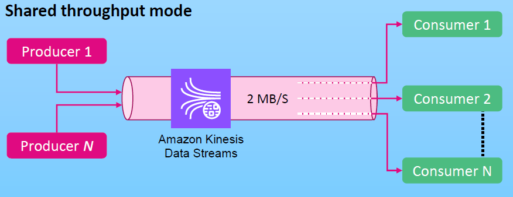
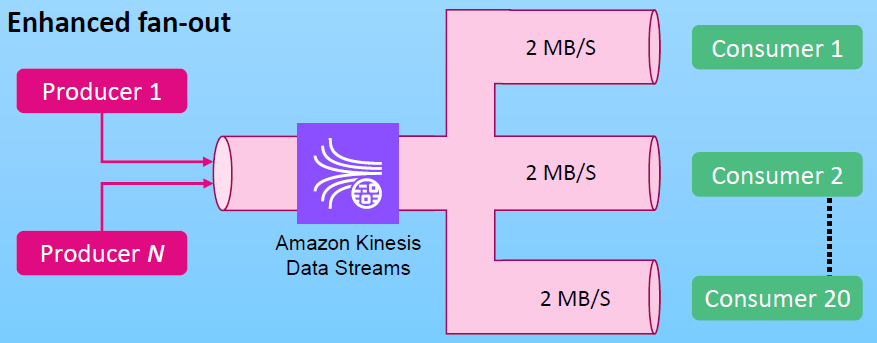

# 🚀 **Amazon Kinesis Data Streams: Shared Throughput vs. Enhanced Fan-Out**

## **📌 Introduction**

Kinesis Data Streams (KDS) allows multiple consumers (applications) to **read and process** streaming data from a **shard**. However, when multiple consumers try to read from the same shard, there are **throughput limitations (quota)**.

To manage this, **Kinesis provides two modes** for reading data:

- 1️⃣ **Shared Throughput Mode** (default)
- 2️⃣ **Enhanced Fan-Out Mode** (premium feature)

---

## 🤔 **WHY fan-out feature**

In Amazon Kinesis Data Streams (KDS), the **fan-out feature** is necessary to optimize throughput and latency when multiple consumers are reading the same record from the same stream. Here’s why fan-out is valuable even though multiple consumers can technically read the same data:

### 1️⃣ **Parallel Data Delivery with Higher Throughput**

- Without enhanced fan-out, all consumers share the same read throughput quota for a shard (e.g., 2 MB/s per shard for data retrieval).
- **Fan-out enables each consumer to have its own dedicated throughput** (up to 2 MB/s per shard), ensuring that one consumer’s high data demand doesn’t affect the others.

### 2️⃣ **Reduced Latency**

- Without fan-out, consumers may experience **latency spikes** because they must compete for read bandwidth and make frequent `GetRecords` API calls to poll data.
- **Fan-out provides a push-based model**, delivering data to consumers with much lower latency compared to polling.

### 3️⃣ **Scalability for Multiple Independent Consumers**

- In scenarios where there are **multiple independent applications** reading the same data (e.g., analytics, monitoring, and archiving), fan-out ensures they can all operate at full speed without bottlenecks.

### 4️⃣ **Use Cases for Real-Time and Concurrent Processing**

- Enhanced fan-out is especially useful for real-time applications, such as streaming dashboards or event-driven architectures, where minimizing delays and maximizing speed are critical.

> So, while basic consumers can share and read the same data, fan-out provides a performance boost, better scaling, and improved user experience for use cases requiring high-speed, parallel data consumption.

## 🎯 **1. What is Shared Throughput?**

    

---

- 🔹 **All consumers share the 2 MB/sec read limit per shard**
- 🔹 **Higher consumer count = Slower performance**
- 🔹 **Consumes records using the `GetRecords` API** (pull-based)

---

- 🔹 **Throughput Limit**: 🚧 **2 MB/sec per shard**
- 🔹 **Latency**: 🚨 Higher as the number of consumers increases
- 🔹 **Best for**: ✅ **Few consumers** (<3) and **non-latency-sensitive** applications

---

🔹 **How it Works:**

```mermaid
sequenceDiagram
    participant Producer as 🔵 Producer (Sends Data)
    participant Shard as 📦 Kinesis Shard (2MB/sec limit)
    participant Consumer1 as 📥 Consumer 1
    participant Consumer2 as 📥 Consumer 2
    participant Consumer3 as 📥 Consumer 3

    Producer->>Shard: 📩 Sends Data (Log Events, Clicks, etc.)
    Consumer1->>Shard: 🔄 Requests Data (GetRecords API)
    Consumer2->>Shard: 🔄 Requests Data (GetRecords API)
    Consumer3->>Shard: 🔄 Requests Data (GetRecords API)
    Shard->>Consumer1: ⏳ Limited Bandwidth
    Shard->>Consumer2: ⏳ Limited Bandwidth
    Shard->>Consumer3: ⏳ Limited Bandwidth
```

📌 **Issue**: More consumers = **higher delay** ⏳ because they all compete for the **same 2 MB/sec bandwidth**.

---

## 🚀 **2. What is Enhanced Fan-Out?**

    

---

- 🔹 **Each consumer gets a dedicated 2 MB/sec read throughput**
- 🔹 **Faster data propagation (latency ~70ms)**
- 🔹 **Uses `SubscribeToShard` API (push-based instead of pull-based)**

---

- 🔹 **Throughput Limit**: 🚀 **2 MB/sec per consumer**
- 🔹 **Latency**: ⚡ **~70ms, regardless of the number of consumers**
- 🔹 **Best for**: ✅ **Multiple consumers** (3+) and **real-time, low-latency processing**

---

🔹 **How it Works:**

```mermaid
sequenceDiagram
    participant Producer as 🔵 Producer (Sends Data)
    participant Shard as 📦 Kinesis Shard
    participant Consumer1 as ⚡ Consumer 1 (2MB/sec)
    participant Consumer2 as ⚡ Consumer 2 (2MB/sec)
    participant Consumer3 as ⚡ Consumer 3 (2MB/sec)

    Producer->>Shard: 📩 Sends Data (Log Events, Clicks, etc.)
    Shard->>Consumer1: 🚀 Pushes Data (SubscribeToShard API)
    Shard->>Consumer2: 🚀 Pushes Data (SubscribeToShard API)
    Shard->>Consumer3: 🚀 Pushes Data (SubscribeToShard API)
```

📌 **Advantage**: Each consumer gets **its own dedicated 2 MB/sec bandwidth**, so **no competition!** 🚀

---

## 🔄 **Comparison: Shared Throughput vs. Enhanced Fan-Out**

| Feature             | Shared Throughput                                   | Enhanced Fan-Out                           |
| ------------------- | --------------------------------------------------- | ------------------------------------------ |
| **Read Bandwidth**  | 🚧 **2 MB/sec per shard** (shared)                  | 🚀 **2 MB/sec per consumer**               |
| **Latency**         | ⏳ **200ms (1 consumer)**, **1000ms (5 consumers)** | ⚡ **~70ms, even with multiple consumers** |
| **Record Delivery** | 🔄 **Pull model** (`GetRecords` API)                | 🚀 **Push model** (`SubscribeToShard` API) |
| **Max Consumers**   | ✅ Unlimited (but limited by shared bandwidth)      | ❌ **20 consumers max** per stream         |
| **Best for**        | ✅ Few consumers, non-latency-sensitive             | ✅ Multiple consumers, real-time data      |

---

## 💰 **Cost Considerations**

| **Mode**              | **Cost**                                                             |
| --------------------- | -------------------------------------------------------------------- |
| **Shared Throughput** | 🆓 Free (no additional cost)                                         |
| **Enhanced Fan-Out**  | 💰 **Extra cost** (charged per consumer-shard hour & data retrieval) |

💡 **Tip:** Use **Shared Throughput** when you have **few consumers** and **Enhanced Fan-Out** when you need **high-speed parallel processing.** 🚀

---

## 📌 **When to Use Which Mode?**

| **Scenario**                                        | **Recommended Mode**     |
| --------------------------------------------------- | ------------------------ |
| **Few consumers (<3)**                              | ✅ **Shared Throughput** |
| **Many consumers (>3)**                             | ✅ **Enhanced Fan-Out**  |
| **Non-latency-sensitive**                           | ✅ **Shared Throughput** |
| **Real-time analytics (low latency required)**      | ✅ **Enhanced Fan-Out**  |
| **Cost-sensitive applications**                     | ✅ **Shared Throughput** |
| **Fraud detection, stock trading, live dashboards** | ✅ **Enhanced Fan-Out**  |

---

## 🎯 **Final Thoughts**

✅ **Shared Throughput** = **Good for small-scale applications, cost-effective**  
✅ **Enhanced Fan-Out** = **Best for multiple real-time consumers, low-latency needs**  
✅ **Both modes can be used together** in a **single stream** 🚀

💡 **Use Shared Throughput for most cases, but if speed matters, switch to Enhanced Fan-Out.**
