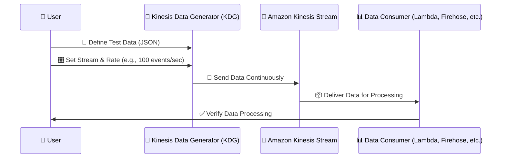

# 🚀 **Amazon Kinesis Data Generator (KDG)**

## **📌 What is Kinesis Data Generator?**

The **Amazon Kinesis Data Generator (KDG)** is a simple web-based tool that allows you to **generate and send test data** to:

- **Amazon Kinesis Data Streams (KDS)**
- **Amazon Data Firehose (formerly Kinesis Data Firehose)**

### 🎯 **Why Use KDG?**

- ✅ Helps in **testing** and **debugging** streaming applications
- ✅ **Simulates real-world streaming data** (logs, sensor data, events, etc.)
- ✅ Eliminates the need to **manually write producer applications**
- ✅ Works with **Kinesis Data Streams** and **Amazon Data Firehose**
- ✅ Supports **custom JSON payloads**

---

## 🛠 **How KDG Works?**



💡 **KDG continuously sends generated data to the Kinesis stream, allowing real-time testing.**

---

## 🎨 **Setting Up Kinesis Data Generator**

### **🔹 Step 1: Access the KDG Web Interface**

- 👉 **Go to** [Kinesis Data Generator](https://awslabs.github.io/amazon-kinesis-data-generator/)
- 👉 Click **Login with AWS credentials**
- 👉 Grant **IAM permissions** to allow KDG to send data

### **🔹 Step 2: Configure the Kinesis Stream**

- 🔹 Select the **Kinesis Data Stream** or **Data Firehose**
- 🔹 Choose a **region** where your stream is deployed

### **🔹 Step 3: Define a JSON Payload**

- You can use JSON templates to simulate real-world data. Example:

  ```json
  {
    "user_id": "{{random.number(1000)}}",
    "event_type": "{{random.arrayElement(['click', 'purchase', 'login', 'logout'])}}",
    "timestamp": "{{date.now('YYYY-MM-DD HH:mm:ss')}}",
    "amount": "{{random.number(100, 999)}}"
  }
  ```

- 📝 **KDG supports Mustache templating for dynamic data generation!**

### **🔹 Step 4: Set Data Rate & Start Sending**

- ✅ Choose **messages per second** (e.g., 100 events/sec)
- ✅ Click **Start Sending Data** 🎯

---

## 📊 **Example Use Cases for KDG**

| **Use Case**                | **Example Scenario**                           |
| --------------------------- | ---------------------------------------------- |
| **Real-time Monitoring**    | Generate logs for a web application            |
| **IoT Sensor Data**         | Simulate temperature & humidity sensor data    |
| **Stock Market Simulation** | Stream real-time stock prices                  |
| **E-commerce Events**       | Simulate user activity like clicks & purchases |

---

## 🛑 **Best Practices**

- ✔ **Use realistic JSON payloads** for accurate testing
- ✔ **Adjust event rate** to simulate different workloads
- ✔ **Monitor the Kinesis stream** using AWS CloudWatch
- ✔ **Ensure IAM permissions** allow KDG to write to Kinesis

---

## 🎯 **Final Thoughts**

- ✅ The **Kinesis Data Generator (KDG)** is an **easy and powerful** tool for **testing streaming applications**.
- ✅ **No need to build custom producers** – just define a JSON template and start streaming!
- ✅ Works with **Amazon Kinesis Data Streams** and **Amazon Data Firehose**.
