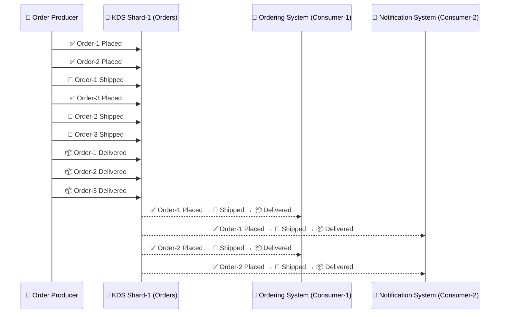

# 🏆 **Multi-Consumer Processing in Kinesis Data Streams (KDS)**

In KDS, multiple applications (or consumers) can read the same record from the same stream independently **without conflict**. You achieve this by configuring **multiple applications or streams readers** that use the Kinesis API (e.g., `GetRecords`, `SubscribeToShard`).

---

## **🎯 Scenario: E-commerce Order Processing & Notifications**

### **Orders Are Processed with These Statuses:**

✅ **Order Placed** → 🚚 **Shipped** → 📦 **Delivered**

### **Two Independent Consumers (Systems) Subscribe to the Stream:**

1️⃣ **Ordering System** 🛒 → Processes the order and updates inventory  
2️⃣ **Notification System** 📩 → Sends emails and SMS notifications

### **Incoming Order Events:**

| Timestamp | Order ID  | Status         |
| --------- | --------- | -------------- |
| `T1`      | `Order-1` | ✅ _Placed_    |
| `T2`      | `Order-2` | ✅ _Placed_    |
| `T3`      | `Order-1` | 🚚 _Shipped_   |
| `T4`      | `Order-3` | ✅ _Placed_    |
| `T5`      | `Order-2` | 🚚 _Shipped_   |
| `T6`      | `Order-3` | 🚚 _Shipped_   |
| `T7`      | `Order-1` | 📦 _Delivered_ |
| `T8`      | `Order-2` | 📦 _Delivered_ |
| `T9`      | `Order-3` | 📦 _Delivered_ |

---

## **🔥 How Kinesis Data Streams (KDS) Handles Multi-Consumer Subscriptions**

💡 **KDS uses shards to store and distribute messages.**

- **Partitioning:** Orders are assigned to a **shard** based on the `Partition Key` (e.g., `Order ID`).
- **Multiple consumers can subscribe to the same shard.**

### **🔄 KDS Subscription Model**

✔ **Ordering System** and **Notification System** **both subscribe to the same shard** and read the same events.  
✔ **Two types of consumer modes**:

- **Shared Throughput Mode** → Consumers share the read bandwidth (2MB/sec per shard).
- **Enhanced Fan-Out Mode (EFO)** → Each consumer gets a dedicated 2MB/sec channel.

## **🏆 Key Takeaways for KDS**

- ✔ **Both consumers see the same order sequence** (FIFO within a shard).
- ✔ **Each consumer reads independently** (they don’t interfere with each other).
- ✔ **Enhanced Fan-Out ensures low latency per consumer.**
- 📌 **Without EFO, consumers compete for read throughput (2MB/sec per shard).**
