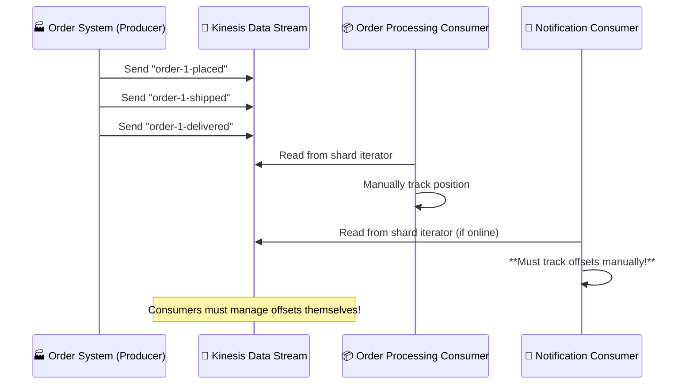
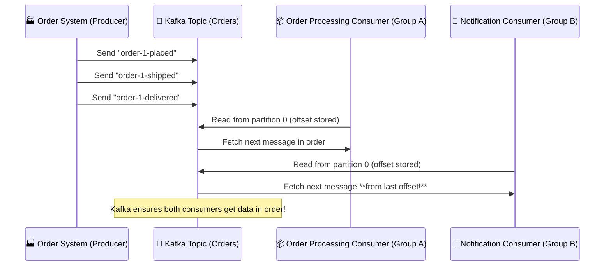

# 🔥 **Amazon Kinesis Data Streams (KDS) vs. Apache Kafka (MSK): The Offset Battle** 🎯

When choosing between **Amazon Kinesis Data Streams (KDS)** and **Apache Kafka (MSK)**, the **biggest difference** is **how they handle offsets**. Understanding this is **CRITICAL** for building **reliable, ordered, and scalable streaming applications**.

Let’s dive deep, **with diagrams**, into **offset management**, **consumer behavior**, and **data consistency**.

---

## 📌 **1. What is an Offset?**

An **offset** is a **position marker** that tells a consumer **where it last read in a data stream**.  
It helps consumers **avoid missing messages** and ensures they **process events in order**.

🛑 **Biggest Difference:**

- **Kinesis (KDS) leaves offset tracking to the consumer!**
- **Kafka (MSK) tracks offsets automatically for each consumer group!**

---

## ⚖ **2. Offset Management in KDS vs. Kafka**

| Feature                                             | **Amazon Kinesis Data Streams (KDS) 🌊**                                                                                                             | **Apache Kafka (MSK) 🎯**                                                                                                              |
| --------------------------------------------------- | ---------------------------------------------------------------------------------------------------------------------------------------------------- | -------------------------------------------------------------------------------------------------------------------------------------- |
| **Who manages offsets?**                            | **The consumer!** KDS does **NOT** track offsets. Each consumer manages its own position in the stream.                                              | **Kafka itself!** Kafka stores offsets **in an internal topic** (`__consumer_offsets`), so offsets persist even if a consumer crashes. |
| **How do consumers track progress?**                | Consumers use **shard iterators** (`LATEST`, `TRIM_HORIZON`, `AT_TIMESTAMP`) but must **track progress manually** (e.g., store offsets in DynamoDB). | Consumers use **Kafka’s offset storage**. They just **ask Kafka** where they left off, no manual tracking required!                    |
| **Replaying old messages**                          | Possible, but **only if the consumer manually tracks offsets** and requests specific iterators.                                                      | Built-in! Consumers can **rewind to any point** by specifying an offset.                                                               |
| **What happens if a consumer crashes?**             | It **forgets where it left off** unless it manually stores the last read position.                                                                   | **No problem!** Kafka **remembers the offset** for each consumer group.                                                                |
| **Can multiple consumers read the same partition?** | **Yes, but they don’t share offsets**. Each consumer reads independently and must manage its own checkpointing.                                      | **Yes, and Kafka automatically tracks progress** for each consumer group!                                                              |
| **How do multiple consumers read the same data?**   | They must use **separate shard iterators** and manually handle ordering.                                                                             | Kafka allows **multiple consumer groups** to read from the same topic while tracking **separate offsets per group**.                   |

---

## 🚀 **3. Real-World Example: Order Processing & Notifications**

Let’s say we have an **e-commerce system** where:

- **Order System** processes order statuses (`order-1-placed`, `order-1-shipped`, `order-1-delivered`).
- **Notification System** sends customer alerts when the order moves to the next stage.

### 🎯 **Scenario: How Do KDS & Kafka Handle Consumers?**

### **🛒 Kinesis (KDS) Order Processing**

### 🛑 **Problem with Kinesis**

- If **Notification System crashes**, it may **lose track of where it was**.
- If it restarts using **LATEST**, it **misses `order-1-shipped`** and only sends `order-1-delivered`.

---

### **🎯 Kafka (MSK) Order Processing**

### ✅ **Kafka’s Solution**

- **Consumers don’t track offsets manually**—Kafka does it!
- If **Notification System crashes**, it **resumes from the last processed message** (`order-1-shipped`), so **no data is lost**.

---

## 🔥 **4. How Do Multiple Consumers Read the Same Stream?**

What if **Order System** and **Notification System** both need to read the same records?

### **Kinesis (KDS) Shared Throughput Mode:**

- Each consumer **tracks its own progress separately**.
- Consumers **compete for read throughput** from the same shard (**2MB/sec per shard**).
- If one consumer reads faster, **it can cause others to fall behind or be throttled**.

### **Kafka Consumer Groups (Better Model!):**

- Consumers are **grouped into consumer groups**.
- Kafka **assigns partitions dynamically** to balance the load.
- **Each group gets its own offsets** (so one system doesn’t affect another).
- Consumers **don’t compete** for throughput – each gets its fair share!

💡 **Kafka makes it easier to manage multiple consumers without manual tracking or conflicts!**

---

## ⚖ **5. When to Choose KDS vs. Kafka?**

| **Use Case**                                  | **Choose Kinesis (KDS) 🌊**                    | **Choose Kafka (MSK) 🎯**                   |
| --------------------------------------------- | ---------------------------------------------- | ------------------------------------------- |
| **AWS-native, serverless solution**           | ✅                                             | ❌                                          |
| **Offset tracking built-in**                  | ❌                                             | ✅                                          |
| **Consumer failure recovery**                 | ❌ (Manual tracking needed)                    | ✅ (Kafka auto-tracks offsets)              |
| **Replaying old messages**                    | ✅ (Requires timestamp iterator)               | ✅ (Use offsets to rewind)                  |
| **High-throughput, scalable event streaming** | ❌ (Shards have limits)                        | ✅ (Partitions scale dynamically)           |
| **Multiple consumers reading the same data**  | ❌ (Consumers must manage their own iterators) | ✅ (Consumer groups track separate offsets) |

---

## 🎯 **6. The Verdict: Kafka Wins for Offset Management!**

### **✅ Choose Kafka (MSK) if you:**

✔ Need **multiple consumers reading the same data** with independent offsets.  
✔ Want **built-in offset tracking** (no manual checkpoints).  
✔ Require **low-latency event-driven processing**.  
✔ Expect **high throughput and dynamic scaling**.

### **✅ Choose Kinesis (KDS) if you:**

✔ Want a **fully managed AWS service** with **serverless scaling**.  
✔ Don't need **complex offset tracking**.  
✔ Prefer **pay-as-you-go pricing** over managing Kafka clusters.  
✔ Have **lower throughput needs**.

---

## 🎯 **Final Takeaway**

- **Kinesis lacks built-in offset management** – Consumers **must track their own positions**.
- **Kafka automatically tracks offsets per consumer group**, preventing **missed or out-of-order messages**.
- **For event-driven microservices & multi-consumer setups, Kafka is superior**.
- **For simple AWS-native streaming, Kinesis is easier to deploy**.
