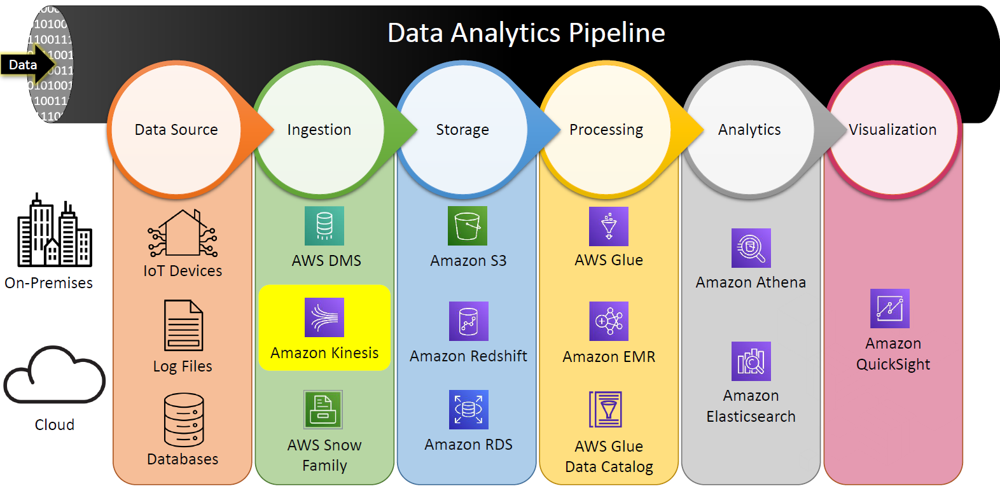
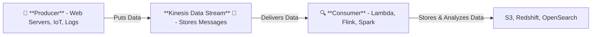
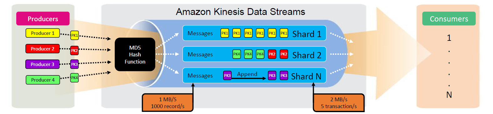
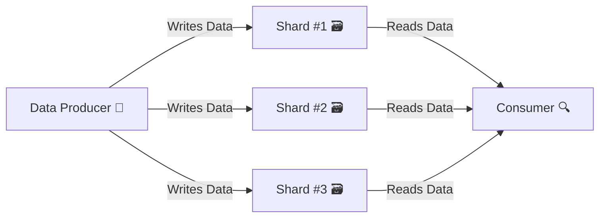

# 🚀 **Amazon Kinesis Data Streams (KDS) - Real-Time Streaming Storage**

<div style="text-align: center;">
    
</div>

## 🔍 **What is Kinesis Data Streams (KDS)?**

Amazon Kinesis Data Streams (KDS) is a fully managed AWS service that enables **real-time storage and delivery** of streaming data.  
It acts as a **high-speed message hub** where **producers send data, KDS temporarily stores it, and consumers process it**.

💡 **KDS is NOT a processing engine**—it simply stores and delivers data to consumers for further analysis.

🔹 **Why Use Amazon Kinesis Data Streams?**

- ✔ **Real-time ingestion & delivery** - Stores streaming data within milliseconds.
- ✔ **Highly scalable & durable** - Can handle terabytes per hour.
- ✔ **Multiple consumers** - Several applications can read from the same stream.
- ✔ **Custom processing** - Consumers (like AWS Lambda, Apache Flink, or Spark) analyze the data.

🔹 **Example Use Case:**

A financial trading system sends **stock market updates** to KDS.

- ✔ KDS **stores the data** in real-time.
- ✔ Consumers (Apache Flink) **analyze stock patterns**.
- ✔ Processed data is **stored in S3** for reporting.

---

## 🏗 **How KDS Works**

- 1️⃣ **Producers** put data into KDS (e.g., app logs, IoT data, stock prices).
- 2️⃣ **KDS stores and delivers the data** (but does not process it).
- 3️⃣ **Consumers (Lambda, Flink, Spark, etc.) process and analyze** the data.
- 4️⃣ Processed data is **stored in destinations like S3, Redshift, or OpenSearch**.

---

<div style="text-align: center;">



</div>

---

## 🔑 **Core Components of KDS**

<div style="text-align: center;">
    
</div>

---

### 🏗 **1. Data Producers**

Producers send records to the **Kinesis Data Stream**. Examples:

- **Web apps & servers** - Send clickstream logs.
- **IoT devices** - Stream sensor data.
- **Stock market feeds** - Deliver price updates.

👉 **AWS Services Used:**

- ✔ **Amazon Kinesis Producer Library (KPL)** - High-throughput producer API.
- ✔ **Amazon Kinesis Data Streams API** - Supports `PutRecord` & `PutRecords` methods.
- ✔ **Amazon Kinesis Agent** - Monitors and sends logs to KDS.

---

### 🛠 **2. Amazon Kinesis Data Streams (KDS)**

💡 **KDS is a real-time storage & delivery service, NOT a processing engine**.

- ✔ **Stores & delivers records** in milliseconds.
- ✔ Supports **multiple consumers** reading from the same stream.
- ✔ Scales automatically based on throughput needs.

**KDS Terminology**:

| Term                 | Description                                                      |
| -------------------- | ---------------------------------------------------------------- |
| **Record**           | A single unit of data sent by a producer (e.g., JSON, CSV).      |
| **Partition Key**    | Determines which shard a record is sent to.                      |
| **Shard**            | A unit of capacity within a stream that handles records.         |
| **Retention Period** | Stores data for **24 hours** (default) or **7 days** (extended). |

🔹 **Example:**  
A streaming **weather monitoring system** sends temperature readings every second.

- ✔ KDS **stores the data**.
- ✔ Consumers **analyze** it in real-time for weather forecasts.

---

### 🔍 **3. Data Consumers**

Consumers **retrieve and process data from KDS**. Examples:

- **AWS Lambda** - Serverless event processing.
- **Apache Flink** - Real-time stream analytics.
- **Amazon EMR / Spark** - Advanced transformations.

👉 **AWS Services Used:**

- ✔ **Amazon Kinesis Client Library (KCL)** - Helps build Kinesis applications in Java, Python, etc.
- ✔ **AWS Lambda** - Event-driven processing.
- ✔ **Amazon Managed Service for Apache Flink** - Stream processing at scale.

---

## 📊 **Shards: The Building Blocks of KDS**

A **shard** is a unit of capacity that defines how much data a stream can handle.

✔ **Each shard supports**:

- ✅ **Write capacity:** **1 MB/sec** or **1,000 records/sec**.
- ✅ **Read capacity:** **2 MB/sec** (max 5 transactions/sec).
- ✅ **Scaling:** Increase or decrease shards manually or with Auto-Scaling.



👉 **Example:**  
A ride-hailing app **assigns trips** to different shards using a **Partition Key (City Name)**.

- ✔ **"New York" records go to Shard #1**
- ✔ **"Los Angeles" records go to Shard #2**

---

## 🚨 **Handling Throttling & Scaling**

Throttling occurs when **shard limits are exceeded**, causing data loss.

🚫 **Causes of Throttling:**

- **Hot Shards:** Some shards get more traffic than others (uneven partition key distribution).
- **Not Enough Capacity:** Too few shards to handle the load.

✅ **Solutions:**

- ✔ **Use balanced partition keys** to distribute records evenly.
- ✔ **Enable Auto-Scaling** to dynamically adjust shards.
- ✔ **Use On-Demand Mode** (AWS manages capacity for you).

---

## ⚖ **Capacity Modes**

| Mode            | Use Case                                    | Limits                            |
| --------------- | ------------------------------------------- | --------------------------------- |
| **On-Demand**   | Automatic scaling for unpredictable traffic | **200 MB/s write, 400 MB/s read** |
| **Provisioned** | Predictable workloads with controlled costs | No limit on throughput            |

💡 **When to Choose On-Demand Mode?**

- ✔ New streams with unknown traffic.
- ✔ Spiky workloads with unpredictable traffic.

💡 **When to Choose Provisioned Mode?**

- ✔ Workloads with steady, predictable traffic.
- ✔ Need control over shard count & costs.

---

## 🚀 **Kinesis Data Streams CLI Operations**

### 🔹 **1. Create a Stream**

```bash
aws kinesis create-stream --stream-name MyStream --shard-count 2
```

### 🔹 **2. Put a Record**

```bash
aws kinesis put-record --stream-name MyStream --partition-key "123" --data "Hello, Kinesis!"
```

### 🔹 **3. Retrieve Data**

1️⃣ **Get Shard Iterator (starting position in the stream):**

```bash
aws kinesis get-shard-iterator --stream-name MyStream --shard-id "shardId-000000000000" --shard-iterator-type TRIM_HORIZON
```

2️⃣ **Get Records from the Stream:**

```bash
aws kinesis get-records --shard-iterator <Shard Iterator>
```

---

## 🎯 **Key Takeaways**

- ✔ **KDS is a real-time data storage and delivery system, NOT a processing engine.**
- ✔ **Producers send data → KDS stores it → Consumers process it.**
- ✔ **Shards define capacity & scalability** (1 MB/sec write, 2 MB/sec read per shard).
- ✔ **Auto-Scaling & On-Demand Mode help manage dynamic workloads.**
- ✔ **AWS CLI enables basic stream management.**
