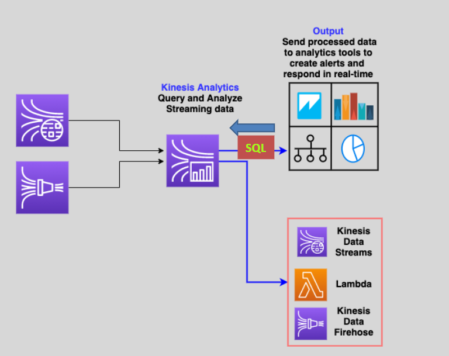

# 📉 Kinesis Data Analytics

Amazon `Kinesis data analytics` is used to process and analyze real-time streaming data from `Kinesis Data Streams` or `Kinesis Data Firehose` using standard `SQL` code.

- `It requires Kinesis Data Analytics applications` to continuously read and process streaming data.
- `It can send the output to analytics tools`
- Supports Kinesis data streams, kinesis data firehose, and lambda functions as destination.
- **Use cases:** Produce time series analytics, feed real-time dashboards, and create real-time metrics.
