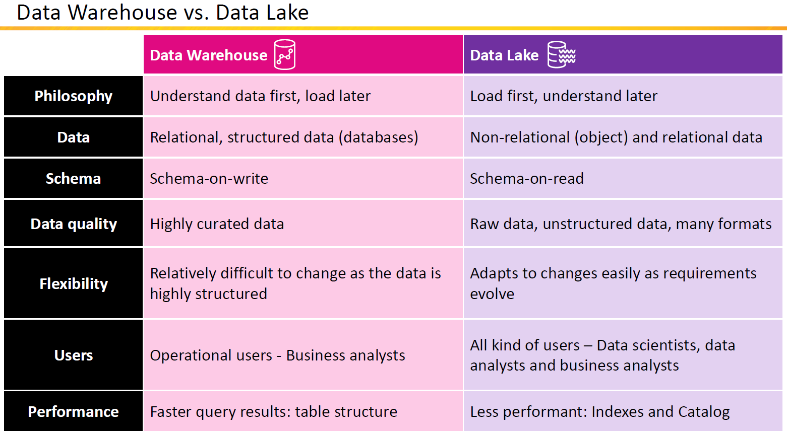

# **🌊 What is a Data Lake?**

## **📋 What is a Data Lake?**

A **Data Lake** is a **centralized storage system** that allows you to store **all types of data**—structured, semi-structured, and unstructured—in its raw format. Unlike traditional databases, data in a Data Lake is not processed or transformed until it is needed.

💡 **Key Idea:** A data lake is like a massive storage container where you can dump all kinds of data without worrying about structure or format.

---

## **⚙️ Key Features of a Data Lake**

1. **All Data Types:**

   - Supports structured (tables), semi-structured (JSON), and unstructured (images, videos) data.

2. **Raw Data Storage:**

   - Stores data in its original format without modification.

3. **Scalability:**

   - Can scale to store petabytes of data.

4. **Cost-Effective:**

   - Uses inexpensive cloud storage solutions like **Amazon S3**, **Azure Data Lake Storage**, or **Google Cloud Storage**.

5. **Flexibility:**
   - Data can be processed and analyzed using various tools like **Spark**, **Presto**, or **Athena**.

---

## **🔄 How a Data Lake Works**

1. **Data Ingestion:**

   - Raw data is ingested from various sources like databases, IoT devices, or APIs.

2. **Data Storage:**

   - The data is stored in a centralized storage system (e.g., Amazon S3).

3. **Processing:**

   - Data is transformed, cleaned, or queried only when needed.

4. **Analysis:**
   - Tools like Spark, Athena, or machine learning frameworks analyze the data.

---

## **🏢 What is a Data Warehouse?**

A **Data Warehouse** is a **centralized repository** designed for storing **structured data** that has already been cleaned and transformed. It is optimized for running analytics and generating reports.

💡 **Key Idea:** A data warehouse is like a library where books (data) are neatly organized and categorized for easy access.

---

## **⚡ Data Lake vs. Data Warehouse**

| **Feature**        | **Data Lake**                                              | **Data Warehouse**                                      |
| ------------------ | ---------------------------------------------------------- | ------------------------------------------------------- |
| **Data Type**      | All types (structured, semi-structured, unstructured).     | Only structured or semi-structured data.                |
| **Storage Format** | Raw data in its original form.                             | Transformed and organized data.                         |
| **Cost**           | Lower storage costs (cloud object storage).                | Higher costs (compute and optimized storage).           |
| **Processing**     | Data is processed only when queried (schema-on-read).      | Data is pre-processed and structured (schema-on-write). |
| **Use Case**       | Data exploration, machine learning, and raw data analysis. | Business intelligence, dashboards, and reporting.       |
| **Performance**    | May require more processing time for queries.              | Faster for predefined queries and reports.              |

---

---

## **🌟 Why Use a Data Lake?**

1. **Store Everything:**

   - Collect all data in one place, regardless of format or size.

2. **Flexibility:**

   - Process and analyze data when you need it, using any tool.

3. **Scalable:**

   - Scale to petabytes of storage with services like Amazon S3.

4. **Future-Proof:**
   - Retain raw data for future use cases (e.g., machine learning).

---

## **📊 Use Cases for Data Lakes**

1. **Machine Learning and AI:**

   - Train models with unstructured data like images or videos.

2. **IoT Data Analysis:**

   - Store and analyze sensor data from IoT devices.

3. **Big Data Analytics:**

   - Analyze large datasets for patterns or trends.

4. **Data Archival:**
   - Keep raw data for compliance or future needs.

---

## **🌍 Real-Life Example**

**Scenario:**  
A retail company collects data from:

- **Online sales** (structured data in tables).
- **Customer reviews** (semi-structured JSON data).
- **Product images** (unstructured image files).

**Data Lake Solution:**

- The company stores all these data types in Amazon S3.
- Uses Presto for ad-hoc queries on sales and reviews.
- Analyzes product images with machine learning tools like SageMaker.

---

## **🧠 Simple Analogy**

Think of a Data Lake and a Data Warehouse like water storage:

- A **Data Lake** is a **natural lake** where all types of water (clean, dirty, etc.) flow in.
- A **Data Warehouse** is like **bottled water**—cleaned, filtered, and ready to drink.

---

## **🌟 Tools for Data Lakes**

1. **Storage Services:**

   - Amazon S3, Azure Data Lake Storage, Google Cloud Storage.

2. **Query Engines:**

   - AWS Athena, Presto, Apache Spark.

3. **Data Lake Platforms:**
   - AWS Lake Formation, Databricks Delta Lake.
