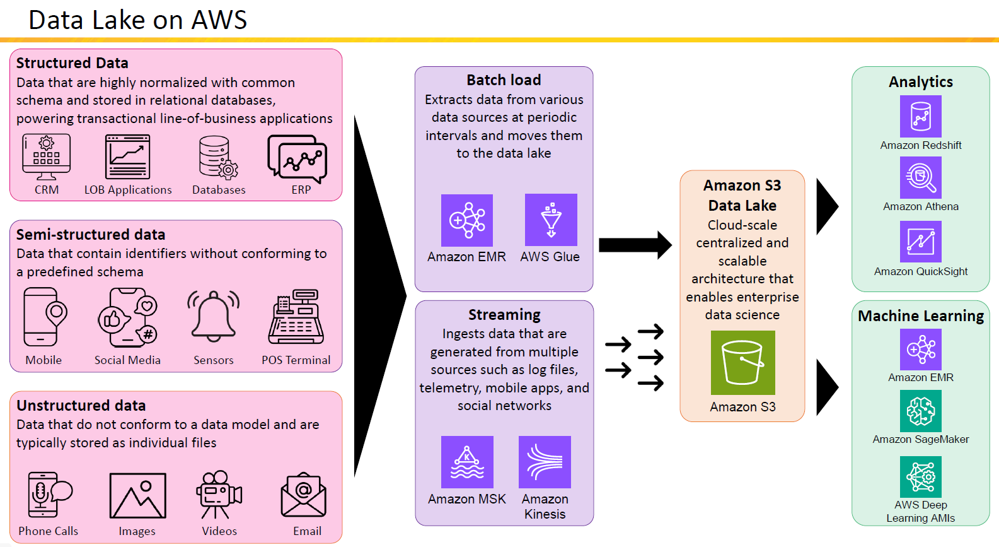

# 🏞️💡 **Implementing a Data Lake on AWS**

## What Is a Data Lake?

A **Data Lake** is a centralized repository that allows you to store **structured**, **semi-structured**, and **unstructured data** at any scale. Unlike traditional databases, a data lake doesn't require the data to be cleaned or transformed before storing—it stores **raw data**, and you can analyze it later.

---

## 🌐 AWS Data Lake Architecture Overview

    

---

## 🧩 1. Types of Data You Can Ingest

| Data Type           | Examples                                | Storage Style       |
| ------------------- | --------------------------------------- | ------------------- |
| **Structured**      | Databases, CRM, ERP systems             | Tables, schemas     |
| **Semi-structured** | Logs, sensor output, social media feeds | JSON, CSV, XML      |
| **Unstructured**    | Videos, images, audio, emails           | Files (binary/text) |

These data types can come from mobile devices, point-of-sale systems, IoT sensors, apps, etc.

---

## 🔁 2. How Data Enters the Data Lake

### 🗓️ **Batch Ingestion**

- **Tools:** [Amazon EMR](https://aws.amazon.com/emr/), [AWS Glue](https://aws.amazon.com/glue/)
- **Use Case:** Periodically extract data from sources like databases or apps and load it into the lake.

### ⚡ **Streaming Ingestion**

- **Tools:** [Amazon MSK (Kafka)](https://aws.amazon.com/msk/), [Amazon Kinesis](https://aws.amazon.com/kinesis/)
- **Use Case:** Real-time data ingestion from apps, telemetry systems, and logs.

---

## 🪣 3. Central Storage: **Amazon S3**

Amazon S3 becomes the **heart** of your data lake.

🧠 Think of it as a **scalable, durable, and secure bucket** that stores every format of data.

Benefits:

- 99.999999999% durability
- Low-cost storage tiers
- Serverless and infinitely scalable

---

## 🔎 4. Analyzing Data in the Lake

Once your data lands in S3, it’s time to **analyze and gain insights**:

| Tool                  | Purpose                             |
| --------------------- | ----------------------------------- |
| **Amazon Athena**     | Run SQL queries directly on S3 data |
| **Amazon Redshift**   | High-performance data warehousing   |
| **Amazon QuickSight** | Create interactive BI dashboards    |

---

## 🤖 5. Using Data for Machine Learning

Your S3-based data lake can also fuel **AI/ML applications**:

| Tool                   | Role                     |
| ---------------------- | ------------------------ |
| **Amazon EMR**         | Spark/Hadoop-based ML    |
| **Amazon SageMaker**   | Train/deploy ML models   |
| **Deep Learning AMIs** | Prebuilt ML environments |

---

## 🧠 Best Practices for Building a Data Lake on AWS

✅ Use **AWS Glue Data Catalog** to manage metadata  
✅ Store raw, curated, and transformed data in **separate S3 prefixes** (e.g., `raw/`, `processed/`)  
✅ Apply **fine-grained access controls** using IAM and S3 bucket policies  
✅ Use **Athena or Redshift Spectrum** to query data without ETL  
✅ Enable **versioning and lifecycle policies** on S3 for cost control and backups

---

## 🏁 Summary: Why Use AWS for Your Data Lake?

| Benefit                       | Description                                   |
| ----------------------------- | --------------------------------------------- |
| ✅ Scalability                | S3 stores petabytes effortlessly              |
| ✅ Flexibility                | Ingest any data format from any source        |
| ✅ Real-time + batch support  | Combine batch (EMR/Glue) with streaming (MSK) |
| ✅ Analytics + ML Integration | Tight integration with Athena, SageMaker, EMR |
| ✅ Secure & Durable           | Fine-grained access + 11 9s durability        |
