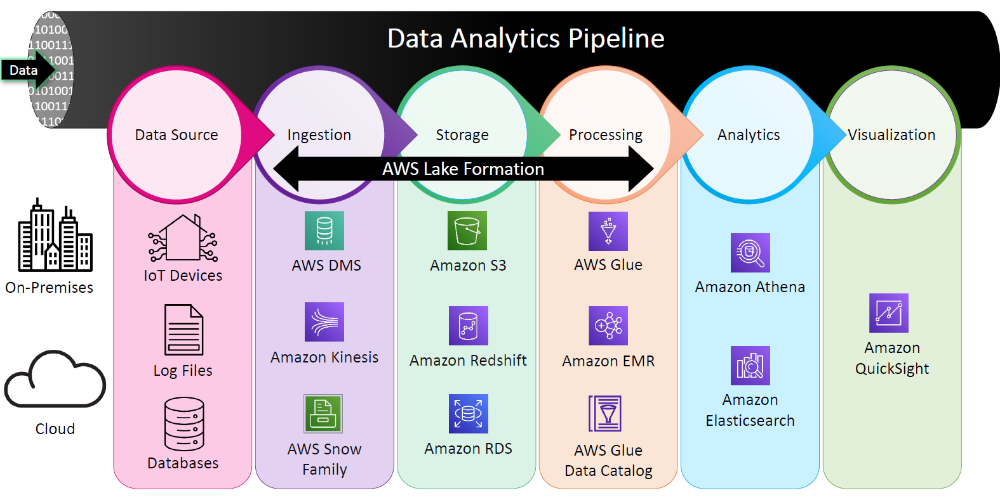
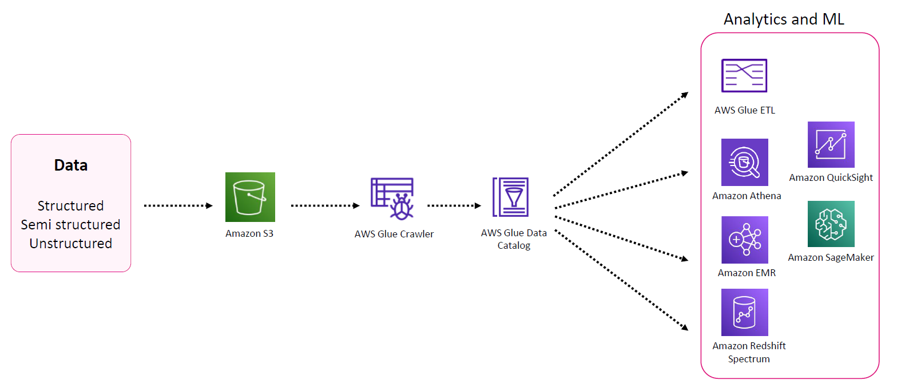
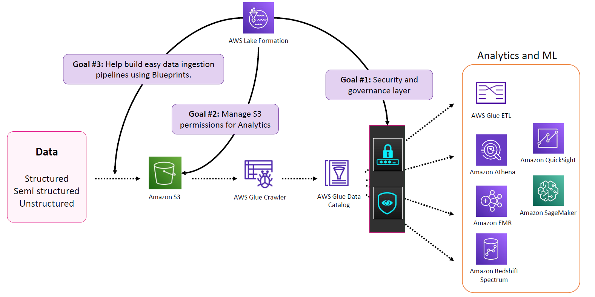

# 🏞️🔐 **What is AWS Lake Formation?**

_“Build secure, governed, and scalable data lakes in days instead of months.”!_

---

<div style="text-align: center;"></div>

---

## 🧠 What’s the Problem?

Imagine you're trying to build a **Data Lake** on AWS manually. Here’s what it used to look like:

1. Ingest **structured**, **semi-structured**, and **unstructured** data into **Amazon S3**.
2. Use **AWS Glue crawlers** to catalog the data.
3. Query it using **Athena**, **EMR**, or **Redshift Spectrum**.
4. Set up **S3 Bucket Policies**, **IAM Roles**, **Glue Catalog Permissions**, and… 💥 BAM! It gets complex **real fast**!

<div style="text-align: center;padding: 0 40px"></div>

---

🚨Security, access control, and data ingestion pipelines become hard to scale and audit. That’s where **AWS Lake Formation** comes to the rescue.

---

## 🧬 What is AWS Lake Formation?

> **AWS Lake Formation** is a **managed service** that makes it easy to set up, secure, and manage a **data lake** on AWS, by abstracting away many manual steps and providing **centralized security, data governance, and automation**.

It builds on top of **Amazon S3** and **AWS Glue** and adds extra capabilities around **security**, **permissions**, and **pipelines**.

---

## 🎯 Lake Formation’s Three Main Goals

<div style="text-align: center;"></div>

---

### 1. 🔐 **Centralized Security & Governance Layer**

- Acts like a **security firewall** between users and data.
- Regardless of the tool (Athena, EMR, Redshift Spectrum), **all access goes through Lake Formation**.
- Tracks who accessed what, when, and how – very handy for **audits**!

📌 Example:  
You don’t want a data scientist seeing financial reports? With Lake Formation, you **deny access at table/column/row level** easily — no more wrangling bucket policies!

---

### 2. 🛡️ **Simplified Permissions for S3 Data**

Forget writing huge JSON IAM or S3 policies!

Lake Formation lets you **grant and revoke** permissions using SQL-style language:

```sql
GRANT SELECT ON TABLE sales_data TO USER analyst;
```

Just like a **database admin**, you can now:

- Grant/revoke access
- Control **column-level**, **row-level**, and **cell-level** access
- Apply policies **centrally**, not per bucket or file

---

### 3. 🚀 **Blueprints & Data Ingestion Pipelines**

Lake Formation includes **pre-built templates (blueprints)** to automate ingestion tasks:

- From sources like **JDBC**, **S3**, and **cloud databases**
- Into **S3**
- With metadata automatically cataloged in the **Glue Data Catalog**

Think of it as a **low-code ETL flow** engine.

---

## 🧱 How Lake Formation Works (Architecture)

🔧 Lake Formation:

- Leverages AWS Glue underneath (crawlers, catalogs, ETL)
- Adds:
  - Fine-grained access control
  - Search & collaboration features
  - ML-powered data classification
  - Auditing and data lineage

---

## 🧪 What Stays the Same?

Even when using Lake Formation, your **data lake structure** remains the same:

- ✅ Store raw, curated, and transformed data in S3
- ✅ Use Glue Crawlers for cataloging
- ✅ Analyze with Athena, EMR, Redshift Spectrum

Lake Formation **augments**, not replaces these services.

---

## 🔎 Example Use Case

> Imagine your data lake holds **customer orders** and **internal HR data**.

With Lake Formation:

- You let the **BI team** access `orders_table` but **deny** access to `employee_salaries`.
- The **ML team** can run analytics on product reviews without needing raw access to the full S3 bucket.
- All access is **auditable** — Lake Formation logs it for compliance needs.

---

## 🧰 Key Components of Lake Formation

| Component                              | Description                                              |
| -------------------------------------- | -------------------------------------------------------- |
| **Data Lake Locations**                | Register S3 buckets or folders as data lake sources      |
| **Glue Data Catalog**                  | Acts as metadata layer for schemas and table definitions |
| **Permissions Manager**                | Grants/revokes access at table, column, and row level    |
| **Data Ingestion Blueprints**          | Predefined templates for ETL pipelines                   |
| **Audit Logs (CloudTrail)**            | Logs every access to support governance and compliance   |
| **Tag-based Access Control (LF-TBAC)** | Use tags to define permissions dynamically               |

---

## 🔍 Integration with Glue: A Perfect Duo 🤝

Lake Formation heavily **uses AWS Glue behind the scenes**:

| AWS Glue Capabilities   | Lake Formation Enhancement              |
| ----------------------- | --------------------------------------- |
| Crawlers, Jobs, Catalog | Secure, govern, and log usage of them   |
| Data Catalog            | Enforced access control via LF policies |
| ETL Jobs                | Blueprint automation                    |

📌 When you click certain buttons in Lake Formation UI, it redirects you to the **Glue console** — showing how tightly integrated they are.

---

## 🧠 Summary

| Feature               | Without Lake Formation            | With Lake Formation                       |
| --------------------- | --------------------------------- | ----------------------------------------- |
| Data Ingestion        | Manual or Glue-based              | Blueprint-based ingestion (automated)     |
| Security              | IAM & S3 policies (manual, messy) | Centralized, role-based fine-grained ACLs |
| Governance & Auditing | Difficult to audit access         | Full audit trail with Lake Formation      |
| Metadata Management   | Glue Catalog                      | Glue Catalog + Centralized Permissions    |

---

## ✅ When to Use Lake Formation

Use AWS Lake Formation if:

- You manage **large-scale shared data lakes**.
- You need **centralized governance** and **fine-grained access**.
- Your **data engineers and data analysts** need to collaborate securely.
- You want to **automate ingestion** and reduce manual Glue job setup.

---

## 🚀 TL;DR

> **Lake Formation** = Amazon S3 + Glue + Central Security + Ingestion Blueprints + Governance Magic 🪄

With it, your data lake becomes a **secure, well-governed powerhouse**—instead of a messy puddle of files on S3!
