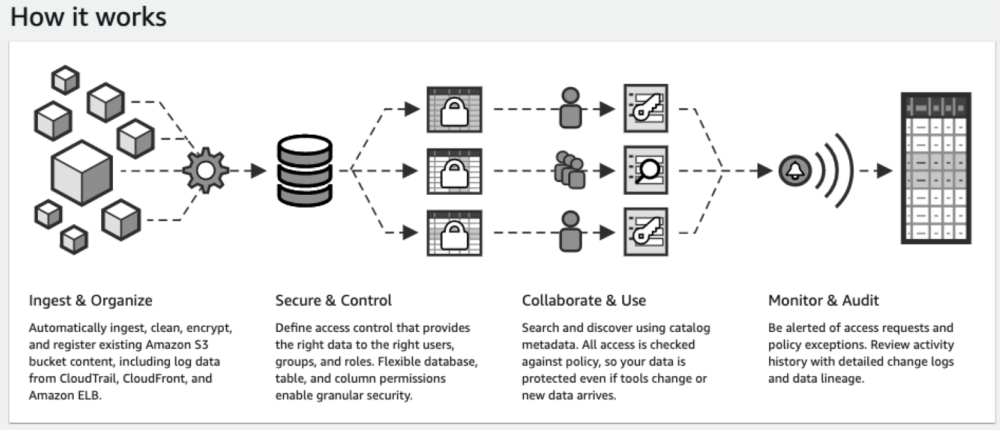
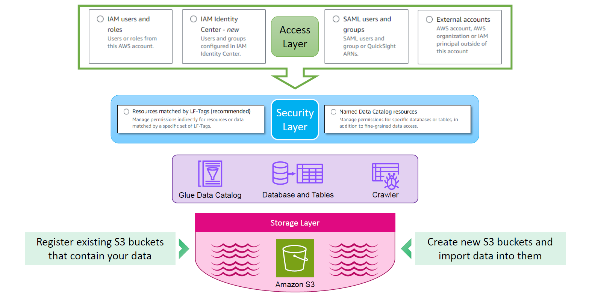

# 💡 How AWS Lake Formation Works — Internals, Flow, and Personas

Welcome to the behind-the-scenes tour of **AWS Lake Formation**! 🧠 Before we start building data lakes, let’s explore **how Lake Formation actually works**, the roles involved, how data flows, and what services power it. By the end, you'll not only understand **how things fit together** but also be ready to build a secure and scalable data lake in AWS!

---

## 🧊 What’s the Big Picture?

---

At its core, Lake Formation is here to help you:

1. 📥 Ingest and organize data
2. 🔐 Apply fine-grained access control (even down to **row/column/cell level**!)
3. 🧑‍🤝‍🧑 Enable collaboration with access control
4. 👁️ Monitor and audit all access and activity

---

## 🧬 High-Level Flow: From Raw Data to Governed Access

   

---

## 📦 Step 1: Storage in Amazon S3

- All data lakes in AWS are built on top of **Amazon S3**, the cloud's most scalable and durable object store.
- You can either:
  - ✅ Create a new S3 bucket for your lake
  - 🔁 Register an existing bucket to turn it into part of the data lake

📝 You can import structured, semi-structured, or unstructured data from:

- CloudTrail logs
- CloudFront access logs
- ELB logs
- Mobile/Sensor data
- External databases

---

## 🔍 Step 2: Catalog It with AWS Glue

Once your data is in S3, you need to **describe its structure** — that’s what AWS Glue helps with:

- **Glue Crawlers** scan the data and create:
  - Databases 🧬
  - Tables 📊
- Glue Catalog becomes your **central metadata store** for querying.

📌 Note: Lake Formation doesn't replace Glue — it **uses Glue under the hood**!

---

## 🛡️ Step 3: Add Security with Lake Formation

### 🏷️ Two Approaches to Define Permissions

| Approach                     | Description                                            |
| ---------------------------- | ------------------------------------------------------ |
| **Named Catalog Resources**  | Grant access at DB/table level manually                |
| **LF Tags (Recommended ✅)** | Tag DBs/tables/columns and assign access based on tags |

💡 LF Tags allow **column-level security**!

- Example: Tag `customer.email` as `Sensitive`, and allow only certain users to access it.

---

## 🔐 Step 4: Control Who Can Access the Data

You can authorize access using:

| Identity Type          | Description                          |
| ---------------------- | ------------------------------------ |
| IAM Users / Roles      | Traditional access control           |
| IAM Identity Center 🔐 | SSO with corporate logins (SAML/AD)  |
| External Accounts 🌐   | Share access with other AWS accounts |

🎯 Supports **fine-grained permissions** and centralizes access control through Lake Formation.

---

## 🧑‍💼 Personas in Lake Formation

Let’s break down the roles involved and their responsibilities:

| Persona               | Description                                                                            |
| --------------------- | -------------------------------------------------------------------------------------- |
| **IAM Administrator** | Manages AWS account and IAM roles — but is NOT a data lake admin by default! ❌        |
| **Data Lake Admin**   | Registers S3 locations, configures catalogs, grants permissions, manages governance ✅ |
| **Workflow Role**     | A role assumed by Glue workflows to process data                                       |
| **Data Engineer**     | (Optional) Runs workflows and manages ingestion pipelines                              |
| **Data Analyst**      | Queries the data using tools like Athena, EMR, SageMaker, Redshift                     |

🚫 IAM Admin ≠ Lake Formation Admin  
You must explicitly grant permissions in Lake Formation!

---

## 🧬 Optional Step: Use Blueprints for Data Ingestion

If you want automation, Lake Formation provides **Blueprints** — ready-made templates to:

- Ingest data
- Clean, transform, catalog, and secure it
- Automate workflows end-to-end

You can also do this manually using Glue ETL scripts, crawlers, or external tools.

---

## 🔎 Monitoring and Auditing

Everything is logged via:

- **AWS CloudTrail**
- **Lake Formation logs**
- **Data Access Logs**

These help track:

- Who accessed what data
- When and how
- And whether they had permission

Great for audits and compliance! 🧾✅

---

## 🎯 Summary: How Lake Formation Works

| Stage       | What Happens                               | Tools Involved                         |
| ----------- | ------------------------------------------ | -------------------------------------- |
| Ingestion   | Import/register data into S3               | Lake Formation, S3, Blueprints, Glue   |
| Cataloging  | Crawl and create metadata                  | AWS Glue Catalog, Crawlers             |
| Security    | Fine-grained access control (row/col/cell) | LF Tags, Named Catalog Access          |
| Consumption | Access by apps/users                       | Athena, EMR, SageMaker, Redshift, etc. |
| Governance  | Audit and monitor all access               | CloudTrail, LF audit logs              |

---

## 💡 Final Thoughts

AWS Lake Formation simplifies building a modern, secure, and governed data lake by:

- 💾 Leveraging S3 + Glue
- 🧱 Adding security and governance
- 🧠 Enabling smart personas with specific duties
- 🔐 Supporting SSO, external accounts, and granular access
- 🔁 Auditing every step for full traceability

This means **your data lake is not just a pile of files**, but a **well-governed, secure, and query-ready platform** for analytics and ML.
