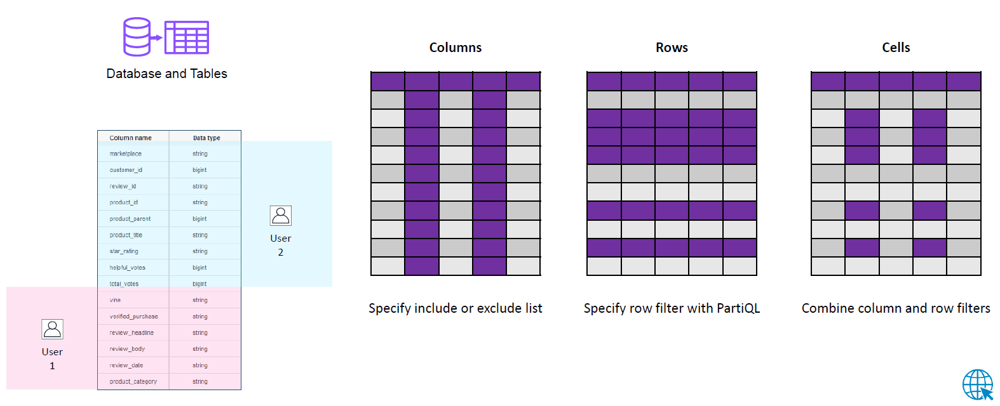
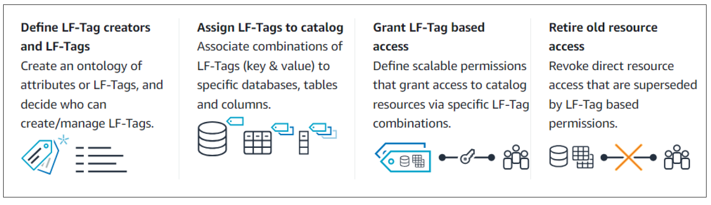
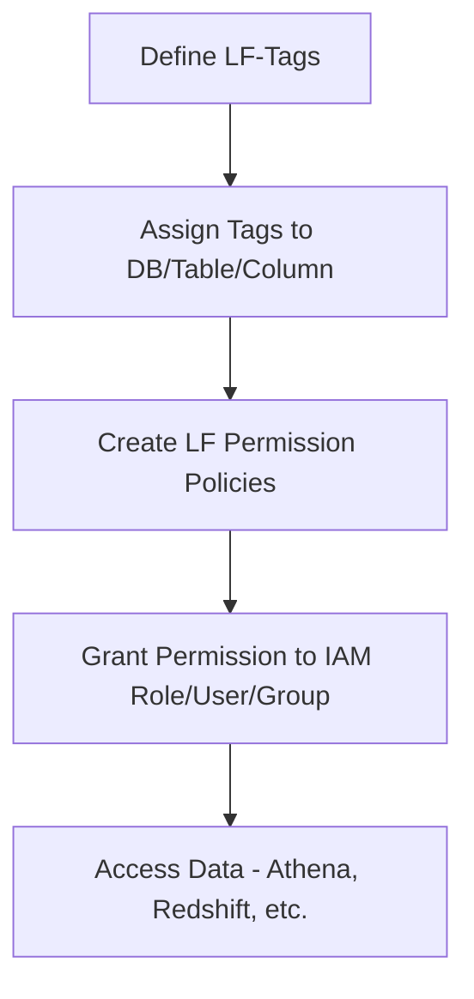

# 🛡️🔐 Permissions on AWS Lake Formation

_**How Fine-Grained Access Control Keeps Your Data Lake Safe**_

---

Lake Formation makes it **easy to build secure data lakes** on AWS, but how do you make sure **the right people access the right data—and nothing more**? 🤔

Welcome to **Lake Formation Permissions**—where you control who sees what, right down to the row and column level.

Let’s dive into how this works, step by step 🚀

---

## 📖 Official Definition

> **Lake Formation Permissions** let you control access to data stored in your AWS data lake (Amazon S3 + AWS Glue catalog), using both **resource-based access control** and **tag-based access control**.

---

## 🧭 Permission Models in Lake Formation

Lake Formation supports **two models** of assigning permissions:

| Type                      | Description                                             | Example Use Case                    |
| ------------------------- | ------------------------------------------------------- | ----------------------------------- |
| **Named Resource Access** | Based on explicitly named databases/tables/columns/rows | Allow user A to read `sales_data`   |
| **LF-Tag-Based Access**   | Based on tags assigned to catalog resources (LF-Tags)   | Allow `HR_Team` to access `PII=yes` |

Let’s explore each one in detail 🔍

---

## 🧱 1. Named Data Catalog Resource Permissions

<div style="text-align: center"></div>

---

This is the **traditional approach**: grant access by directly naming the resource (like a specific database or table).

### ✅ You Can Grant Access To

- A **Database**
- A specific **Table**
- Even specific **Columns**
- Even specific **Rows** (via data filters)

---

### 🎯 Example: Column & Row-Level Access

Imagine this:

| Column         | Row A     | Row B     |
| -------------- | --------- | --------- |
| `customer_id`  | `123`     | `456`     |
| `email`        | `a@x.com` | `b@y.com` |
| `purchase_amt` | `$200`    | `$300`    |

Now let’s say:

- Sales user can **only access** `customer_id` and `purchase_amt` _but not `email`_
- And only where `country = "US"`

That’s called **Cell-Level Security** 🧬  
It's a combination of:

- **Column-level filtering**
- **Row-level filtering**

### 🧪 Data Filter Example (Row-Level)

```sql
SELECT * FROM customer_data
WHERE country = 'US'
```

You define this filter as a **Data Filter** in Lake Formation.

### [Named Data Catalog resources Workshop](https://aws.amazon.com/blogs/big-data/part-1-effective-data-lakes-using-aws-lake-formation-implementing-cell-level-and-row-level-security/)

---

## 🏷️ 2. LF-Tag Based Permissions (Recommended ✅)

<div style="text-align: center"></div>

---

This is a **modern and dynamic** way of managing access.

### 🪄 What’s an LF-Tag?

- A **key-value pair** like `Environment=Prod` or `Sensitivity=High`
- Can be applied to:
  - Databases
  - Tables
  - Columns

### 🎯 Example

- Only allow access to tables where `Environment = Prod`
- Block access to columns tagged `GDPR=Yes`

---

### 🛠 How It Works

<div style="text-align: center;">



</div>

### [LF-Tag Based Permissions Workshop](https://aws.amazon.com/blogs/big-data/easily-manage-your-data-lake-at-scale-using-tag-based-access-control-in-aws-lake-formation/)

---

## 🥊 Named Resource Access 🆚 Tag-Based Access

| Feature                 | Tag-Based Access              | Named Resource Access      |
| ----------------------- | ----------------------------- | -------------------------- |
| Scalable Access Control | ✅ Yes                        | ❌ Manual per resource     |
| Dynamic Policy Updates  | ✅ Change tag, not policy     | ❌ Must update permissions |
| Row/Cell-level Security | ❌ Not supported              | ✅ Supported               |
| Best for                | Large orgs, multiple datasets | Fine-grained data control  |

---

## 📦 Real-World Use Case

Let’s say you’re storing customer info and purchase data.  
You tag the `email` column as `GDPR=Yes`, and give your analytics team access only to `GDPR=No`.

This way, **they won’t even see** the restricted data—even if they query the table! 🔒

---

## 🧪 Example Scenario: Combining Both

Imagine your data lake contains:

- A `sales_db` database
- A `transactions` table
- Columns: `customer_id`, `amount`, `location`, `email`

🔹 Use **Named Resource Access** to give:

- `FinanceTeam` → full access to `transactions`

🔹 Use **LF-Tags** to give:

- `AnalyticsTeam` → access only to `GDPR=No` tagged columns

Now you’ve **fully secured** your lake by role and need. 👏

---

## 📌 Summary

| Feature                  | Description                                      |
| ------------------------ | ------------------------------------------------ |
| 🧱 Named Resource Access | Granular control (rows, columns, cells)          |
| 🏷️ LF-Tag Access         | Dynamic, scalable access model                   |
| 🛡️ Separation of Duties  | IAM Admin ≠ Data Lake Admin                      |
| 🧑‍💼 Personas           | Admin, Engineer, Analyst, etc.                   |
| 📊 Permissions           | Select, Describe, Alter, Drop, Grant (Granular!) |

---

## 🧠 Final Thoughts

Lake Formation takes your security game to the next level 🎯  
Forget writing complex IAM and bucket policies—just **tag your data**, and **grant access like a boss** 💼

Whether you're locking down PII, enabling external teams, or streamlining governance, **Lake Formation makes secure data lakes possible, at scale**.
