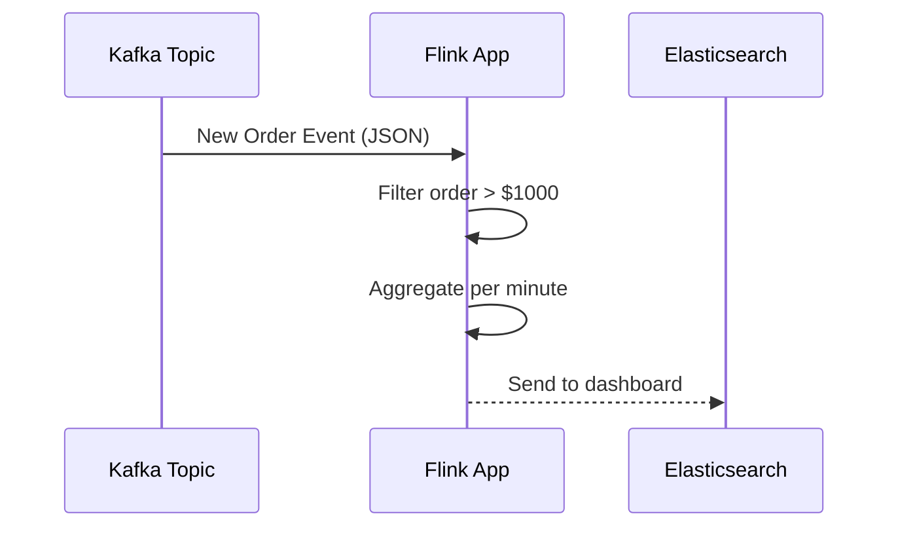
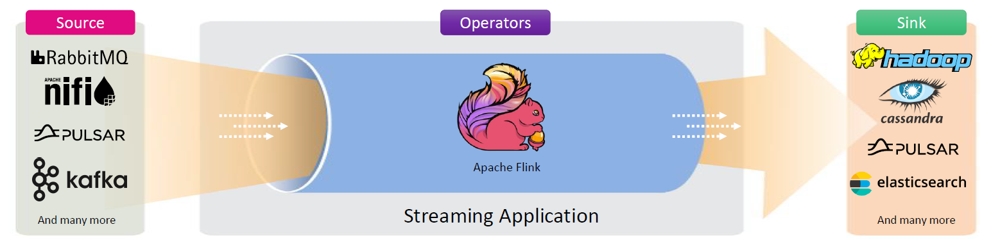

# ⚡ **What is Apache Flink? — Stream It Like It’s Hot!**

Welcome to the world of **real-time data processing**, where milliseconds matter and “waiting” is a sin. Let’s dive into **Apache Flink**, the superhero of real-time, large-scale data processing!

---

## 📘 Official Definition (with a Human Touch)

> **Apache Flink** is **an open-source framework and distributed engine** for **stateful computations over unbounded and bounded data streams**.  
> It excels at **processing data in real-time** with **low-latency, high-throughput**, and **event-time accuracy**.

---

## 🎯 What Can You Do with Flink?

Apache Flink supports a wide range of use cases:

- 🔄 Real-time data pipelines (ETL)
- 🧠 Streaming analytics & dashboards
- ⚙️ Event-driven applications
- 📊 Complex event processing (CEP)
- 🧪 Machine learning model scoring
- 🗂️ Batch analytics (yes, it can do that too!)

---

## 🧱 Key Concepts & Components

Let's break Flink down into its core building blocks:

| 🔹 Component    | 📌 Description                                                          |
| --------------- | ----------------------------------------------------------------------- |
| **JobManager**  | The brain. Coordinates distributed execution, scheduling, and recovery. |
| **TaskManager** | The muscle. Executes tasks and manages state.                           |
| **Operators**   | The tools. Transform, filter, aggregate, or join streams.               |
| **Sources**     | Entry gates. Ingest data from Kafka, Kinesis, files, etc.               |
| **Sinks**       | Exit gates. Output to S3, databases, Elasticsearch, etc.                |

---

## 🧠 Why Flink is Special (and Fast!)

### ✅ Stream-First

Flink was built **stream-first**, not batch-first like some older systems (👀 looking at you, Hadoop & Spark). In Flink, **batch is just a special case of streaming.**

### ✅ Event-Time Processing

Unlike many systems that work in "arrival time", Flink works in **event time**, allowing accurate **time-windowing** even when events arrive late.

### ✅ True Real-Time

Flink processes each event **as soon as it arrives**, not in batches. It can provide **sub-second latency**!

---

## 🔄 How Flink Works (with a 🧑‍💻 Simple Example)

Let’s say you’re building a real-time dashboard for **e-commerce orders**:

- Events are flowing in from a **Kafka topic**.
- You want to **filter orders > \$1000**, and **count them per minute**.
- Then you send this to an **Elasticsearch dashboard**.

### 👉 Sequence Diagram of Flow

---

## 🧬 Apache Flink Architecture (Simplified)

  

---

## 🧪 Real-World Example: Fraud Detection

Imagine you work at a bank. You want to flag:

- 🔴 Any transaction over \$10,000
- ⚠️ Or more than 5 transactions in 1 minute from the same account

Flink lets you:

1. Ingest transactions in real-time from Kafka.
2. Apply filters and aggregation in-memory.
3. Trigger alerts instantly.

**Boom 💥 — you've got yourself a fraud detection engine!**

---

## 💻 Languages You Can Use

You don’t need to learn a new language to use Flink. You can use:

- 🟨 **Java**
- 🔷 **Scala**
- 🐍 **Python**
- 💬 **SQL (Flink SQL!)**

So yes, whether you're a backend wizard or data engineer, **Flink speaks your language**.

---

## 💾 Where Does Flink Get Data From?

| 🛠️ Source          | 🔍 Description              |
| ------------------ | --------------------------- |
| **Apache Kafka**   | Most common stream source   |
| **Amazon Kinesis** | AWS-native streaming source |
| **Files**          | HDFS, S3, local files       |
| **Databases**      | Via CDC or JDBC             |

And yes, it can send to just as many places too (hello, S3 & Elasticsearch).

---

## 🧰 Flink Modes of Execution

| Mode               | Description                                         |
| ------------------ | --------------------------------------------------- |
| **Streaming Mode** | Continuous, unbounded stream (e.g., Kafka)          |
| **Batch Mode**     | Finite dataset, treated as a special case of stream |

---

## 🧼 State Handling in Flink

State is Flink’s **superpower**.

It stores in-memory data like:

- Count of events
- Aggregated sums
- User session data

🔒 State is checkpointed & recoverable = 💪 fault-tolerant.

Backends: **RocksDB** (for large state) or **Memory** (faster, less scalable)

---

## 🏁 Summary — Why Use Apache Flink?

✅ **Truly Real-Time**: Event-by-event processing, not micro-batching  
✅ **Stateful**: Maintain context of data between events  
✅ **Fault-Tolerant**: Recoverable with checkpoints  
✅ **Flexible**: Stream + Batch + SQL + ML + CEP  
✅ **Production-Ready**: Scalable, HA, observable

---

## 🎉 Final Thought

Apache Flink isn’t just fast — it’s **smart fast**.  
Whether you're monitoring bank transactions, analyzing game events, or powering IoT devices, Flink lets you **react in the moment**, not after the moment.

> **"Think fast, act faster — that’s Flink."**
