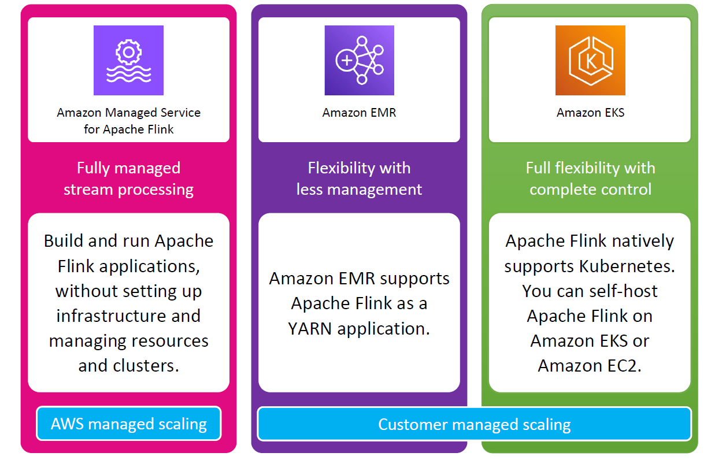
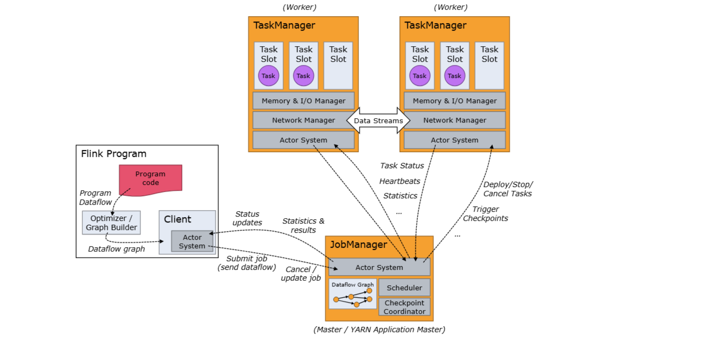
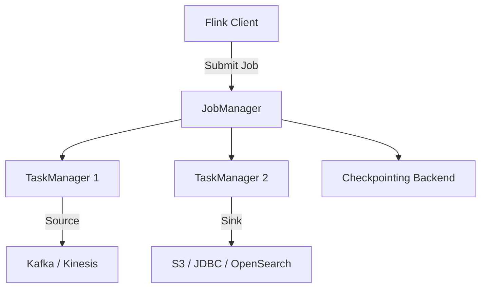

# 🛠️ How to Set Up Apache Flink — The Complete Guide

Apache Flink is a powerful distributed stream and batch processing framework. To get it working optimally for your project, you need to understand its various setup options and configuration parameters.

---

<div style="text-align: center;">
  
</div>

---

## 🌐 1. Choose How to Deploy Flink

Apache Flink can be deployed in multiple environments based on your needs and control requirements.

### 🖥️ Local Setup (for Development)

- Great for testing and small-scale jobs.
- Run using the Flink standalone binaries:

  ```bash
  ./bin/start-cluster.sh
  ```

### ☁️ Cluster Setup (for Production)

Flink supports the following cluster managers:

| Option                 | Description                                          |
| ---------------------- | ---------------------------------------------------- |
| **Standalone Cluster** | You manage all nodes manually. No resource manager.  |
| **YARN**               | Deploy Flink as an application or session in Hadoop. |
| **Kubernetes**         | Flink jobs run as Pods. Natively supported.          |
| **Amazon MSF**         | Fully managed Apache Flink on AWS.                   |

---

## ⚙️ 2. Understand the Flink Cluster Components

<div style="text-align: center;">
  
</div>

---

| Component       | Role                                            |
| --------------- | ----------------------------------------------- |
| **JobManager**  | Coordinates execution, checkpoints, etc.        |
| **TaskManager** | Executes tasks of your job. Needs enough slots. |
| **Dispatcher**  | Accepts job submissions in session mode.        |

---

## 🔧 3. Key Configuration Options (`flink-conf.yaml`)

Found in `conf/flink-conf.yaml`, these are the core configs you may want to modify:

### ✅ Basic Settings

```yaml
jobmanager.rpc.address: jobmanager-host
taskmanager.numberOfTaskSlots: 4
```

### 📦 Memory Management

```yaml
taskmanager.memory.process.size: 1728m
taskmanager.memory.task.heap.size: 512m
```

### 💾 Checkpointing

```yaml
state.checkpoints.dir: file:///tmp/flink-checkpoints
state.backend: rocksdb
state.savepoints.dir: file:///tmp/flink-savepoints
```

### 🔁 Restart Strategies

```yaml
restart-strategy: fixed-delay
restart-strategy.fixed-delay.attempts: 3
restart-strategy.fixed-delay.delay: 10 s
```

### 🌍 High Availability (HA)

```yaml
high-availability: zookeeper
high-availability.zookeeper.quorum: zk1:2181,zk2:2181,zk3:2181
high-availability.storageDir: file:///flink/recovery
```

### 🔄 Checkpointing Intervals

```yaml
execution.checkpointing.interval: 30s
execution.checkpointing.mode: EXACTLY_ONCE
```

---

## 📥 4. Source and Sink Connectors

- Kafka
- Kinesis
- File Systems (HDFS, S3)
- JDBC (MySQL, Postgres)
- Elasticsearch
- Redis
- Custom Connectors

You can configure them using Flink's `DataStream` API or `Table API / SQL`.

---

## 🗂️ 5. Package Your Flink Application

You typically build your Flink application into a JAR file:

```bash
mvn clean package
```

Then submit it using the CLI:

```bash
./bin/flink run -d my-job.jar
```

---

## 🛡️ 6. Monitoring & Observability

- **Flink Web UI** → Job progress, task status, and metrics.
- **REST API** → `/jobs`, `/metrics`, etc.
- **Prometheus + Grafana** → Export metrics for dashboarding.
- **Logs** → Found in `/log` directory of Flink home.

---

## 💡 7. Tips & Best Practices

- Always test locally with a mini-cluster before deploying.
- Use **RocksDB** for large-scale stateful jobs.
- Enable **incremental checkpoints** to reduce storage usage.
- Scale TaskManagers and Slots according to parallelism.
- Use **Savepoints** for long-running jobs and upgrades.

---

## 🧠 Summary

Apache Flink setup gives you flexibility whether you want full control (Kubernetes, Standalone) or simplicity (Amazon MSF). Here's a quick table:

| Deployment | Managed | Easy Setup | Production Ready |
| ---------- | ------- | ---------- | ---------------- |
| Local Dev  | ❌      | ✅         | ❌               |
| Standalone | ❌      | ⚠️         | ✅               |
| YARN       | ❌      | ✅         | ✅               |
| Kubernetes | ❌      | ⚠️         | ✅✅             |
| Amazon MSF | ✅      | ✅✅       | ✅✅✅           |

---

## 📊 Bonus: Simple Architecture Diagram


