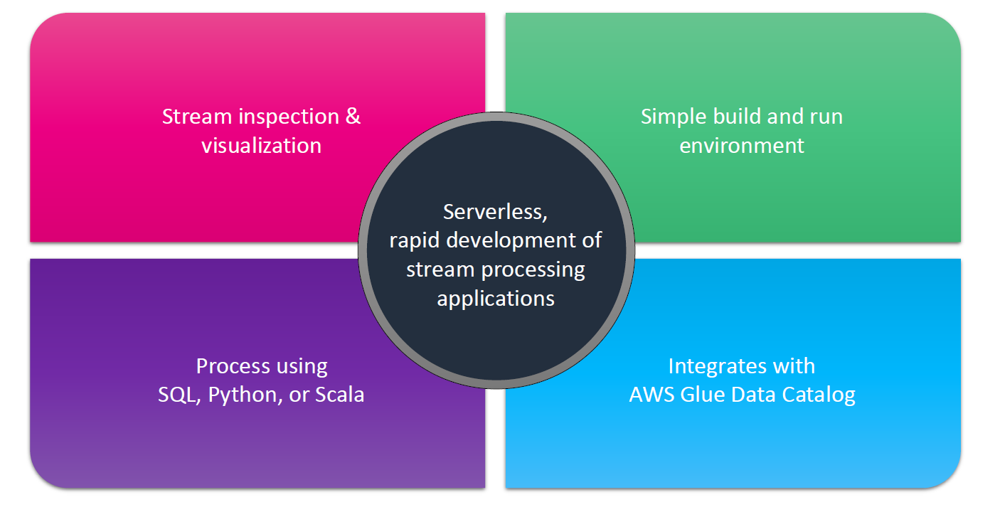
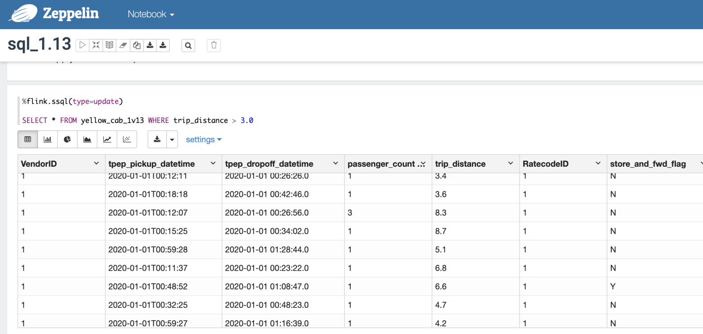
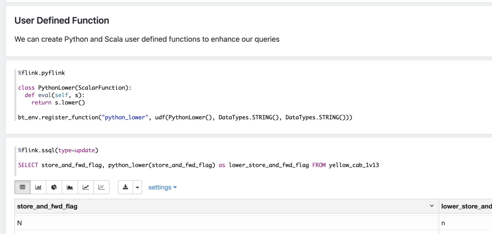
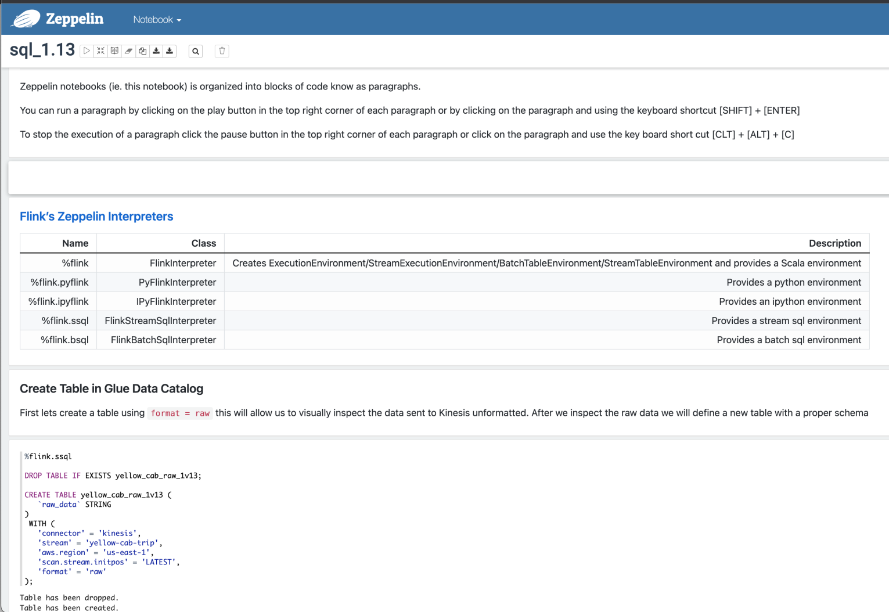

# 📓 Amazon Managed Flink Studio — Stream Processing with a Notebook Twist

## 🚀 What Is Amazon Managed Flink Studio?

Think of **Amazon Managed Flink Studio** as your **data streaming laboratory**, where you can write, test, and visualize your **Apache Flink** jobs — **interactively and in real time** — using **notebooks**.

It’s part of the **Amazon Managed Service for Apache Flink** (previously called **Kinesis Data Analytics for Apache Flink**), but adds a new way to **develop and debug** your Flink applications using something called **Apache Zeppelin**.

---

## 📘 TL;DR (Too Long; Read it Anyway)

| 🔹 Feature                   | 📌 Description                                          |
| ---------------------------- | ------------------------------------------------------- |
| **Studio Notebooks**         | Interactive notebook-based dev environment              |
| **Powered by Zeppelin**      | Browser-based IDE for code + visualizations             |
| **Uses Apache Flink Engine** | All the power of real-time streaming under the hood     |
| **Languages Supported**      | Scala, Python, SQL                                      |
| **Great for**                | Testing, prototyping, debugging Flink apps in real time |

---

## 🎨 What is Apache Zeppelin?

- **Apache Zeppelin** is a **web-based notebook** (like Jupyter, but more Flink-focused).
- It allows you to:
  - Write code in **Scala, Python, or SQL**
  - See **immediate output**
  - Create **graphs/visualizations**
  - Interact with data on the fly

So, it's like your **data playground**, but supercharged with **Flink’s real-time engine**.

---

## 💡 Why Use Flink Studio?

Here’s where Flink Studio _shines_ 💡:

| ✅ Benefit                    | 🔍 Explanation                                       |
| ----------------------------- | ---------------------------------------------------- |
| **Interactive Dev**           | Write + run + see output in the same UI              |
| **Faster Prototyping**        | No need to deploy full Flink apps just to test logic |
| **Visualize Outputs**         | Graph your streaming data results in real time       |
| **Debug Easily**              | Spot issues fast with live data                      |
| **No Infrastructure Worries** | Fully managed by AWS, so you just focus on code      |

---



---

## ⚙️ What Happens Behind the Scenes?

Here's what the architecture looks like:

```mermaid
flowchart TD
    A[Notebook (Zeppelin)] --> B[Apache Flink Engine]
    B --> C[Streaming Data - e.g., Kafka/Kinesis]
    B --> D[Outputs - e.g., S3, Redshift, OpenSearch]
    B --> E[Notebook Visualizations]

    subgraph Amazon Managed Flink Studio
        A
        B
    end
```

You write code in the notebook (A), it’s interpreted and executed by Flink (B), which pulls data (C), and outputs results (D) or visualizations (E). All of this, managed for you by AWS.

---

## 🧪 Real-Life Use Case Example

Let’s say you're a **DevOps Engineer** working on **streaming logs** from microservices.

Using Flink Studio, you can:

1. Connect to your **Kinesis stream** of logs.
2. Write **Flink SQL** queries to filter for `ERROR` messages.
3. Count error messages **per service per minute**.
4. Visualize the trend in the same notebook using **Zeppelin’s graph tools**.
5. Share the notebook with your team as a **live report**!

All of this, **in one tab**. No deployments, no extra tools.

---

## 🔧 Languages You Can Use

- 💬 **SQL** → Great for business logic, filtering, aggregations
- 🟨 **Scala** → High performance, native to Flink
- 🐍 **Python** → Easy and familiar for data engineers & scientists

---

## 💬 How Do You Start?

1. Go to **Amazon Managed Service for Apache Flink** in the AWS Console.
2. Click **"Create Studio Notebook"**.
3. Choose a **runtime environment** (e.g., Flink 1.15).
4. Select data sources (like Kinesis Data Streams or MSK).
5. Write your code in **Apache Zeppelin**.
6. Hit **Run** and watch the magic ✨

---

## 🔐 What About Access Control?

- Managed via **IAM roles** — you define who can read/write/run notebooks.
- Access to sources like Kinesis or S3 also managed via roles.

---

## 📊 Final Thoughts

✅ Flink Studio makes **stream processing approachable**.  
✅ You can experiment with live data — _without worrying about deployment_.  
✅ It's perfect for **learning, prototyping**, and **troubleshooting**.

> 🧠 “Flink Studio gives you the power of Apache Flink with the simplicity of a notebook.”

---



---



---


