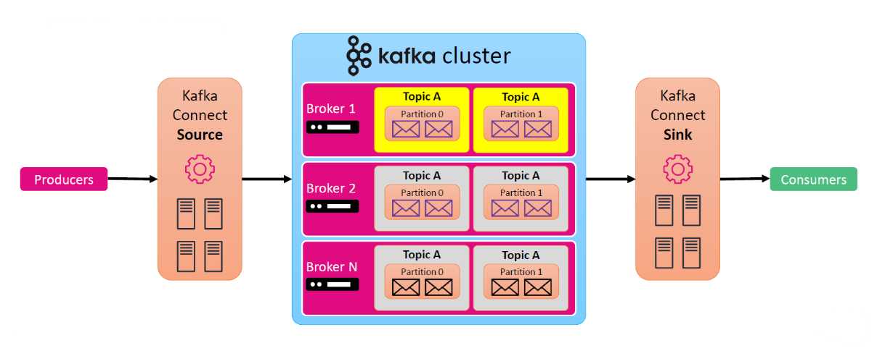
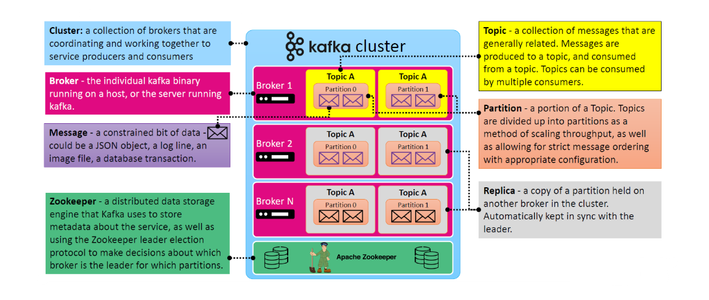
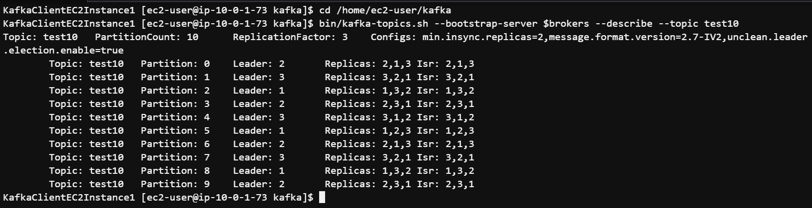

# 🌀 What is Apache Kafka?

**The Heart of Real-Time Event Streaming!**

## 📚 Official Definition

> **Apache Kafka** is an **open-source distributed event streaming platform** designed to handle high-throughput, low-latency, real-time data feeds.  
> It allows applications to **publish**, **subscribe to**, **store**, and **process** streams of records in a fault-tolerant way.

---

    

---

## 🧠 Why Should I Care?

Kafka is used by **companies like Netflix, Uber, LinkedIn, and Airbnb** to power things like:

- **Real-time analytics dashboards** 📊
- **Monitoring and alerting systems** 🚨
- **Streaming pipelines to data lakes** 💧
- **Microservices communication** 🔗

If your system needs to handle **lots of data flowing fast**, **Kafka is your friend**.

---

## 🧩 Kafka Core Components (With Real-World Analogies)

    

---

### 🏘️ Cluster

> A Kafka **cluster** is a group of Kafka **brokers** working together.

**Analogy**: Imagine a **city** of post offices (brokers), each handling messages (data) that come in and go out.

---

### 📦 Broker

> A **broker** is a single Kafka server (or node) in the cluster.

**Analogy**: A **post office** building where messages are stored and distributed.  
Kafka can have 1 or more brokers.

---

### 🗂️ Topic

> A **topic** is a category or feed name to which messages are published.

**Analogy**: A **mailbox label**, like "Orders" or "Payments". Producers drop messages into it, and consumers read from it.

Topics are split into **partitions** for scalability and ordering.

---

### 🧱 Partition

> A **partition** is a chunk of a topic's data — it provides a way to scale and preserve ordering.

**Analogy**: Think of a **conveyor belt**. Each partition is a belt where messages line up in order.

- Messages are always **ordered within a partition**.
- More partitions = more throughput 🚀

---

### ✉️ Message (Record)

> The **message** is the unit of data — a JSON object, log line, or image.

**Analogy**: A **letter** being dropped in the mailbox.

---

### 🧍 Producer

> A **producer** writes messages to Kafka topics.

**Analogy**: The person **dropping letters** (messages) into the mailbox (topic).

---

### 🧍‍♀️ Consumer

> A **consumer** reads messages from Kafka topics.

**Analogy**: A **mailman** picking up letters (messages) for delivery (processing).

---

### 🧬 Replica

> A **replica** is a backup copy of a partition stored on another broker.

- Ensures **high availability** and **fault tolerance**
- Automatically synced with the **leader partition**

---

### 🦁 Zookeeper (soon to be optional)

> Kafka uses **Apache ZooKeeper** for managing metadata and leader election.

- Tracks broker status, topic configs, and partition assignments
- Kafka is moving to a **ZooKeeper-less architecture** (KRaft mode)

---

## 🔀 How Kafka Distributes Data

Kafka splits a **topic into partitions**, and each **partition is assigned to a broker**.  
**Consumers** read from these partitions based on group membership.

---

    

---

## 🔌 Kafka Connect: Data Integration Made Easy

### 🔗 What is Kafka Connect?

> Kafka Connect is a tool to **stream data into and out of Kafka** using connectors.

It supports:

- **Source Connectors**: Read from external systems into Kafka
- **Sink Connectors**: Push data from Kafka to external systems

### 🛠️ Example Use Cases

| Source          | Kafka    | Sink             |
| --------------- | -------- | ---------------- |
| MySQL changes   | 👉 Kafka | 👉 Amazon S3     |
| REST API events | 👉 Kafka | 👉 Elasticsearch |
| Sensor data     | 👉 Kafka | 👉 PostgreSQL    |

---

## 🎯 Kafka Use Case Example (Ordering System)

Let’s say you have an **eCommerce** app:

- The **order service** produces events like:
  - `order-1-placed`
  - `order-1-paid`
  - `order-1-shipped`
- The **analytics system** consumes all orders
- The **notification system** sends alerts based on order status

Using Kafka, all systems are **decoupled** but can still react in **real time**.

---

## 🔍 Kafka vs Other Messaging Systems

| Feature          | Kafka                          | RabbitMQ        | AWS Kinesis |
| ---------------- | ------------------------------ | --------------- | ----------- |
| Storage Duration | Configurable (days to forever) | Limited         | 24–365 days |
| Message Order    | Guaranteed in partition        | No strict order | Depends     |
| Pull vs Push     | Pull-based                     | Push-based      | Pull-based  |
| Throughput       | Very high                      | Medium          | Medium-High |

---

## 🧠 Key Kafka Concepts Summary

| 🧱 Term           | 📖 Definition            |
| ----------------- | ------------------------ |
| **Cluster**       | Group of brokers         |
| **Broker**        | Kafka server             |
| **Topic**         | Message channel          |
| **Partition**     | Subset of topic messages |
| **Message**       | Unit of data             |
| **Replica**       | Backup partition         |
| **Zookeeper**     | Coordination system      |
| **Kafka Connect** | For data integration     |

---

## 🎉 Final Thoughts

✅ Apache Kafka is **scalable, durable, fast, and fault-tolerant**  
✅ Perfect for **event-driven**, **microservices**, and **real-time analytics**  
✅ Can plug into **data lakes, data warehouses, dashboards, and machine learning pipelines**

> 🧠 “Kafka doesn’t just move data—it empowers systems to **talk**, **react**, and **grow in real time**.”
