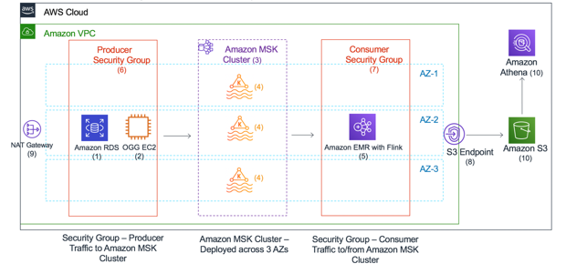

# Amazon MSK (Managed Streaming for Apache Kafka)

Amazon MSK is a **fully managed service** that simplifies the deployment, operation, and scaling of **Apache Kafka** for processing streaming data. It integrates seamlessly with AWS services, enabling you to build real-time applications without the overhead of managing Kafka infrastructure.

---

    

---

## 🌟 **What is Apache Kafka?**

Apache Kafka is an **open-source distributed event streaming platform** designed for high-throughput, fault-tolerant processing of real-time data. It enables:

- **Publish/Subscribe Messaging**: Applications can produce and consume events.
- **Event Storage**: Retain data streams for later analysis or replay.
- **Stream Processing**: Analyze or process data in real time.

---

## 🔑 **Key Features of Amazon MSK**

1. **Managed Kafka Clusters**:

   - AWS handles the setup, maintenance, and scaling of Kafka clusters.
   - Clusters run within **Amazon VPC**, ensuring secure communication and isolation.

2. **Data Durability**:

   - Data is stored in **EBS volumes** and replicated across brokers within the cluster for fault tolerance.

3. **High Availability**:

   - Multi-AZ deployment ensures fault-tolerant and highly available Kafka clusters.

4. **Seamless Scaling**:

   - **Storage Auto-Scaling** adjusts the cluster storage capacity based on throughput.

5. **Security**:

   - Supports **encryption at rest** (using AWS KMS) and **in-transit** (TLS).
   - Integrates with AWS IAM for authentication and access control.

6. **Monitoring and Metrics**:

   - Integrates with **Amazon CloudWatch** for real-time monitoring.
   - Provides Kafka-specific metrics for cluster health and performance.

7. **Kafka API Compatibility**:
   - Fully compatible with Apache Kafka, allowing you to use existing Kafka clients and tools.

---

## 🛠️ **How Amazon MSK Works**

Amazon MSK provides two distinct planes:

1. **Control Plane**:

   - Manages cluster creation, updates, and deletion.
   - Operates in a **VPC managed by AWS**.

2. **Data Plane**:
   - Operates in your **VPC**, enabling secure data transfer within your network.
   - Handles Kafka operations like topic creation, data production, and consumption.

---

## 🚀 **Amazon MSK Serverless**

Amazon MSK Serverless allows you to use Kafka without managing cluster capacity.

### Key Features

- **On-Demand Scaling**:
  - Automatically adjusts capacity based on the volume of streaming data.
- **Simplified Management**:
  - No need to configure brokers or storage.
- **Use Case**:
  - Ideal for applications with unpredictable or highly variable workloads.

---

## 🍴 **Common Use Cases**

1. **Real-Time Analytics**:

   - Process and analyze streaming data from IoT sensors, website clickstreams, or application logs.

2. **Event-Driven Architectures**:

   - Enable microservices to communicate via event streams.

3. **Log Aggregation**:

   - Centralize logs from multiple sources for monitoring and troubleshooting.

4. **Data Replication**:
   - Stream data between systems for disaster recovery or syncing.

---

## 🔄 **Amazon MSK Workflow**

1. **Cluster Creation**:

   - Use the AWS Management Console, CLI, or SDK to create a Kafka cluster.
   - Specify configurations like the number of brokers and storage settings.

2. **Data Production**:

   - Applications use Kafka producers to write data streams to topics in the cluster.

3. **Data Storage and Replication**:

   - Kafka stores the data in **partitions** replicated across brokers for durability.

4. **Data Consumption**:

   - Kafka consumers read and process data from topics in real time.

5. **Monitoring**:
   - Use CloudWatch metrics and Kafka logs to monitor the health and performance of the cluster.

---

## 🏗️ **Integration with AWS Services**

Amazon MSK integrates with:

- **AWS Lambda**: Trigger functions for real-time data processing.
- **Amazon S3**: Store streaming data for long-term analysis.
- **Amazon CloudWatch**: Monitor cluster performance and set alarms.
- **Amazon Redshift**: Perform analytics on streaming data.
- **Amazon Kinesis**: Combine with MSK for advanced data processing use cases.

---

## 🛡️ **Security Features**

1. **Encryption**:

   - **At Rest**: Data stored in EBS is encrypted using **AWS KMS**.
   - **In Transit**: Kafka traffic is secured using **TLS**.

2. **Authentication and Authorization**:

   - **IAM Integration**: Manage access to MSK resources using AWS IAM roles and policies.
   - **SASL/SCRAM**: Use Kafka-native authentication protocols for additional security.

3. **Networking**:
   - Operates entirely within your **VPC**, ensuring secure communication between resources.

---

## ✅ **Why Choose Amazon MSK?**

1. **Fully Managed**:

   - Focus on building applications without worrying about Kafka infrastructure.

2. **Scalability**:

   - Handle millions of events per second with automatic scaling.

3. **Cost-Effective**:

   - Pay only for the resources you use.

4. **Integration**:

   - Seamlessly integrates with the broader AWS ecosystem.

5. **Reliability**:
   - Multi-AZ deployment ensures high availability and fault tolerance.

---

## 📚 **Conclusion**

Amazon MSK simplifies the deployment and management of **Apache Kafka**, making it easier to build **real-time streaming applications**. With its managed infrastructure, scalability, and seamless integration with AWS services, MSK enables you to process and analyze streaming data efficiently while focusing on your application logic. Whether you’re building event-driven systems, analyzing IoT data, or aggregating logs, Amazon MSK is a reliable and powerful solution for streaming data processing.
