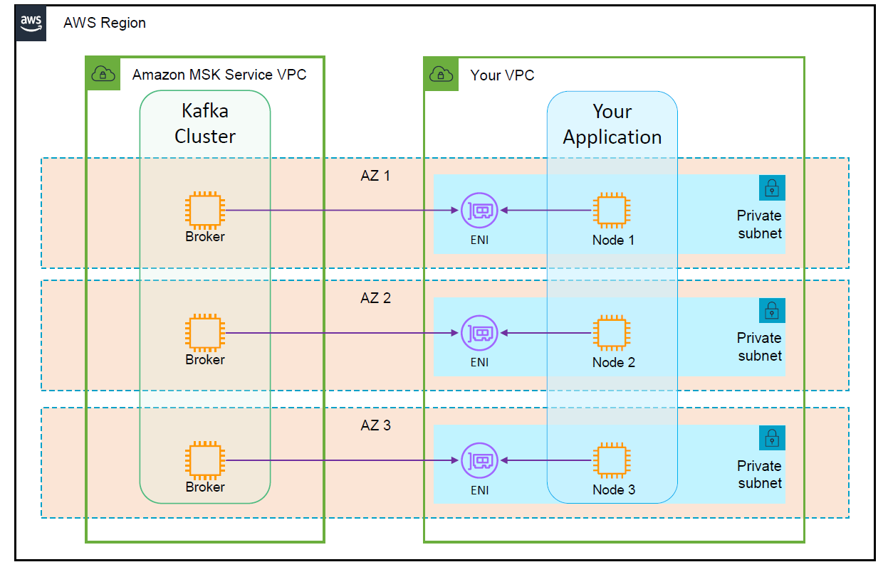
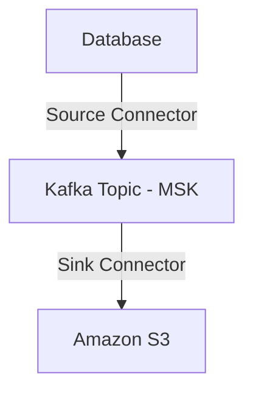
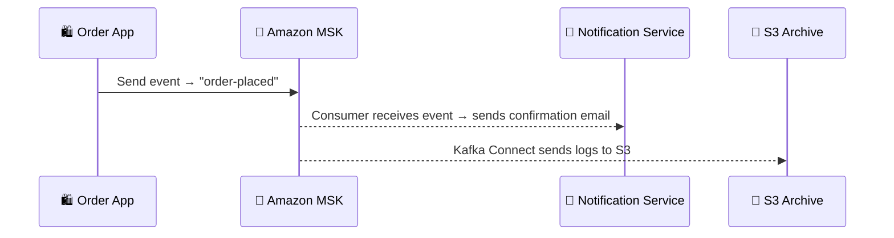

# 🚀 Amazon MSK (Managed Streaming for Apache Kafka)

Amazon MSK is **Kafka without the headache**. You get all the power of **Apache Kafka**, but you let AWS handle the messy stuff — provisioning, patching, scaling, and keeping things running.

Let’s dive into this streaming beast and understand what makes it awesome 👇

---

## 📦 What Is Apache Kafka (Quick Recap)?

Before we talk about **MSK**, let’s quickly remember what **Apache Kafka** is:

> Apache Kafka is an open-source distributed event streaming platform that lets you **publish**, **subscribe**, **store**, and **process** events in **real-time**.

Kafka organizes data into:

- **Topics** → logical groups of events
- **Partitions** → for parallelism and ordering
- **Producers** → write data
- **Consumers** → read data

Kafka is amazing, but managing it yourself? 😅 That’s where **MSK** shines.

---

## ☁️ What Is Amazon MSK?

> **Amazon MSK** (Managed Streaming for Apache Kafka) is a **fully managed Kafka service** that makes it super easy to build and run apps on Kafka **without managing the infrastructure**.

🔧 You don’t install Kafka.  
🛡️ You don’t worry about high availability.  
📈 You don’t stress over scaling.

AWS handles all of that. You just **stream your data** like a boss 💼

---

## ⚙️ Core Features of Amazon MSK

| 🧠 Feature                     | 🔍 Description                                                                              |
| ------------------------------ | ------------------------------------------------------------------------------------------- |
| **Fully Managed**              | AWS provisions, patches, monitors brokers                                                   |
| **Native Kafka Compatibility** | MSK runs real Apache Kafka — no changes to your code                                        |
| **Secure & Private**           | MSK runs in your VPC with TLS & IAM/SASL                                                    |
| **Scalable & Resilient**       | Supports both **serverless** and **provisioned** clusters                                   |
| **Integrated**                 | Seamlessly connects with AWS services like **Lambda**, **S3**, **Redshift**, **CloudWatch** |
| **Supports Kafka Connect**     | Move data in/out with minimal setup                                                         |
| **Zookeeper Managed by AWS**   | You don’t deal with it anymore 🎉                                                           |

---

## 🛠️ MSK Cluster Types

### 1️⃣ Provisioned Clusters

- You define number of brokers, instance types, EBS volumes
- Good when you need **fine-grained control**
- Handles **high-throughput**, large-scale workloads

### 2️⃣ Serverless Clusters

- Fully auto-scaled based on traffic
- You don’t manage brokers at all
- Best for **on-demand**, spiky workloads
- Still Kafka-compatible!

---

## ⚡ How MSK Works

- Producers send data to **topics**
- Data gets distributed into **partitions**
- Consumers read from those topics in parallel
- Everything runs in AWS — fault-tolerant and scalable

---

## 🔌 Connectivity in MSK

    

| 🔐 Connection Option        | ⚡ Description                                                    |
| --------------------------- | ----------------------------------------------------------------- |
| **VPC-only Access**         | MSK runs **inside** your VPC — secure and isolated                |
| **IAM Authentication**      | Use AWS IAM to control Kafka access (serverless only)             |
| **TLS/SASL Authentication** | Kafka-native options also available                               |
| **Multi-AZ by Default**     | Ensures broker availability and high durability                   |
| **Private DNS & Endpoints** | Use `b-1.mskclustername.kafka.region.amazonaws.com` for bootstrap |

---

## 🔄 Kafka Connect with MSK

MSK supports **Kafka Connect**, which allows easy movement of data between Kafka and external systems:

Use it to:

- Push logs to S3
- Stream transactions to Redshift
- Pull from DynamoDB or RDS into MSK

💡 Great for **ETL pipelines** and **real-time integrations**

---

## 🧪 Example: Real-Time Order Processing

Let’s say you run an eCommerce platform:

This is **event-driven architecture** at work — powered by MSK 🔥

---

## 🚀 When Should I Use MSK?

✅ You want Kafka **without managing servers**  
✅ You already use Kafka and want it on AWS  
✅ You need **real-time processing** at scale  
✅ You want to integrate with AWS services (e.g., Lambda, Glue, S3)

---

## 🆚 MSK vs DIY Kafka on EC2

| ⚙️ Feature           | EC2 Kafka | Amazon MSK            |
| -------------------- | --------- | --------------------- |
| Setup Effort         | High      | Very low              |
| Broker Monitoring    | Manual    | Built-in              |
| Zookeeper Management | Yours     | AWS-managed           |
| Scaling              | Manual    | Auto or API           |
| High Availability    | DIY       | Built-in              |
| Patching & Upgrades  | Manual    | Automated             |
| IAM Integration      | Complex   | Built-in (serverless) |

---

## 🎯 TL;DR (Summary)

✅ **Amazon MSK** is the best way to run **Apache Kafka on AWS**  
✅ You can choose between **provisioned** or **serverless** clusters  
✅ It integrates natively with AWS services  
✅ You get **all the power of Kafka**, minus the operational burden  
✅ It’s perfect for **event-driven**, **real-time**, and **streaming data** workloads
