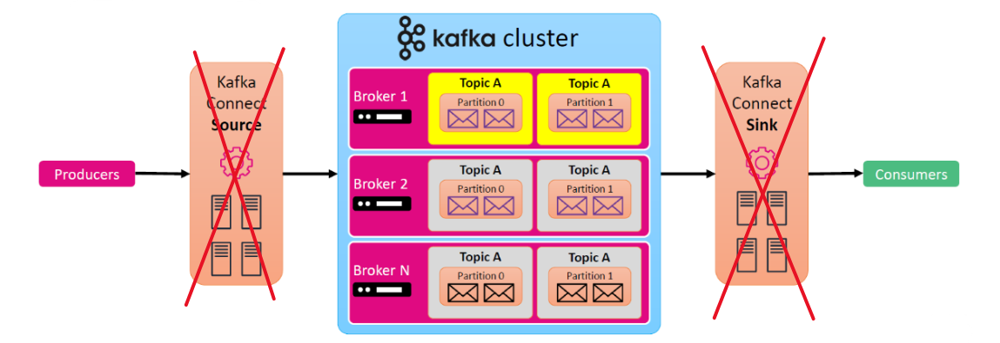
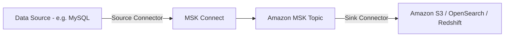
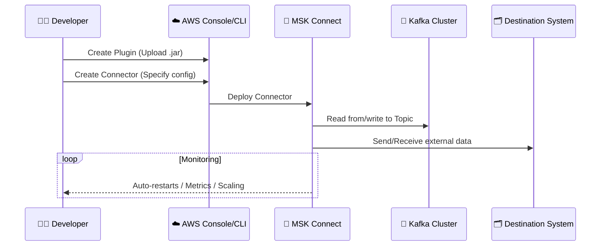

# 🔌 Amazon MSK Connect — Plug-and-Stream Without the Pain

Welcome to the **data streaming jungle**, where apps want to throw data _into_ Kafka (source connectors), others want to slurp it _out_ (sink connectors), and you — the brave backend engineer — don’t want to manage servers, patching, or scaling 🧑‍💻💥

That’s where **Amazon MSK Connect** comes in. Let's break it down:

---

    

---

## 📖 What Is Amazon MSK Connect?

> **Amazon MSK Connect** is a fully managed **Kafka Connect** service by AWS that helps you move data _into_ and _out of_ Apache Kafka — without provisioning or maintaining Kafka Connect infrastructure.

It's like having a magical connector toolbox where:

- You don’t deploy servers 🚫🖥️
- You don’t monitor scaling manually 📈
- You don’t patch, upgrade, or babysit the setup 🛠️
- You just plug in your connectors, and AWS handles the rest 🤝

---

## 🔍 Kafka Connect 101

Before MSK Connect, there was… **Kafka Connect**, the open-source framework to **stream data between Kafka and external systems**.

### 🎯 Use cases

- Send **change logs** from your **MySQL** database into **Kafka** (Debezium source connector)
- Export **Kafka topic data** to **S3**, **OpenSearch**, or **Snowflake** (sink connector)
- Stream **IoT sensor readings** directly from **HTTP endpoints**

Kafka Connect has **two connector types**:

- **Source Connector** → External system → Kafka
- **Sink Connector** → Kafka → External system

---

## ☁️ What Makes MSK Connect Special?

| 💡 Feature                | 🧠 Description                                            |
| ------------------------- | --------------------------------------------------------- |
| **Fully managed**         | AWS manages the whole Kafka Connect cluster for you       |
| **Auto-scaling**          | Automatically scales connectors up/down                   |
| **Fault-tolerant**        | Recovers from connector failures automatically            |
| **Pay-per-use**           | You pay only for connector resources you use              |
| **Private Networking**    | Uses **VPC + AWS PrivateLink** — no public traffic        |
| **Connector marketplace** | Use AWS connectors, or bring your own JAR (custom plugin) |

---

## 🧱 MSK Connect Architecture (How It Works)

- **MSK Connect** runs Kafka Connect **workers** that manage **connectors**
- You can **deploy**, **scale**, and **monitor** connectors with ease
- Connectors push or pull data from/to Kafka in real time

---

## ⚙️ Supported Connectors

🎒 **Out-of-the-box Connectors**:

- ✅ Amazon S3 Sink
- ✅ Amazon OpenSearch Sink
- ✅ Amazon Redshift Sink
- ✅ Debezium (MySQL/PostgreSQL source)
- ✅ JDBC Source/Sink
- ✅ Custom JAR plugins (BYO)

You can use AWS-provided ones or upload your own **custom plugin** (e.g., Debezium for DB change data capture).

---

## 🚀 How to Set Up MSK Connect (The Flow)

---

## 🧪 Example: Stream DB Changes into OpenSearch

1. 🎯 Goal: Stream `orders` table changes from MySQL → Kafka → OpenSearch
2. 🧩 Source Connector: **Debezium MySQL**
3. 🧩 Sink Connector: **OpenSearch Sink**
4. 🧰 Tool: **Amazon MSK Connect**

You define connector configs (JSON), plug them into MSK Connect, and **boom**, your streaming ETL pipeline is live!

---

## 🧠 MSK Connect: Smart Features Explained

### ⚖️ Auto Scaling

- You define:
  - Max/min **workers**
  - **CPU thresholds**
- MSK Connect scales horizontally AND vertically (1–8 vCPUs per worker)

### 🧼 Automatic Recovery

- If a **Kafka consumer rebalance** or **TCP issue** causes failure,
- MSK Connect **auto-restarts** the task without manual intervention

### 🔐 Private Networking

- Uses **VPC** + **PrivateLink**
- No public IPs, no public endpoints

---

## 💸 Pricing

- **You pay per vCPU and memory** used by connector workers
- No charge for idle connectors that auto-scale down
- You don’t pay for Kafka separately if using MSK (unless self-hosted)

---

## 🆚 MSK Connect vs DIY Kafka Connect

| Feature             | DIY Kafka Connect | Amazon MSK Connect |
| ------------------- | ----------------- | ------------------ |
| Server Management   | You               | AWS                |
| Scaling             | Manual            | Auto               |
| Monitoring          | DIY tools         | CloudWatch         |
| Fault Tolerance     | You handle it     | AWS handles it     |
| Kafka Compatibility | ✅                | ✅                 |
| Plugin Support      | ✅                | ✅ (plus BYO)      |
| Pricing Model       | EC2-based         | Pay-as-you-go      |

---

## 🧠 TL;DR Summary

- ✅ **Amazon MSK Connect** = Fully managed **Kafka Connect**
- 🔌 Moves data in and out of **Amazon MSK** (or any Kafka cluster)
- 🧩 Supports **Debezium**, **S3**, **OpenSearch**, and more
- 📈 Auto-scales, auto-recovers, and connects securely
- 💡 Use **source connectors** to ingest data, **sink connectors** to export
- ☁️ No infrastructure, patching, or zookeeper nightmares!
