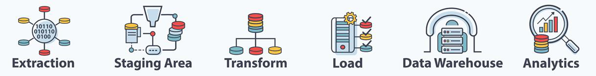
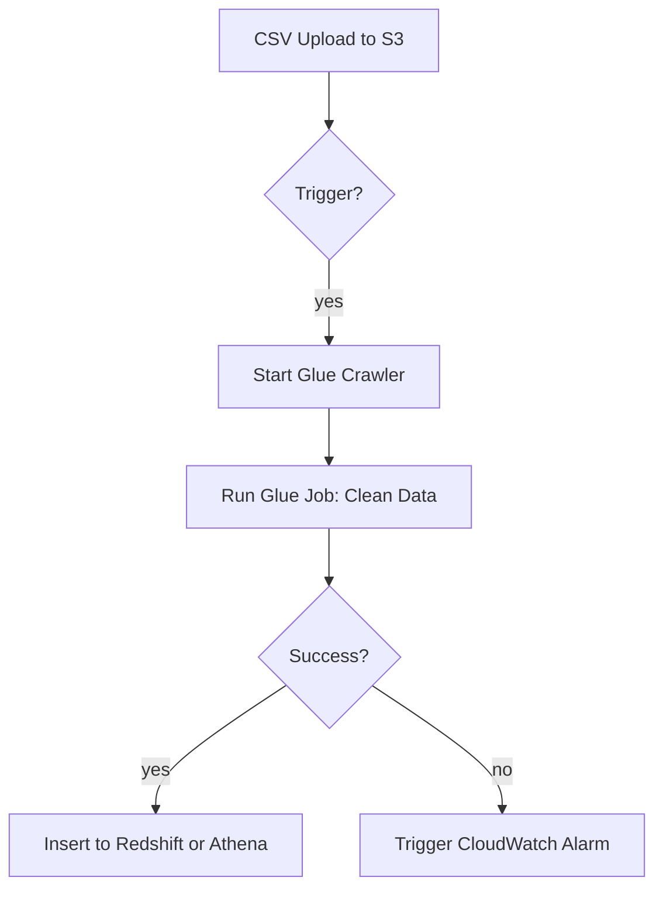

# 🎩 Orchestration of Data Pipelines

Data orchestration is the backbone of any modern data platform. Without it, moving data from source to destination reliably, securely, and at scale would be an operational nightmare. Let's break down what data orchestration is, why it's crucial, and how it works across the AWS ecosystem.

---

---

## 🧠 What Is Data Pipeline Orchestration?

**Definition:**

> **Data Orchestration** is the automated process of scheduling, managing, and coordinating data movement and transformation from various sources to a central location for storage, analysis, or further processing.

Think of it like conducting a data symphony — various instruments (data sources, tools, services) need to play at the right time and in harmony.

---

## 🎯 Why Orchestrate?

| Feature                                | Purpose                                                               |
| -------------------------------------- | --------------------------------------------------------------------- |
| ✅ **Automation**                      | No more manual data jobs! Everything runs on schedule or via trigger. |
| 🪢 **Dependencies**                     | Control sequence — e.g., run ETL only after raw data is ingested.     |
| ⏱️ **Scheduling**                      | Run tasks daily, weekly, monthly, or triggered by events.             |
| 🧵 **Parallel & Sequential Execution** | Boost performance with parallelism where possible.                    |
| 🔁 **Retries & Recovery**              | Automatically retry or reroute on failure.                            |
| 🔍 **Observability**                   | Monitor job statuses, logs, and performance metrics.                  |

---

## 📦 Key AWS Services for Orchestration

AWS provides multiple tools based on your workload, flexibility, and integration needs.

### 1. 🧪 **AWS Glue Workflows**

- Purpose-built for **ETL pipeline orchestration**.
- Drag-and-drop interface.
- Automates job runs, crawlers, and triggers.
- Serverless.

### 2. 🔁 **AWS Step Functions**

- General-purpose orchestrator using **State Machines**.
- Excellent for integrating multiple AWS services like Lambda, S3, SNS, DynamoDB, etc.
- Supports visual workflow building & SDK integration.
- **Express & Standard** workflows for short vs. long-running jobs.

### 3. 🌀 **Amazon Managed Workflows for Apache Airflow (MWAA)**

- Open-source **Apache Airflow**, fully managed by AWS.
- Ideal for **complex DAGs**, batch workflows, and migrating on-prem Airflow pipelines.
- Supports integration with AWS & third-party tools.
- Highly scalable with ECS Fargate, VPC, IAM, CloudWatch, SQS, and more.

---

## ⚖️ Workflow Comparison Table

| Feature                     | AWS Glue Workflow   | AWS Step Functions         | Amazon MWAA (Airflow)           |
| --------------------------- | ------------------- | -------------------------- | ------------------------------- |
| **Orchestration Model**     | Workflow            | State Machine              | Directed Acyclic Graph (DAG)    |
| **Type**                    | Serverless          | Serverless                 | Managed on ECS Fargate          |
| **Best Use Case**           | Glue-only ETL       | General AWS automation     | Open-source data pipelines      |
| **Authored In**             | Visual, SDK, CDK    | JSON (ASL), SDK, CDK       | Python (Airflow DAG)            |
| **Third-Party Integration** | No                  | Some                       | Yes (e.g., Hadoop, Spark)       |
| **Pricing**                 | Free (pay for jobs) | Pay per transition/runtime | Pay for infra (compute/storage) |
| **HA & Scaling**            | Built-in            | Built-in                   | Multi-AZ with Auto Scaling      |

---

## 📌 Real-World Example

**Use Case: Retail Sales Data Pipeline!**

### Flow

### Orchestrated Using

- **Glue Workflow** (if limited to Glue)
- **Step Functions** (if using Lambda or other services too)
- **Airflow DAG on MWAA** (for enterprise pipelines with more control)

---

## 📚 Further Reading

- [AWS Glue Workflows](https://docs.aws.amazon.com/glue/latest/dg/orchestrate-using-workflows.html)
- [AWS Step Functions](https://docs.aws.amazon.com/step-functions/latest/dg/welcome.html)
- [Amazon MWAA](https://docs.aws.amazon.com/mwaa/latest/userguide/what-is-mwaa.html)
- [Apache Airflow](https://airflow.apache.org/)
